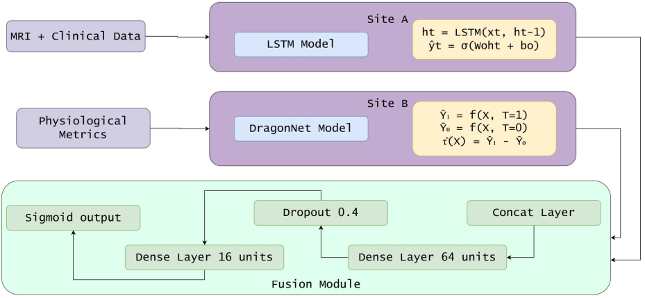
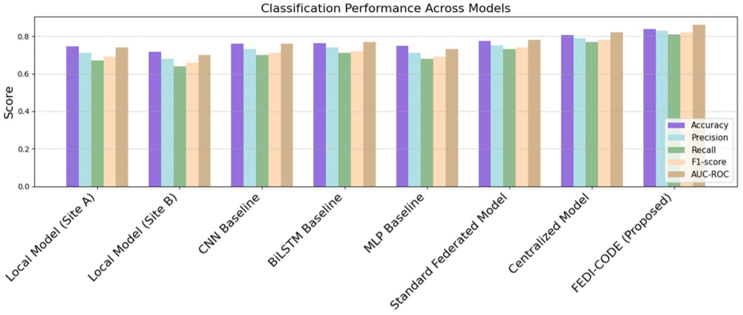

Imagine a future where your risk of developing dementia could be assessed early and accurately—not by sending your private medical data to a central database, but through a smart AI system that learns from hospitals around the world without ever exposing your personal information. This is the promise of FEDI-CODE, a novel artificial intelligence framework designed to predict dementia risk by analyzing patient data across multiple healthcare sites while preserving privacy and providing personalized insights into modifiable lifestyle factors.

> **TL;DR**
> - FEDI-CODE is a new federated AI model that predicts dementia risk by training on distributed patient data without sharing sensitive information between institutions.
> - Beyond prediction, FEDI-CODE estimates how changes in factors like alcohol use and cardiovascular health could reduce an individual’s dementia risk, offering actionable clinical guidance.

Dementia, a progressive cognitive decline affecting millions worldwide, is notoriously difficult to detect early due to subtle symptoms and fragmented healthcare data scattered across hospitals and clinics. Traditional AI models often require pooling patient data centrally, raising privacy concerns and regulatory barriers. Federated learning—a method where AI models train collaboratively across multiple sites without exchanging raw data—has emerged as a promising solution. However, most federated models focus solely on prediction accuracy and overlook the causal relationships between risk factors and disease progression, limiting their usefulness for personalized interventions. FEDI-CODE addresses these challenges by combining federated learning with causal inference and temporal modeling of longitudinal clinical and imaging data, enabling both accurate risk prediction and individualized treatment effect estimation.

FEDI-CODE integrates several advanced techniques into a unified framework. It uses Long Short-Term Memory (LSTM) networks to capture temporal patterns in patients’ longitudinal brain imaging and clinical data. The federated learning setup allows the model to train collaboratively across multiple institutions without centralizing sensitive medical records, preserving privacy. A fusion module aggregates learned representations from each site to form a global prediction, while a counterfactual inference component estimates the individual treatment effects of modifiable risk factors such as alcohol consumption, body weight, and cardiovascular health indicators. This causal insight helps identify which lifestyle changes might most effectively reduce a person’s dementia risk.

In extensive experiments on simulated multi-site dementia datasets, FEDI-CODE achieved an accuracy of 83.7%, precision of 83%, recall of 81%, and an AUC-ROC of 0.86—outperforming standard federated and deep learning models. Importantly, it generalized well to external datasets, maintaining robust accuracy and predictive power. Beyond classification, FEDI-CODE’s causal inference module provided interpretable estimates of how individual risk factors influence dementia probability, offering actionable guidance for personalized interventions. Visualization of feature importance highlighted key contributors to dementia risk, aligning with known clinical insights. These results demonstrate FEDI-CODE’s potential as a scalable, privacy-aware tool for early dementia screening and personalized risk management.

Early detection and intervention are critical for managing dementia, a condition expected to affect over 139 million people globally by 2050. FEDI-CODE’s ability to predict dementia risk accurately while preserving patient privacy addresses a major hurdle in deploying AI across healthcare institutions. Its integration of causal inference offers clinicians interpretable insights into how modifying certain risk factors might alter disease trajectory, moving beyond black-box predictions toward actionable care strategies. This combination of privacy, accuracy, and interpretability positions FEDI-CODE as a promising step forward in AI-driven dementia research and personalized medicine.

While FEDI-CODE shows strong performance on simulated and external datasets, real-world deployment will require validation across diverse healthcare systems with varying data quality and patient populations. The complexity of federated learning and causal inference models may pose challenges for integration into existing clinical workflows. Additionally, the model’s reliance on accurate longitudinal data and imaging means its effectiveness depends on consistent data collection practices. Future work should explore real-world trials, address potential biases, and refine user-friendly interfaces to translate FEDI-CODE’s insights into practical clinical decision support.

## Figures

*Fig 1 shows FEDI-CODE, a new collaborative and cause-aware system for data analysis.*

*Comparison of how well different models classify data accurately.*

## Sources

- [FEDI-CODE: A federated and causally-informed framework for dementia risk prediction using multi-site patient data](https://journals.plos.org/plosone/article?id=10.1371/journal.pone.0351957)
- DOI: [10.1371/journal.pone.0351957](https://doi.org/10.1371/journal.pone.0351957)
