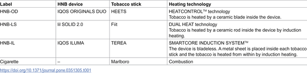
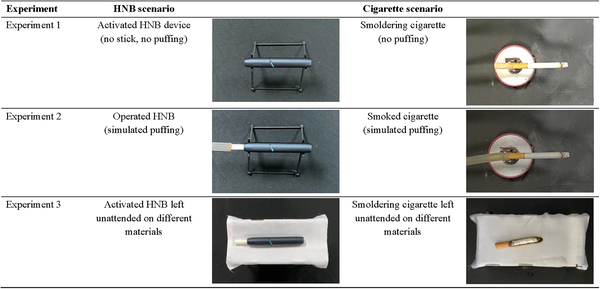
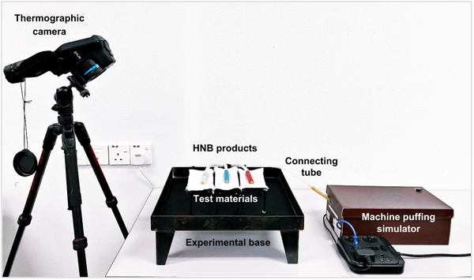

Could new heat-not-burn tobacco products reduce the risk of accidental fires compared to traditional cigarettes? Smoking materials have long been a leading cause of home fires and related fatalities worldwide. With the rise of alternative tobacco devices that heat rather than burn tobacco, understanding their fire safety profile is more important than ever. Recent research using thermal imaging technology sheds light on how these newer products behave when in contact with common household materials, offering valuable insights into their potential to prevent accidental fires.

> **TL;DR**
> - Traditional cigarettes reach surface temperatures over 600°C, often causing visible burns and posing significant fire hazards when in contact with flammable household materials.
> - Heat-not-burn (HNB) tobacco products operate at much lower temperatures (below 65°C), remaining well under ignition thresholds of common combustible materials and showing no visible thermal damage in tests.

Smoking-related fires have been a major cause of home fire deaths, often starting when a lit cigarette accidentally contacts flammable items like bedding or furniture. In Malaysia, where this study was conducted, cigarettes rank among the top causes of fire incidents. Meanwhile, heat-not-burn tobacco products, which heat tobacco electronically without combustion, are gaining popularity worldwide. These devices promise reduced harm through lower temperatures and less smoke, but their fire safety compared to traditional cigarettes had not been thoroughly evaluated, especially under tropical ambient conditions.

Researchers in Malaysia tested three popular heat-not-burn devices alongside conventional cigarettes under controlled ambient conditions (around 26°C and 67% humidity). Using a high-precision thermal camera, they recorded surface temperatures during operation and simulated puffing. They also placed these devices on a variety of common household combustible materials—including fabrics like bamboo, cotton, and silk, mats made of bamboo and PVC, as well as dry leaves and rice straw—to observe any thermal damage or ignition. Each experiment was repeated multiple times to ensure reliable data.

The study found that smoldering cigarettes reached maximum surface temperatures of approximately 692°C, with puffing increasing this by up to 22%, sometimes exceeding 800°C. These temperatures are well above the ignition points of many household materials, and indeed, cigarettes caused visible burn marks on fabrics and mats, highlighting their fire hazard potential. In contrast, heat-not-burn products operated at much lower temperatures, ranging from 47°C to 65°C, which is roughly 13 times cooler than cigarettes. Importantly, these temperatures stayed below the ignition thresholds of all tested materials, and no visible thermal damage was observed after contact with the HNB devices.

These findings provide empirical evidence that heat-not-burn tobacco products pose a significantly lower fire risk compared to conventional cigarettes under typical ambient conditions. This has important implications for public safety, especially in reducing accidental home fires caused by smoking materials. For consumers, regulators, and fire safety advocates, understanding these differences can inform safer tobacco product choices and policies. Moreover, the use of thermal imaging offers a clear, visual method to assess fire hazards associated with tobacco products, potentially guiding future safety standards.

While this study offers valuable insights, it is important to note that it was conducted under specific ambient conditions in Malaysia and focused on surface temperatures and immediate thermal damage. Real-world fire risks also depend on user behavior, device maintenance, and environmental variability. Additionally, the study did not assess risks related to device battery failures or other electronic malfunctions, which have been noted in other types of tobacco products like e-cigarettes. Therefore, while heat-not-burn products appear safer in terms of fire ignition potential, comprehensive safety assessments should consider all possible risk factors.

## Figures

*Details of the heated tobacco and cigarette products used in this study.*

*Fig 4 shows different setups used in experiments with heated tobacco and cigarettes.*

*Diagram showing the setup used to test HNB products and cigarettes in Experiment 2.*

## Sources

- [Fire risk evaluation of heat-not-burn products and combustible cigarettes: Thermal exposure of different materials under ambient conditions](https://journals.plos.org/plosone/article?id=10.1371/journal.pone.0351305)
- DOI: [10.1371/journal.pone.0351305](https://doi.org/10.1371/journal.pone.0351305)
