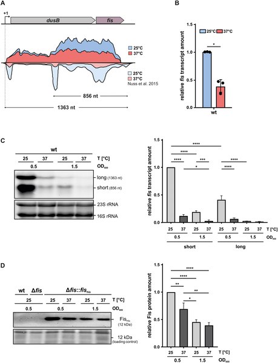
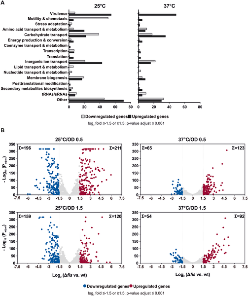
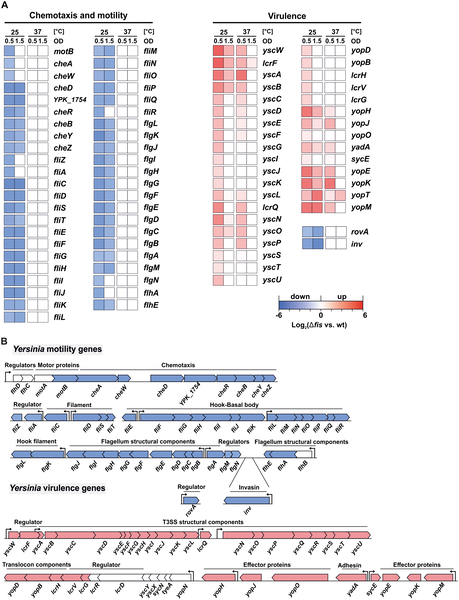
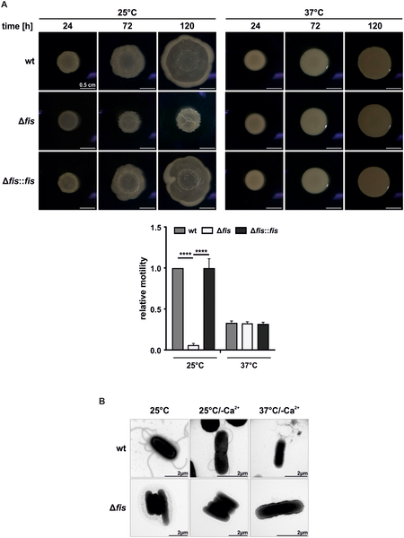

Imagine a bacterium that can sense the temperature around it and use that information to decide when to arm itself for infection. This is exactly what Yersinia pseudotuberculosis, a bacterial pathogen, does. At cooler environmental temperatures, it keeps its virulence factors in check, but once inside a warm host, it flips a genetic switch to become ready for infection. The key player in this temperature-sensitive control? A small but powerful protein called Fis.

> **TL;DR**
> - Fis is a global regulator in Yersinia pseudotuberculosis that represses virulence genes at environmental temperatures (around 25°C) while promoting motility and cell adhesion.
> - Deleting the fis gene disrupts this balance, causing premature activation of virulence factors, loss of motility, and increased pathogenicity even at cooler temperatures.

Bacterial pathogens like Yersinia pseudotuberculosis face a critical challenge: they must survive in the environment outside a host while also being ready to infect when they enter a warm-blooded animal. Temperature is a key environmental cue that signals the transition from outside to inside the host. At lower temperatures, the bacteria express genes that help them move and stick to surfaces, but keep their aggressive infection tools turned off. When they detect the higher temperature inside a host (around 37°C), they activate a suite of virulence genes, including the type III secretion system (T3SS), which injects proteins into host cells to disable immune defenses. Understanding how bacteria finely tune this switch is crucial for grasping infection dynamics and could inform future antimicrobial strategies.

Researchers studied the role of Fis by comparing normal Yersinia pseudotuberculosis bacteria with mutants lacking the fis gene. They grew both strains at 25°C (environmental temperature) and 37°C (host body temperature) and analyzed gene expression using RNA sequencing. They also performed functional assays to observe bacterial motility, secretion of virulence proteins, and ability to evade immune cells. Protein levels of Fis were measured by Western blotting, and infection models using Galleria mellonella larvae helped assess pathogenicity.

The study revealed that Fis expression is higher at 25°C and decreases at 37°C, aligning with its role in environmental adaptation. At 25°C, Fis represses over 600 genes, including those responsible for the T3SS and Yersinia outer proteins (Yops), which are crucial for immune evasion. Simultaneously, Fis promotes genes involved in flagella biosynthesis and cell adhesion, supporting bacterial motility and host cell engagement. Deleting fis caused bacteria to lose motility, prematurely secrete virulence factors, and evade phagocytosis even at 25°C, resulting in increased pathogenicity in infection models. This indicates that Fis acts as a temperature-sensitive switch that prevents premature activation of virulence, optimizing the infection process.

These findings highlight Fis as a central regulator that balances survival outside the host with infection readiness inside the host. By repressing virulence genes at environmental temperatures and promoting motility, Fis ensures that Yersinia pseudotuberculosis conserves energy and avoids triggering host defenses prematurely. Understanding this regulatory mechanism deepens our knowledge of bacterial pathogenesis and could eventually guide the development of interventions that disrupt bacterial infection timing, potentially reducing disease severity.

While this study provides compelling evidence of Fis’s role as a temperature-sensitive regulator, it focuses on a specific bacterial species and laboratory conditions. The complexity of host environments and interactions with the immune system in natural infections may involve additional regulatory layers. Moreover, direct therapeutic applications require further research to translate these molecular insights into clinical strategies. Nonetheless, the work establishes a foundation for exploring how global regulators like Fis coordinate bacterial adaptation and virulence.

## Figures

*fis gene activity drops at higher temperature (37°C) and as bacteria stop growing, shown by RNA tests and gene mapping.*

*Fis protein affects many genes in Y. pseudotuberculosis differently at 25°C and 37°C, showing which genes increase or decrease activity.*

*Gene activity linked to movement and infection changes with temperature in bacteria lacking Fis protein, shown by color-coded heatmap and gene layout.*

*Fis helps bacteria move by controlling flagella growth, shown by movement tests and microscope images comparing normal and mutant strains at different temperatures.*

## Sources

- [Fis suppresses late-stage virulence gene expression in Yersinia pseudotuberculosis at environmental temperatures](https://journals.plos.org/plospathogens/article?id=10.1371/journal.ppat.1014105)
- DOI: [10.1371/journal.ppat.1014105](https://doi.org/10.1371/journal.ppat.1014105)
