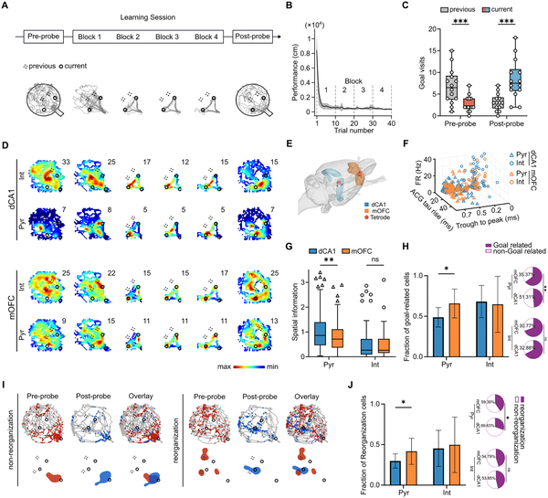
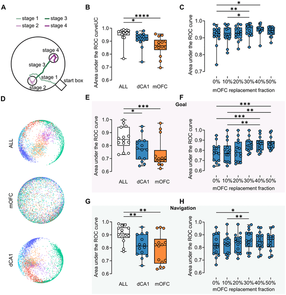
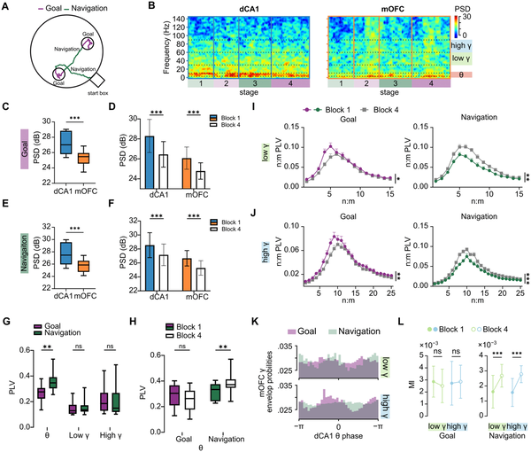
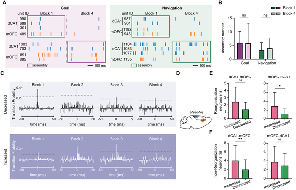

Imagine you’re navigating a new city, trying to find a friend’s house whose location changes every day. Your brain must quickly update your mental map and switch goals on the fly. How does it manage this remarkable flexibility? Recent research sheds light on this question by studying how two brain regions—the medial orbitofrontal cortex and the dorsal CA1 hippocampus—work together to guide flexible goal-directed navigation.

> **TL;DR**
> - Rats rapidly learn new goal locations on a maze, showing flexible navigation and memory retention.
> - Coordinated neural rhythms and complementary activity patterns in the medial orbitofrontal cortex and dorsal CA1 support updating and maintaining these flexible goal memories.

Goal-directed navigation is a fundamental cognitive ability that requires integrating where you are with where you want to go. The dorsal CA1 region of the hippocampus is known for creating detailed spatial maps, while the medial orbitofrontal cortex (mOFC) contributes to representing goals and expected outcomes. However, how these two regions coordinate their activity to enable rapid learning and flexible updating of goals was not well understood. This study used a clever maze task where rats had to find two new hidden reward locations each day, allowing researchers to observe how brain activity changes as animals learn and remember new goals.

Researchers implanted electrodes in both the dorsal CA1 (dCA1) hippocampus and the medial orbitofrontal cortex (mOFC) of rats. The rats performed a daily task on a cheeseboard maze where the rewarded goal locations changed every day. Each session included a pre-learning probe without rewards, a learning phase with 40 trials to find two new hidden goals, and a post-learning probe to test memory retention. Neural activity was recorded simultaneously from both brain regions throughout. The team analyzed single-neuron firing patterns, population-level activity, and rhythmic synchronization between regions, focusing on theta and gamma brain waves. They also developed a computational model to explore how dynamic synaptic changes might support flexible learning.

The study found that rats quickly learned new goal locations and retained this memory after training. Neurons in both dCA1 and mOFC encoded goal-related information but in different ways: dCA1 cells showed precise spatial tuning, reflecting ‘where am I?’ in the environment, while mOFC neurons showed more dynamic updating related to learning the new goals, reflecting ‘where am I going?’ Importantly, combining activity from both regions improved decoding of the animal’s behavioral stage and learning progress, highlighting their complementary roles. During navigation, the two regions exhibited stronger synchronization in the theta frequency range and enhanced theta-gamma coupling compared to goal periods. The computational model supported the idea that dynamic coordination between these regions’ neural rhythms could underlie efficient acquisition and flexible updating of goal information.

This work advances our understanding of how the brain integrates stable spatial maps with changing goal information to support flexible navigation—a critical ability for adapting to new environments. By revealing complementary roles of the hippocampus and orbitofrontal cortex and their coordinated rhythmic activity, the study provides a mechanistic framework for how flexible goal learning occurs in real time. These insights could inform future research on cognitive disorders involving navigation and memory deficits, such as Alzheimer’s disease, and inspire new approaches to artificial intelligence systems that require flexible goal updating.

While the findings are compelling, they come from recordings in rats performing a specific maze task, so caution is needed when generalizing to humans or other types of flexible learning. The study focuses on two brain regions, but navigation and goal learning involve broader networks that were not recorded here. Additionally, the computational model captures qualitative features but does not yet provide a full quantitative account of the underlying neural mechanisms. Further studies will be needed to explore how these dynamics interact with other brain areas and in different behavioral contexts.

## Figures

*Rats quickly learned new goal spots on a cheeseboard task, shown by shorter paths and more visits to current goals after training.*

*Brain areas mOFC and dCA1 work together to guide navigation through different stages of a goal-directed task.*

*Brain waves in specific regions change during goal-directed learning as animals navigate and reach target spots.*

*Learning changes how brain regions dCA1 and mOFC coordinate neuron activity during navigation and goal tasks over time.*

## Sources

- [Flexible goal learning involves coordinated population activity in dCA1 and medial orbitofrontal cortex](https://journals.plos.org/plosbiology/article?id=10.1371/journal.pbio.3003824)
- DOI: [10.1371/journal.pbio.3003824](https://doi.org/10.1371/journal.pbio.3003824)
