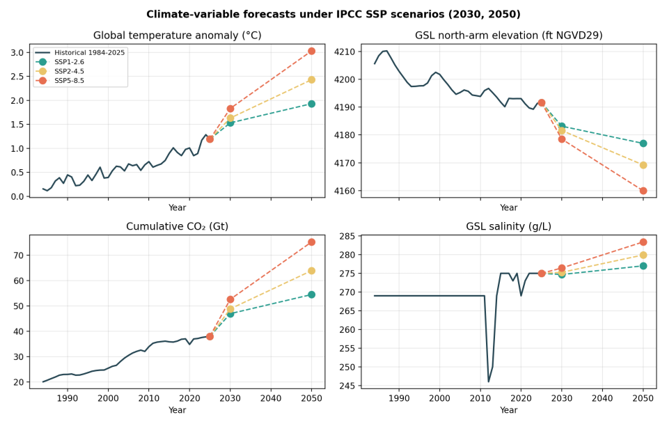
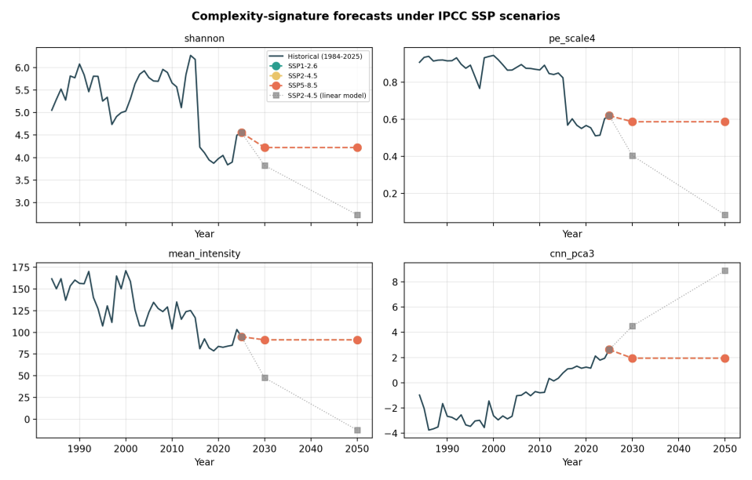
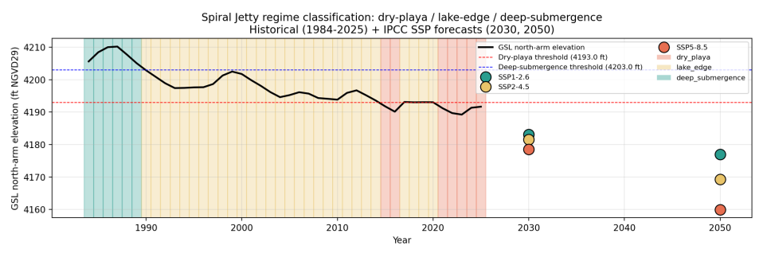

What will famous land art look like as climate change reshapes the environment? Robert Smithson’s Spiral Jetty, a monumental earthwork embedded in Utah’s Great Salt Lake, serves as a unique marker of environmental shifts. By combining satellite imagery, climate projections, and cutting-edge AI, researchers are now forecasting how this iconic artwork’s appearance may change by 2030 and 2050 under different climate futures.

> **TL;DR**
> - The study integrates decades of satellite data with climate model projections to predict the Great Salt Lake’s water levels and salinity, which directly influence Spiral Jetty’s exposure and visual complexity.
> - Using AI-driven image synthesis conditioned on climate forecasts, the research generates plausible visualizations of Spiral Jetty’s future states, highlighting the intersection of art, environment, and technology.

*Note: this summary is based on a preprint — research shared ahead of formal peer review.*

Robert Smithson’s Spiral Jetty, created in 1970, is a massive coil of rocks and earth extending into Utah’s Great Salt Lake. Its visibility and texture depend heavily on the lake’s water level and salinity, which fluctuate with hydroclimatic conditions. Over 40 years of satellite images have shown that the artwork’s visual complexity correlates strongly with environmental factors such as lake elevation and regional temperature. This makes Spiral Jetty not only a piece of land art but also a remote-sensing indicator of climate dynamics.

The research employs a two-stage forecasting pipeline. First, it uses linear regressions to relate regional climate variables—like lake elevation, temperature, and salinity—to global temperature anomalies projected by the IPCC’s Shared Socioeconomic Pathways (SSP) for 2030 and 2050. Second, it forecasts image complexity features derived from satellite data using both linear and Random Forest models to capture trends and regime shifts. Finally, the study fine-tunes a state-of-the-art AI image generator, Stable Diffusion XL, conditioned on these climate forecasts and hydrological masks, to produce ensembles of future Spiral Jetty images representing different climate scenarios.

The forecasts consistently indicate that the Great Salt Lake’s north arm will drop below the threshold that submerges Spiral Jetty, leaving the artwork fully exposed on a dry salt flat by 2030 across all climate scenarios. The Random Forest models show that the visual complexity of the site will saturate in a ‘dry-playa’ regime, reflecting a stark environmental shift from earlier decades. AI-generated images conditioned on these projections are expected to reveal a landscape increasingly dominated by dryness and salt crust, rather than water, marking a dramatic transformation in Spiral Jetty’s appearance.

This study exemplifies a novel interdisciplinary approach, merging climate science, remote sensing, and generative AI to forecast the future of cultural heritage sites under environmental stress. By visualizing how climate change may alter the appearance of a landmark artwork, it raises awareness about the broader impacts of climate shifts on cultural and natural landscapes. The methodology also offers a framework for anticipating changes at other vulnerable land-art sites, aiding conservation planning and public engagement.

While the climate forecasts rely on established IPCC scenarios and a robust 42-year satellite data record, the projections extend beyond historical climate conditions, introducing uncertainties inherent in extrapolation. The AI-generated images, though grounded in data and physics-informed conditioning, remain speculative and require further validation. The study carefully separates empirical climate forecasting from generative visualization, acknowledging that the latter is a form of informed artistic speculation rather than definitive prediction.

## Figures

*Global temperature, lake elevation, CO2, and salinity trends from 1984 to 2050 show Great Salt Lake dropping below Spiral Jetty's dry-playa level by 2030. — Figure from Alev Cinbarci and Sean Kalaycioglu, [CC BY 4.0](http://creativecommons.org/licenses/by/4.0/), caption edited.*

*Predictions show climate complexity hitting a stable 'dry-playa' state by 2030 and 2050 across scenarios, with some models diverging in forecasts. — Figure from Alev Cinbarci and Sean Kalaycioglu, [CC BY 4.0](http://creativecommons.org/licenses/by/4.0/), caption edited.*

*Spiral Jetty's water levels from 1984 to 2050 show drying trends, with future forecasts predicting increasingly dry conditions under higher emissions. — Figure from Alev Cinbarci and Sean Kalaycioglu, [CC BY 4.0](http://creativecommons.org/licenses/by/4.0/), caption edited.*

## Sources

- [Forecasting Land Art Under Climate Scenarios](https://arxiv.org/abs/2607.28489)
- DOI: [10.48550/arxiv.2607.28489](https://doi.org/10.48550/arxiv.2607.28489)

*This article reuses and adapts text and figures from the original research by Alev Cinbarci and Sean Kalaycioglu, available via arXiv Mathematics, under the [CC BY 4.0](http://creativecommons.org/licenses/by/4.0/) license.*
