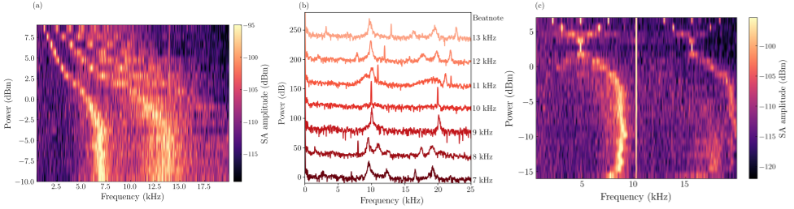
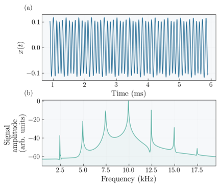
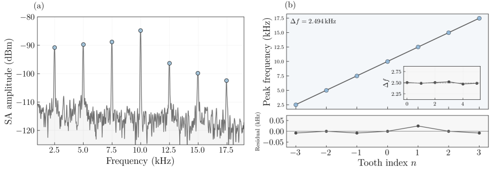
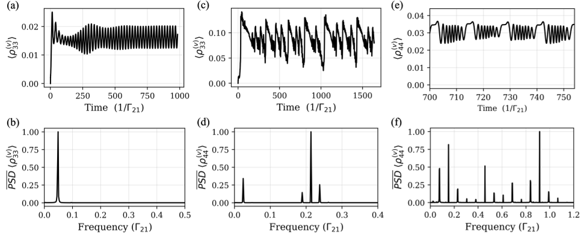

Imagine a crystal that doesn’t just have a repeating pattern in space, like the facets of a diamond, but also a rhythm in time—a ticking quantum clock that keeps oscillating without external prompting. These exotic states, known as time crystals, have fascinated physicists for their unusual symmetry-breaking in time rather than space. Recently, scientists have taken a leap forward by creating such time crystals in a gas of cesium atoms excited to Rydberg states and driven by radio-frequency fields. Not only do these atomic ensembles exhibit persistent oscillations, but they also generate frequency combs—spectral patterns akin to a quantum music spectrum—opening new windows into quantum synchronization and nonlinear dynamics.

> **TL;DR**
> - Cesium Rydberg atoms driven by lasers and radio-frequency fields form a driven-dissipative time crystal, exhibiting stable, self-sustained oscillations intrinsic to the system.
> - Applying RF fields tunes the oscillation frequencies and leads to the emergence of frequency combs, revealing complex synchronization and nonlinear mixing in the atomic ensemble.

*Note: this summary is based on a preprint — research shared ahead of formal peer review.*

Conventional crystals break spatial symmetry by repeating their structure in space. Time crystals, by contrast, break time-translation symmetry, meaning their properties oscillate periodically in time without external periodic forcing. This phenomenon was theorized and later observed in various quantum systems far from equilibrium, where many interacting particles collectively synchronize their dynamics. Rydberg atoms—atoms excited to high-energy states with exaggerated properties—are a versatile platform for exploring such nonequilibrium quantum phases due to their strong interactions and controllable dissipation. Previous studies have shown time crystal behavior and synchronization in driven Rydberg systems, but tuning these oscillations with radio-frequency (RF) fields and observing frequency combs in warm atomic vapors remained unexplored until now.

The researchers used a cesium vapor cell heated to 50°C and illuminated it with two lasers to excite atoms from their ground state to a high-lying Rydberg state via a two-photon transition. One laser probed the cesium D2 transition at 850 nm, while the other coupled atoms to the Rydberg state at 510 nm. The beams counter-propagated to reduce Doppler broadening and overlapped inside the vapor cell. A radio-frequency field near 5.73 GHz was applied via a horn antenna to drive transitions between Rydberg levels and modulate the system. The transmitted probe light was monitored with a photodetector, and its intensity fluctuations were analyzed in both time and frequency domains. By varying laser powers, detunings, and RF field strengths, the team explored the nonlinear optical response and emergent oscillations of the atomic ensemble.

At low coupling laser powers, the system showed a typical electromagnetically induced transparency (EIT) peak. Increasing the coupling strength led to nonlinear effects and bistability, where the system could reside in two distinct states. Beyond a threshold, the atoms exhibited self-sustained oscillations in probe transmission, signaling the formation of a dissipative time crystal phase. These oscillations evolved from nearly sinusoidal to strongly anharmonic waveforms as laser detuning increased. Applying an RF field allowed continuous tuning of the oscillation frequency through Stark shifts of the Rydberg levels. At higher RF powers, multiple frequency components emerged, forming a comb-like spectrum with regularly spaced peaks. Introducing a second RF tone enabled heterodyne detection, revealing intermodulation products and injection locking phenomena, where the atomic oscillations synchronized with the RF beatnote. The experimental observations were quantitatively captured by a four-level mean-field model and related to classical nonlinear oscillator behavior, such as that described by the Van der Pol oscillator.

This work demonstrates a tunable driven-dissipative time crystal in a warm Rydberg vapor, a platform that is experimentally accessible and rich in many-body quantum dynamics. The ability to control intrinsic oscillations with RF fields and generate frequency combs opens new avenues for studying nonequilibrium phases of matter and synchronization phenomena in quantum systems. Frequency combs are valuable tools in precision measurement and spectroscopy, and their emergence here suggests potential applications in quantum sensing and information processing. Moreover, the connection between quantum time crystals and classical nonlinear oscillators provides a conceptual bridge that could inspire new theoretical and experimental explorations of complex quantum dynamics.

While the experiments reveal clear signatures of time-crystalline order and frequency comb generation, the system operates under driven-dissipative conditions in a warm vapor, which introduces decoherence and thermal effects absent in ultracold atomic setups. The observed phenomena depend sensitively on laser parameters, atomic density, and RF field configurations, requiring careful calibration. Immediate practical applications are not the focus of this study; rather, it advances fundamental understanding of nonequilibrium quantum phases. Further work is needed to explore coherence times, scalability, and potential integration with quantum technologies.

## Figures

*Maps show how oscillation frequency and signal strength change with RF power, highlighting stable phases and mixed frequencies near 10 and 20 kHz. — Figure from Dixith Manchaiah et al., [CC BY 4.0](http://creativecommons.org/licenses/by/4.0/), caption edited.*

*(a) Oscillator's motion over time and (b) its frequency pattern showing a comb-like structure. — Figure from Dixith Manchaiah et al., [CC BY 4.0](http://creativecommons.org/licenses/by/4.0/), caption edited.*

*Figure 4 shows a comb-like signal pattern and its frequency spacing, with data fitting and error analysis for different signal peaks. — Figure from Dixith Manchaiah et al., [CC BY 4.0](http://creativecommons.org/licenses/by/4.0/), caption edited.*

*Simulations show how atomic populations oscillate and form frequency patterns with and without applied radio signals, matching experimental results. — Figure from Dixith Manchaiah et al., [CC BY 4.0](http://creativecommons.org/licenses/by/4.0/), caption edited.*

## Sources

- [Frequency Comb Behavior of Time Crystals in an RF-Driven Dissipative Rydberg System](https://arxiv.org/abs/2603.12170)
- DOI: [10.1103/fg8f-q4rs](https://doi.org/10.1103/fg8f-q4rs)

*This article reuses and adapts text and figures from the original research by Dixith Manchaiah et al., available via Phys. Rev. Research 8, 033115,2026, under the [CC BY 4.0](http://creativecommons.org/licenses/by/4.0/) license.*
