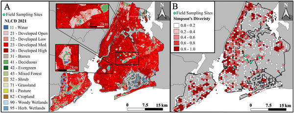
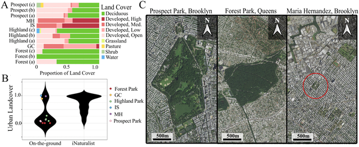
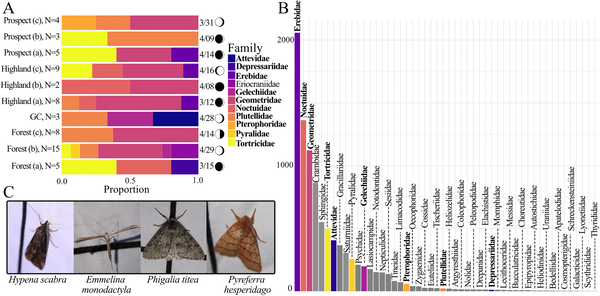
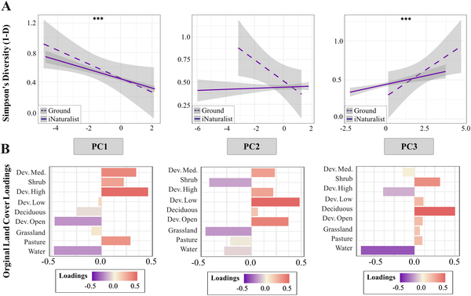

Discover how New York City's bright lights are changing the secret world of moths at night. While the city’s towering skyscrapers and bustling streets are symbols of urban life, a quieter, often overlooked community thrives in the shadows—the moths. These nocturnal insects play vital roles in ecosystems, yet their diversity and survival are increasingly threatened by urbanization. What does the moth community look like amid the concrete and neon glow of the city? And how can we protect these hidden residents?

> **TL;DR**
> - Moth diversity in New York City’s parks declines with increased urban development and artificial light at night.
> - Maintaining urban vegetation and reducing light pollution are key to preserving nocturnal moth biodiversity in cities.

Urbanization is a major driver of biodiversity loss worldwide, affecting many species including insects. Moths, which are closely related to butterflies but mostly active at night, serve as important indicators of environmental health. Despite their ecological significance—pollinating plants, serving as food for other animals, and contributing to nutrient cycling—moths have received less attention in urban biodiversity research compared to their daytime counterparts. New York City, with its dense development, intense artificial lighting, and fragmented green spaces, presents a challenging environment for moths. Understanding how these factors influence moth communities is essential for urban conservation efforts.

Researchers combined two complementary approaches to study moth biodiversity across New York City. First, they analyzed over 9,000 citizen science observations from iNaturalist, a platform where community members upload species sightings. These records spanned the entire city and multiple years, providing a broad spatial and temporal overview. To ground-truth and enrich these data, scientists conducted nighttime field surveys at twelve locations within six parks across Brooklyn and Queens. Using light traps—white sheets illuminated by ultraviolet and visible lights—they attracted and photographed moths over one-hour periods shortly after dusk. Alongside species identification, they measured environmental variables including artificial light intensity, air pollution, temperature, and humidity. They also assessed land cover around sampling sites using satellite data, categorizing areas by vegetation type and degree of urban development. Statistical models, including structural equation modeling, helped disentangle direct and indirect effects of urban features on moth diversity.

The study revealed a clear pattern: moth diversity decreases as urban development intensifies and artificial light increases. Parks with more deciduous tree cover and open land supported richer moth communities, while heavily built-up areas had fewer species. Importantly, the structural equation model showed that urbanization not only directly reduces moth diversity but also indirectly harms it by diminishing green spaces and tree cover. Interestingly, developed open spaces like lawns and parks did not directly lower diversity and might even support moths when associated with vegetation. The citizen science data and field surveys complemented each other, with some species detected only in the field, highlighting the value of combining data sources. These findings underscore the sensitivity of nocturnal moths to urban environmental changes, particularly light pollution and habitat loss.

This research sheds light on the hidden nocturnal biodiversity within one of the world’s largest cities, emphasizing the ecological importance of urban green spaces. By demonstrating how artificial light and urban development shape moth communities, the study provides actionable insights for city planners and conservationists. Efforts to reduce nighttime lighting in parks, preserve and increase tree cover, and maintain open vegetated areas can help sustain moth populations and the vital ecosystem services they provide. Moreover, engaging citizen scientists proved invaluable for mapping biodiversity across a complex urban landscape, illustrating how community involvement can support urban ecology research.

While comprehensive, the study has some limitations. The field surveys were limited to a two-month period and twelve sites, which may not capture full seasonal or spatial variation in moth diversity. The citizen science data, though extensive, can be biased toward more accessible or popular areas and may miss less conspicuous species. Additionally, the complex interplay of urban factors such as air pollution and microclimate requires further investigation to fully understand their impacts. Nonetheless, the combined approach offers robust evidence of urbanization’s effects on moths and highlights areas for future research.

## Figures

*Map showing 12 NYC sites where moths were studied and areas with different moth species diversity based on citizen science data.*

*This figure shows land types around sampling sites, urban land proportions, and satellite images of locations in Brooklyn and Queens, NY.*

*This figure shows moth family diversity from field sampling and iNaturalist data, including counts, survey dates, moon phases, and photos of moths.*

*Fig 4 shows how land types like urban areas, forests, and open spaces relate to biodiversity, with strong statistical confidence.*

## Sources

- [From concrete to canopy: Illuminating moth biodiversity in New York City’s urban jungle](https://journals.plos.org/plosone/article?id=10.1371/journal.pone.0342856)
- DOI: [10.1371/journal.pone.0342856](https://doi.org/10.1371/journal.pone.0342856)
