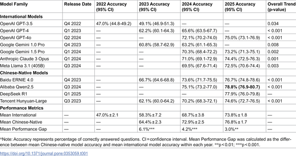
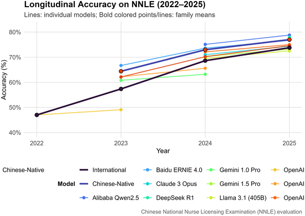
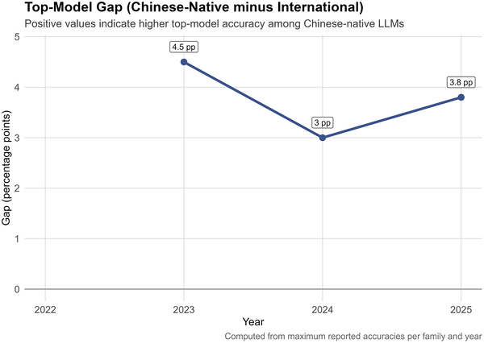

Can artificial intelligence pass a professional nursing licensing exam? Over the past three years, researchers have put some of the world’s leading large language models (LLMs) to the test on China’s National Nurse Licensing Examination (NNLE). The results reveal impressive gains in knowledge recall but also persistent gaps when it comes to complex clinical reasoning — a crucial skill for safe and effective nursing care.

> **TL;DR**
> - From 2022 to 2025, top AI language models improved dramatically on the Chinese nurse licensing exam, with accuracy rising from about 47% to nearly 79%, surpassing the approximate passing threshold.
> - Despite gains, AI models still struggle with clinical judgment tasks like prioritizing nursing interventions, showing that exam success does not equate to readiness for autonomous clinical practice.

The nursing profession demands more than memorized facts — it requires nuanced clinical decision-making, ethical reasoning, and patient-centered care. China’s National Nurse Licensing Examination (NNLE) is designed to assess both foundational nursing knowledge and practical skills through realistic, clinically oriented questions. This exam provides a unique opportunity to evaluate how AI models, trained on vast amounts of text, perform not only in recalling information but also in applying it to complex healthcare scenarios. While previous studies have shown AI passing medical licensing exams, nursing’s distinct emphasis on holistic care and judgment calls for a focused investigation.

Researchers compiled a large dataset of 9,800 multiple-choice questions from NNLE exams administered between 2022 and 2025. They tested 15 leading large language models — including international models like OpenAI’s GPT series and Google’s Gemini, as well as Chinese-native models such as Baidu’s ERNIE and Alibaba’s Qwen. Each model was evaluated only on exam questions released after the model’s launch, ensuring fair comparisons over time. The team measured raw accuracy and analyzed performance trends, differences between Chinese-native and international models, and error types, especially focusing on clinical reasoning challenges.

The study found a clear upward trajectory in AI performance, with top models improving from 47% accuracy in 2022 to 78.8% in 2025 — crossing the approximate passing threshold of the NNLE. Chinese-native models consistently outperformed international counterparts, though the performance gap narrowed over time. Models excelled in the Professional Practice section, which tests nursing knowledge, achieving an average accuracy of 81.6%. However, performance was lower in the Practical Skills section, which requires applying knowledge to clinical scenarios, with an average accuracy of 70.9%. Nearly half of the errors made by top models involved clinical reasoning failures, particularly in prioritizing nursing interventions — a complex judgment task critical to patient safety.

These results highlight that while AI language models have acquired substantial nursing knowledge, they remain limited in replicating the nuanced clinical judgment essential to nursing practice. The study underscores the distinction between passing a knowledge-based exam and demonstrating readiness for real-world patient care. For educators, healthcare professionals, and AI developers, this research provides valuable insights into where AI can support nursing education and where human expertise remains indispensable. It also illustrates the importance of culturally and linguistically tailored AI models, as Chinese-native systems showed consistent advantages.

It is important to note that exam performance alone does not indicate clinical competence or the ability to practice autonomously. The NNLE questions exclude visual data like medical images, which are integral to many clinical decisions. Moreover, AI models were tested in zero-shot settings without specialized training on nursing scenarios, which may limit their reasoning capabilities. Finally, the study focuses on the Chinese nursing context, so findings may not directly generalize to other countries or healthcare systems. Continued research is needed to explore how AI can safely and effectively augment nursing education and practice.

## Figures

*Performance of large language models on China's nurse licensing exam from 2022 to 2025.*

*Large language models improved steadily from 2022 to 2025 on China's nurse exam, with Chinese-native models leading and all top models passing by 2024.*

*Chinese-native models outperformed international ones by 3-4.5% from 2023-2025, showing the value of local language and culture tuning.*

## Sources

- [From knowledge to judgment: A three-year longitudinal analysis of artificial intelligence large language model performance on the Chinese national nurse licensing examination](https://journals.plos.org/plosone/article?id=10.1371/journal.pone.0353059)
- DOI: [10.1371/journal.pone.0353059](https://doi.org/10.1371/journal.pone.0353059)
