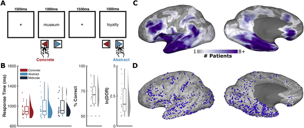
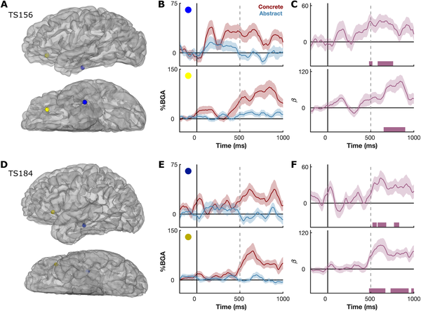

Have you ever wondered how your brain instantly knows whether a word like “apple” refers to something tangible you can see and touch, while a word like “justice” points to an abstract idea? This rapid ability to judge word meaning is fundamental to language comprehension, yet the precise brain mechanisms behind it have remained elusive. A recent study using rare intracranial brain recordings and targeted brain stimulation sheds light on how specific brain regions work together in real time to support these quick judgments.

> **TL;DR**
> - Concrete words activate a network spanning frontal and ventrotemporal brain regions, while abstract words engage lateral posterior temporal cortex.
> - Bidirectional communication between these brain areas forms a causal cascade that transforms visual word forms into conceptual meaning, as shown by brain stimulation disrupting this process.

Understanding how the brain represents the meaning of words—especially distinguishing concrete concepts like “table” from abstract ones like “decision”—has challenged neuroscientists for decades. Previous studies often relied on non-invasive imaging methods that lack the fine temporal and spatial resolution needed to capture the rapid neural dynamics involved. Moreover, it has been unclear which brain regions causally contribute to these semantic distinctions, rather than simply being correlated with them. This study leverages intracranial recordings from patients undergoing epilepsy surgery, offering a rare window into the brain’s electrical activity with millisecond precision, alongside electrical stimulation to test causal roles.

Nineteen neurosurgical patients with epilepsy participated in a task where they read single words and judged whether each word referred to something concrete (perceivable) or abstract. Researchers recorded broadband gamma activity—a marker of local cortical processing—from over 2,000 electrodes implanted across the patients’ left hemispheres. They analyzed brain responses to concrete, abstract, and “midscale” words that lie between these categories (e.g., “profit”). Additionally, in five patients, targeted electrical stimulation was applied to key brain regions to test whether disrupting these areas impaired the ability to judge word concreteness.

The study found that concrete words elicited stronger high-frequency activity in a network including ventrotemporal cortex (especially the mid-fusiform gyrus) and frontal regions such as the inferior frontal gyrus and orbitofrontal cortex. Abstract words showed greater activation in lateral posterior middle temporal cortex. Importantly, analyses of directional connectivity revealed bidirectional communication between frontal and temporal regions, suggesting a dynamic cascade: early visual-linguistic integration in ventrotemporal cortex sends information forward to frontal hubs, which then send feedback to temporal areas to integrate conceptual features. Brain stimulation of ventrotemporal and inferior frontal regions disrupted concreteness judgments, confirming their causal role. Words with intermediate concreteness ratings activated similar networks but did not show neural activity modulated by participants’ subjective judgments.

This research provides a mechanistic, systems-level account of how the human brain rapidly transforms written words into grounded conceptual meanings. By combining intracranial recordings with causal brain stimulation, the study moves beyond correlational findings to demonstrate the essential role of frontotemporal network interactions in semantic processing. These insights deepen our understanding of language comprehension and could inform future research on language disorders where semantic processing is impaired.

While the study offers powerful causal evidence, it was conducted in patients with epilepsy whose brain function may differ somewhat from the general population. The task focused on single-word judgments, which may not capture the full complexity of language processing in natural contexts. Additionally, the “midscale” words that blend concrete and abstract features showed neural patterns that were less clearly modulated by subjective judgments, highlighting the challenge of categorizing semantic concepts that lie on a continuum. Further research is needed to explore how these findings generalize to broader language use and to other populations.

## Figures

*Patients judged word concreteness while brain activity was recorded from 2,241 electrodes, highlighting active areas during 300–700ms after word onset.*

*Brain activity in two patients shows different responses to concrete vs. abstract words, highlighting key brain areas involved.*

## Sources

- [Frontotemporal network interactions causally support rapid concreteness judgments during reading](https://journals.plos.org/plosbiology/article?id=10.1371/journal.pbio.3003723)
- DOI: [10.1371/journal.pbio.3003723](https://doi.org/10.1371/journal.pbio.3003723)
