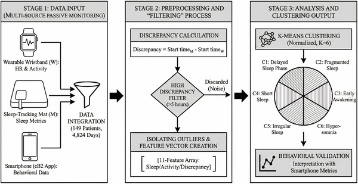

Have you ever noticed that your smartwatch and sleep mat sometimes tell very different stories about your night’s rest? While these disagreements might seem like annoying measurement errors, a recent study suggests they could actually reveal important clues about sleep behaviors associated with common mental disorders. By looking beyond the usual assumption that device discrepancies are just noise, researchers have uncovered distinct sleep patterns that might help clinicians better understand and monitor mental health.

> **TL;DR**
> - Discrepancies between two consumer sleep trackers—a wristband and a sleep mat—can serve as behavioral signals rather than mere measurement errors.
> - Analyzing these disagreements revealed six distinct full-day sleep behavior patterns in patients with common mental disorders, some indicating oversleeping or unusual sleep timing.

Sleep disturbances are closely linked to mental health conditions such as anxiety and depression. Traditionally, researchers have relied on self-reports or single-device sleep data, which can be limited by recall bias or sensor inaccuracies. Consumer sleep trackers have become popular tools for monitoring sleep, but their measurements often differ, especially in people with disrupted sleep. Instead of dismissing these differences as errors, the study’s authors hypothesized that they might reflect real behavioral variations, offering a new window into the complex sleep patterns seen in mental health disorders.

The study involved 149 patients diagnosed with non-severe common mental disorders, mostly women aged 18 to 71, monitored over three months. Each participant used two sleep-tracking devices simultaneously: a wristband tracker worn on the wrist and a sleep mat placed under the mattress. The wristband uses accelerometers and heart rate sensors to estimate sleep, while the mat relies on pressure and sound sensors to detect when the person is in bed. Researchers collected nearly 5,000 days of paired sleep data and focused on days where the two devices disagreed on sleep start times by more than five hours—a discrepancy too large to be random error. Using cluster analysis, they identified six distinct patterns of sleep behavior reflected in these disagreements. Additional data such as daily step counts and smartphone usage helped validate these patterns as behaviorally meaningful.

The analysis revealed six robust sleep behavior patterns characterized by large discrepancies between the wristband and mat data. These included signs of oversleeping, unintended sleep episodes outside the bed, and atypical sleep-wake cycles spanning the full 24-hour day. Importantly, these patterns were consistent within individuals over time, suggesting they represent genuine behavioral traits rather than random noise. For example, some patients showed prolonged periods of rest detected by the wristband but not by the mat, indicating sleep or rest occurring away from the bed. Others exhibited unusual timing of sleep onset or fragmented sleep periods. These insights provide a more holistic view of sleep-related behavior in people with mental health conditions.

By reinterpreting discrepancies between consumer sleep devices as meaningful behavioral signals, this study opens new avenues for passive, continuous monitoring of sleep health in mental disorders. Such multi-device approaches could improve early detection of pathological changes like depressive episodes and help clinicians tailor treatments by identifying behavioral side effects. The findings also highlight the value of integrating multiple sensor types to capture the complexity of sleep and rest patterns beyond traditional in-bed measurements. Ultimately, this research suggests that the quirks in your wearable devices might hold clinically relevant information about your mental health.

While promising, these findings come with some limitations. The study focused on non-severe common mental disorders and excluded severe psychiatric conditions, so results may not generalize across all populations. The devices used differ in technology and accuracy, and the interpretation of discrepancies as behavioral signals requires further validation. Additionally, the analysis did not account for comorbidities or medication effects that might influence sleep patterns. Future research should explore how these behavioral sleep patterns relate to clinical outcomes and whether integrating more diverse data sources can enhance monitoring and intervention strategies.

## Figures

*Overview of the study process from data collection to analysis, showing key steps like cleaning and grouping the data.*

## Sources

- [Full-day sleep pattern analysis in common mental disorders: Leveraging highly discrepant recordings from two consumer tracking devices](https://journals.plos.org/plosone/article?id=10.1371/journal.pone.0346876)
- DOI: [10.1371/journal.pone.0346876](https://doi.org/10.1371/journal.pone.0346876)
