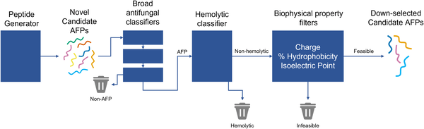
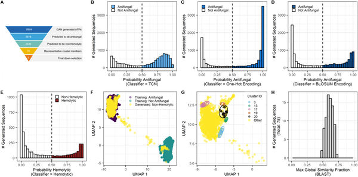

Fungal infections pose a growing threat to both global health and food security, yet developing new antifungal drugs remains a daunting challenge. What if artificial intelligence could speed up the discovery of novel antifungal agents? A recent study introduces Fung-AI, an AI-powered pipeline designed to generate and prioritize new antifungal peptides, offering a promising step toward tackling stubborn fungal pathogens with fewer side effects.

> **TL;DR**
> - Fung-AI uses a generative adversarial network to create thousands of novel peptide sequences predicted to have antifungal activity and low toxicity.
> - Experimental tests confirmed that several AI-designed peptides inhibit fungal pathogens relevant to agriculture and human health, with minimal harm to human cells.

Fungal pathogens cause millions of deaths annually and spoil a significant portion of crops worldwide. Unlike bacteria or viruses, fungi share many biological features with humans, making it difficult to develop drugs that selectively target fungi without damaging human cells. Currently, only a handful of antifungal drug classes exist, and resistance is on the rise. Antifungal peptides—short chains of amino acids—offer a promising alternative because they can attack fungi in diverse ways and may reduce the risk of resistance. However, the vast number of possible peptide sequences makes discovering effective candidates a complex and time-consuming task.

To address this, researchers developed Fung-AI, a computational pipeline that leverages a generative adversarial network (GAN) trained on known antifungal and non-antifungal peptides. This AI model generated nearly 10,000 new candidate peptides. These candidates were then filtered through multiple machine learning classifiers to predict antifungal activity and minimize potential toxicity, such as hemolytic effects on human cells. The peptides were further analyzed for biophysical properties and structural diversity. From this rigorous in silico screening, thirteen peptides were synthesized and experimentally tested against fungal pathogens including Fusarium graminearum, a wheat pathogen, and Candida species, which cause human infections. Cytotoxicity was also evaluated using human liver cells.

Out of the synthesized peptides, five showed mild antifungal activity against Fusarium graminearum, with inhibitory concentrations ranging from 250 to 500 micrograms per milliliter. Four of these also inhibited Candida albicans, a common human fungal pathogen. Notably, two peptides demonstrated low toxicity toward human liver cells, suggesting potential for further development. However, none of the peptides were effective against Candida auris, an emerging multidrug-resistant pathogen, highlighting the need for pathogen-specific optimization. These results validate that AI can generate novel antifungal peptides with promising activity and safety profiles, though further refinement is needed to enhance potency and spectrum.

This study demonstrates a proof-of-principle for using generative AI to accelerate antifungal drug discovery, a field urgently in need of new therapeutic options. By combining AI-driven design with experimental validation, Fung-AI offers a scalable strategy to explore vast peptide sequence spaces that would be impractical to search manually. The approach could ultimately contribute to protecting human health and global food supplies by providing new antifungal agents tailored to combat resistant fungal strains with minimal side effects.

While encouraging, the antifungal activity observed was moderate and limited to certain pathogens, indicating that these peptides are starting points rather than ready-to-use drugs. The high minimal inhibitory concentrations suggest that optimization is necessary to improve efficacy. Additionally, the lack of activity against Candida auris underscores the complexity of fungal diversity and resistance mechanisms. Future work will need to expand pathogen coverage, enhance peptide potency, and thoroughly assess safety in more complex biological systems before clinical or agricultural application.

## Figures

*Fung-AI finds safe, diverse antifungal peptides by screening candidates through multiple tests before lab testing their effectiveness and safety.*

*AI tools screened nearly 10,000 peptides to find 78 promising antifungal candidates with low harm, visualized and compared to known proteins.*

## Sources

- [Fung-AI: An AI/ML-driven pipeline for antifungal peptide discovery](https://journals.plos.org/ploscompbiol/article?id=10.1371/journal.pcbi.1014105)
- DOI: [10.1371/journal.pcbi.1014105](https://doi.org/10.1371/journal.pcbi.1014105)
