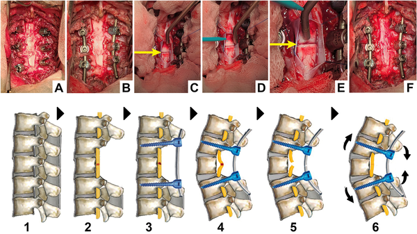
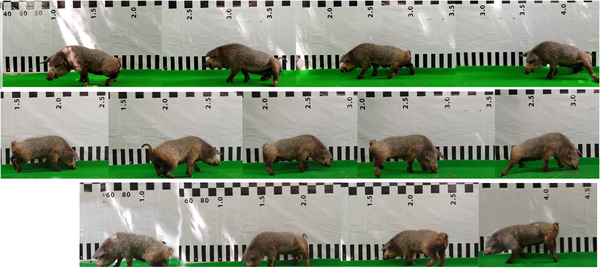
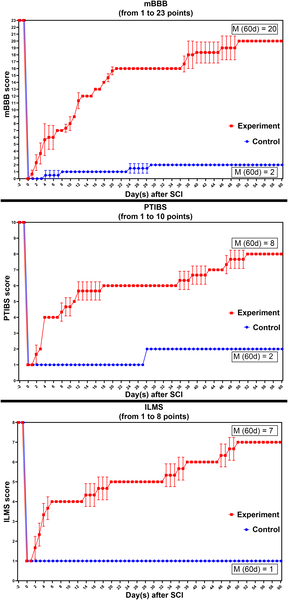
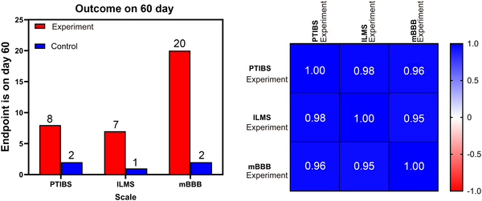

Imagine a spinal cord completely severed, a devastating injury that today means permanent paralysis. Now, picture a special gel applied at the injury site that helps reconnect nerve fibers, restoring sensation and movement. This is no longer just science fiction. Scientists have demonstrated in pigs that a novel fusogen sealant can promote functional and structural recovery after total spinal cord transection, opening new avenues for treating spinal cord injuries.

> **TL;DR**
> - A polyethylene glycol-chitosan conjugate gel applied to a completely severed spinal cord in pigs enabled significant recovery of motor and sensory function within 60 days.
> - Microscopic analysis showed nerve fibers crossing the injury site in treated animals, while untreated controls showed no such regeneration.

Spinal cord injuries are among the most disabling conditions, often resulting in permanent loss of movement and sensation below the injury site. Despite decades of research, effective clinical treatments to restore function after complete spinal cord transection remain elusive. The challenge lies in the complex biological response to injury, including scar formation and nerve degeneration, which block natural regeneration. Recent research has explored 'fusogens'—substances that can fuse severed nerve membranes—as a novel approach to repair injured axons directly, bypassing the need for regrowth.

In this study, researchers used Hungarian Mangalica pigs, a large animal model closer to humans than rodents, to test a newly synthesized fusogen gel made from polyethylene glycol and chitosan. The pigs underwent complete transection of the thoracic spinal cord, followed by spinal stabilization surgery. Three pigs received the gel applied directly to the injury gap, along with intravenous polyethylene glycol infusions, while two control pigs did not receive the treatment. Over 60 days, animals underwent rehabilitation and were regularly assessed for motor, sensory, and pelvic functions using established neurological scales. To track nerve regeneration, fluorescent tracers were injected below the injury site, and spinal cord tissue was analyzed postmortem using immunofluorescence microscopy.

The results were striking. Control pigs remained paraplegic with no return of sensation or movement. In contrast, treated pigs began showing signs of sensory recovery as early as two days after surgery. By the end of the study, all treated animals could stand upright and walk on all four limbs. Microscopic examination revealed nerve fibers crossing the injury site in treated animals, indicating that the fusogen gel facilitated reconnection of severed axons. These functional and morphological improvements were statistically significant, suggesting the gel’s potential to promote spinal cord repair.

This study represents a significant advance in spinal cord injury research by demonstrating that a fusogen sealant can induce meaningful recovery after complete spinal cord transection in a large animal model. The use of polyethylene glycol-chitosan conjugate gel offers a promising therapeutic strategy that could one day translate into treatments for human patients with devastating spinal injuries. By enabling direct fusion of severed nerve membranes, this approach bypasses the slow and often unsuccessful process of nerve regeneration, potentially restoring function more rapidly and effectively.

While these findings are encouraging, it is important to remember that this research is still at the preclinical stage with a small number of animals studied. The treatment’s safety, efficacy, and applicability in humans remain to be established through further studies and clinical trials. Additionally, the complex nature of human spinal cord injuries, which often involve more extensive damage and secondary complications, may pose challenges not fully captured in this experimental model. Nonetheless, this work lays important groundwork for future development of fusogen-based therapies.

## Figures

*Step-by-step surgery images show spinal access, cord cutting, gel repair, and final stabilization with screws and rods.*

*A pig's motor recovery after spinal injury improves from trying to stand on day 10 to better movement by day 40 with PEG-chitosan treatment.*

*Neurological scores over 60 days show recovery progress in experimental and control groups using three different movement and sensory tests.*

*Bar charts show average scores on three brain tests at day 60, with a correlation analysis of behavior scores on the right.*

## Sources

- [Fusogen-induced recovery of spinal cord function and morphology after complete transection](https://journals.plos.org/plosone/article?id=10.1371/journal.pone.0349579)
- DOI: [10.1371/journal.pone.0349579](https://doi.org/10.1371/journal.pone.0349579)
