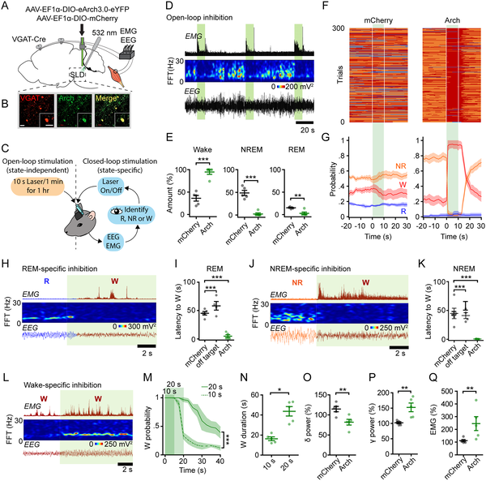
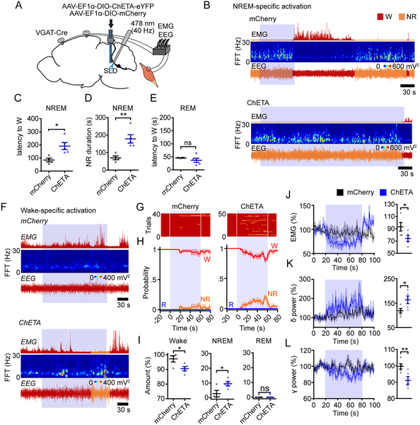
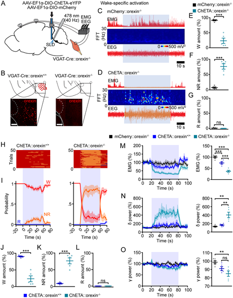

Imagine a switch in the brain that can flip you instantly from sleep to wakefulness or vice versa. Scientists have now discovered a specific group of neurons in the brainstem that act like this switch—silencing them wakes mice up rapidly, while activating them suppresses wakefulness. Even more intriguingly, these neurons play a critical role in narcolepsy, a disorder marked by sudden, uncontrollable sleep attacks.

> **TL;DR**
> - GABAergic neurons in the sublaterodorsal tegmental nucleus (SLD) suppress wakefulness and promote non-REM sleep in healthy mice.
> - In narcoleptic mice lacking orexin, activating these SLD GABA neurons triggers sudden sleep attacks, while silencing them prevents these pathological sleep intrusions.

The sleep-wake cycle is governed by complex neural circuits that balance wakefulness, non-REM (NREM), and REM sleep. The sublaterodorsal tegmental nucleus (SLD), a region in the brainstem, is well-known for its role in generating REM sleep. However, the function of its GABAergic neurons—neurons that release the inhibitory neurotransmitter GABA—has remained unclear. Understanding how these neurons influence sleep and wake states is especially important because disruptions in this balance underlie sleep disorders like narcolepsy, which causes sudden sleep attacks and muscle weakness during wakefulness.

Researchers used optogenetics, a technique that employs light to control genetically modified neurons, to selectively activate or silence SLD GABA neurons in mice. They implanted optic fibers and electrodes to monitor brain activity (EEG) and muscle activity (EMG), enabling precise measurement of sleep and wake states. Experiments were conducted in both healthy mice and narcoleptic mice genetically engineered to lack orexin, a neuropeptide critical for maintaining wakefulness. By turning these neurons on or off during specific sleep or wake states, the team could observe their direct effects on arousal and behavior.

Silencing SLD GABA neurons caused mice to rapidly awaken from sleep and increased brain and muscle activity associated with alertness. Conversely, activating these neurons suppressed wakefulness and prolonged NREM sleep without affecting REM sleep. Anatomical tracing revealed that SLD GABA neurons send projections to brain regions known to promote wakefulness, providing a pathway for their inhibitory effects. Crucially, in narcoleptic mice, activating SLD GABA neurons triggered sudden sleep attacks—rapid transitions from wakefulness to NREM sleep typical of narcolepsy—while silencing these neurons prevented both sleep attacks and episodes of muscle weakness (cataplexy).

This study clarifies the role of SLD GABA neurons as powerful suppressors of wakefulness and identifies them as a key player in the pathological sleep intrusions seen in narcolepsy. By demonstrating that manipulating these neurons can control sleep-wake transitions and mitigate narcoleptic symptoms, the research opens new avenues for developing targeted therapies for narcolepsy and potentially other sleep disorders. Understanding these neural circuits also advances our fundamental knowledge of how the brain orchestrates the delicate balance between sleep and wakefulness.

While these findings in mouse models are compelling, translating them to humans requires caution. The complexity of human sleep regulation and narcolepsy involves multiple brain regions and neurotransmitters beyond the SLD GABA neurons. Additionally, optogenetic methods used here are not yet applicable in clinical settings. Further research is needed to explore how these neurons interact with other sleep-wake circuits and to develop safe, targeted interventions for human patients.

## Figures

*Turning off specific brain neurons in mice helps them wake up faster from sleep, shown by brain activity and muscle recordings.*

*Activating specific brain neurons reduces wakefulness and alters sleep patterns in mice, shown by brain and muscle activity recordings.*

*Activating specific brain neurons in mice lacking orexin strongly reduces wakefulness and increases sleep, shown by brain activity and muscle recordings.*

## Sources

- [GABA neurons in the sublaterodorsal tegmental nucleus suppress wakefulness in healthy and narcoleptic mice](https://journals.plos.org/plosbiology/article?id=10.1371/journal.pbio.3003303)
- DOI: [10.1371/journal.pbio.3003303](https://doi.org/10.1371/journal.pbio.3003303)
