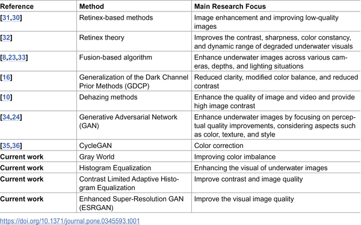
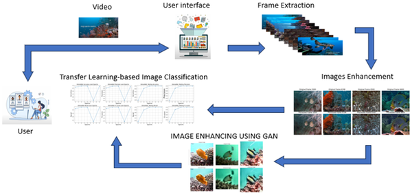
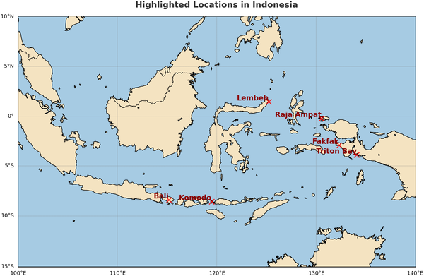

Underwater environments are some of the most mysterious and visually challenging places to explore. Murky waters, shifting light, and color distortions often blur the rich tapestry of marine life captured in underwater videos. But what if artificial intelligence could clear up these blurry images and help us identify the fish, coral, and turtles hidden beneath the waves? Recent research is doing just that—using AI to enhance underwater images and classify marine species, opening new doors for marine biology and conservation.

> **TL;DR**
> - AI techniques, including Generative Adversarial Networks (GANs), can significantly improve the clarity and color accuracy of underwater images.
> - Deep learning models trained via transfer learning can accurately classify marine species from enhanced underwater images, aiding ecological monitoring and conservation.

The ocean covers over 70% of our planet and hosts a vast diversity of life that plays critical roles in Earth's climate, oxygen production, and ecosystem health. Monitoring marine species like fish, coral reefs, and sea turtles helps scientists understand biodiversity, track environmental changes, and predict climate impacts. However, underwater video footage is notoriously difficult to analyze due to poor lighting, water turbidity, and color shifts caused by light absorption and scattering. Traditional manual analysis is slow and subjective, prompting researchers to explore automated methods that can handle large volumes of underwater data more efficiently.

In recent work, researchers tackled these challenges by developing a multi-step computational pipeline. They started by enhancing underwater images using algorithms like the Gray World method to correct color imbalances, and compared contrast enhancement techniques such as Histogram Equalization and Contrast Limited Adaptive Histogram Equalization (CLAHE). To further improve image detail, they applied an advanced AI technique called Enhanced Super-Resolution Generative Adversarial Network (ESRGAN), which is designed to sharpen and clarify noisy images. For species classification, the team used transfer learning on three powerful deep learning models—VGG16, ResNet50, and DenseNet121—pretrained on large datasets and fine-tuned to recognize fish, coral, and turtles from the enhanced images. Their dataset included high-resolution underwater videos from diverse Indonesian marine locations, complemented by challenging images from the LifeCLEF-2015 dataset.

The combination of traditional image processing and AI-based enhancement successfully improved the visual quality of underwater images, making features like fish shapes and coral textures more distinct. Among the classification models, DenseNet121 showed promising accuracy in identifying different marine species despite the challenges posed by imbalanced datasets and visually similar species. The use of ESRGAN helped recover finer details in low-quality frames, which in turn supported better classification results. Overall, this approach demonstrated that enhancing image quality before classification can significantly aid automated underwater species identification.

This research offers practical tools for marine biologists and environmental monitors by automating the enhancement and classification of underwater imagery. Improved image clarity and reliable species identification can accelerate biodiversity assessments, track ecosystem health, and inform conservation strategies. Moreover, these AI-driven methods hold potential for integration into underwater robotics and autonomous vehicles, enabling real-time monitoring in challenging marine environments. By making underwater data more accessible and interpretable, such advances contribute to our understanding and protection of vital ocean ecosystems.

While the AI techniques used here enhance image quality and classification accuracy, they are not without limitations. GAN-based enhancement can sometimes introduce artificial textures or color distortions that may mislead analysis. The datasets used also have imbalanced species representation, which can bias model performance toward more common species. Additionally, underwater environments vary widely, and models trained on specific regions may not generalize perfectly elsewhere. Continued development of larger, more diverse datasets and refinement of algorithms will be essential to improve robustness and reliability for broad ecological applications.

## Figures

*Table comparing different methods to improve underwater images for clearer and better visuals.*

*Diagram showing how underwater videos are enhanced and analyzed to identify objects using a classification model.*

*Map showing the locations of Indonesia's islands: Bali, Komodo, Raja Ampat, Lembeh, Fakfak, and Triton Bay.*

## Sources

- [GAN-based underwater image enhancement and scene classification using transfer learning](https://journals.plos.org/plosone/article?id=10.1371/journal.pone.0345593)
- DOI: [10.1371/journal.pone.0345593](https://doi.org/10.1371/journal.pone.0345593)
