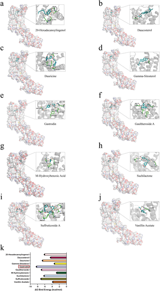

Epilepsy, a neurological disorder marked by recurrent seizures, affects millions worldwide and remains challenging to treat for many patients. Recent research shines a light on a natural compound from traditional Chinese medicine—gastrodin—that may help protect brain cells by calming the brain’s immune cells. But how does this ancient remedy work at the molecular level? Scientists have discovered that gastrodin targets a specific receptor on microglia, the brain’s resident immune cells, to reduce harmful inflammation and neuronal damage associated with epilepsy.

> **TL;DR**
> - Gastrodin, the active ingredient in Gastrodia elata, binds directly to the P2RY12 receptor on microglia, inhibiting their harmful activation and migration in epilepsy.
> - By blocking P2RY12-mediated signaling, gastrodin reduces neuroinflammation and neuronal injury in cell models of epilepsy, suggesting a potential new therapeutic strategy.

Epilepsy is more than just abnormal electrical activity in the brain; it involves complex biological processes including neuroinflammation. Microglia, the brain’s immune cells, play a central role in this inflammation by migrating to injury sites and releasing inflammatory molecules that can worsen seizures and brain damage. The P2RY12 receptor on microglia detects signals from damaged neurons and guides their migration. Excessive microglial activation through P2RY12 contributes to a vicious cycle of inflammation and neuronal injury in epilepsy. Current epilepsy treatments often fail to address these underlying inflammatory processes, leaving a significant need for new approaches.

Researchers combined bioinformatics, molecular docking simulations, and laboratory cell experiments to investigate how gastrodin interacts with microglial P2RY12. They analyzed gene expression data from epilepsy patients to identify key genes involved in disease progression, highlighting P2RY12 as a promising target. Using computer modeling, they demonstrated that gastrodin fits well into the binding site of P2RY12. In vitro, they created an epilepsy-like environment by treating human microglia and neuron-like cells with kainic acid, a chemical that induces seizure-like damage. They then tested how gastrodin affected microglial migration, inflammatory signaling, and neuronal health in this model.

The study found that gastrodin binds directly to the P2RY12 receptor, blocking its activation and downstream signaling pathways involved in microglial migration and inflammation. In the epilepsy cell model, gastrodin significantly reduced microglial movement toward injured neurons and prevented cytoskeletal changes necessary for migration. It also lowered the release of pro-inflammatory cytokines such as TNF-α and IL-1β, reduced calcium overload in neurons, and decreased neuronal cell death. Importantly, when P2RY12 expression was experimentally reduced, gastrodin’s protective effects were even stronger, confirming the receptor’s critical role in mediating these processes.

This research provides a clearer molecular understanding of how gastrodin, a compound from a traditional medicinal herb, can modulate microglial behavior to protect neurons in epilepsy. By targeting P2RY12, gastrodin interrupts a key pathway that drives harmful neuroinflammation and neuronal damage. These findings suggest that P2RY12 is a promising therapeutic target and that gastrodin or related compounds could inspire new treatments for epilepsy, especially for patients who do not respond well to current drugs. Moreover, this work bridges traditional medicine and modern molecular neuroscience, offering a scientific basis for the clinical use of Gastrodia elata.

While the results are promising, they are based on in vitro cell models and computational analyses. The complex environment of the human brain and the full spectrum of epilepsy’s pathology cannot be fully replicated in these models. Clinical studies are needed to confirm whether gastrodin’s effects translate to patients and to evaluate safety, dosage, and efficacy in humans. Additionally, P2RY12 is involved in normal brain immune functions, so long-term effects of its inhibition require careful assessment. Nonetheless, this study lays important groundwork for future research into novel epilepsy therapies.

## Figures

*Active compounds from Gastrodia elata bind to the P2RY12 protein, showing how they fit and interact, with their binding strengths measured.*

## Sources

- [Gastrodin alleviates neuronal damage in epileptic cell models by targeting P2RY12 to inhibit microglial hyperactivation](https://journals.plos.org/plosone/article?id=10.1371/journal.pone.0346877)
- DOI: [10.1371/journal.pone.0346877](https://doi.org/10.1371/journal.pone.0346877)
