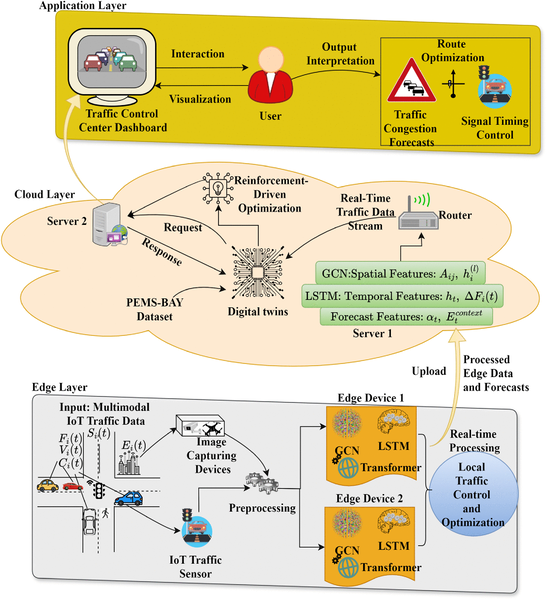
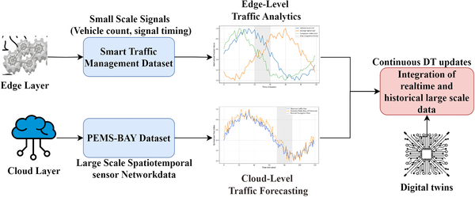
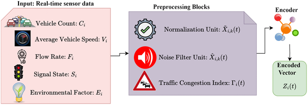

If you've ever sat at a red light wondering why the traffic signal doesn't seem to respond to the congestion around you, you're not alone. Traditional traffic systems often rely on fixed schedules or slow, centralized control that can't keep up with the ebb and flow of urban traffic. But what if traffic lights could anticipate jams before they happen and adjust themselves in real time to keep cars moving smoothly? Recent advances in artificial intelligence and digital twin technology are making this vision a reality.

> **TL;DR**
> - A new framework integrates edge computing, cloud-based digital twins, and AI models to forecast traffic and adapt signal timings in real time.
> - This system reduces average vehicle waiting times by 17%, demonstrating robust performance even with noisy or incomplete data.

Urban traffic networks are complex systems where vehicle flows change dynamically and unpredictably. Managing these networks efficiently requires understanding not just current traffic conditions but also predicting how congestion will evolve in the near future. Traditional traffic management systems often struggle because they rely on centralized processing and static signal timings, which can cause delays and inefficiencies. The rise of Internet of Things (IoT) sensors, edge computing, and cloud platforms has opened new possibilities to process traffic data closer to the source and coordinate adaptive control strategies across the city.

The framework, called GEC-DTSP, uses a combination of advanced AI techniques and a digital twin architecture. At the network edge, roadside sensors collect multi-source traffic data, which are processed locally on edge devices to predict traffic flow, vehicle density, and congestion states over multiple future time steps. This prediction leverages a hybrid model combining Graph Convolutional Networks (GCNs) to capture spatial relationships between roads, Long Short-Term Memory (LSTM) networks for short-term temporal patterns, and Transformer-based models for longer-range temporal dependencies. These predictions feed into a cloud-level Digital Twin Engine that maintains a continuously updated virtual replica of the traffic network by fusing real-time and historical data. Finally, a deep reinforcement learning module uses the forecasted traffic states to optimize traffic signal phases dynamically, aiming to minimize vehicle delays and maximize throughput. The entire system operates as a closed feedback loop, continuously updating and adapting based on new data.

Experimental evaluations of GEC-DTSP demonstrated a significant 17% reduction in average vehicle waiting times at intersections compared to baseline approaches. The traffic forecasting models showed improved accuracy measured by standard metrics like Mean Absolute Error (MAE) and Root Mean Square Error (RMSE). Notably, the system maintained robust performance even when input data were noisy or partially missing, highlighting its resilience in real-world conditions. The edge-cloud digital twin architecture enabled scalable, low-latency processing, crucial for timely adaptive control in busy urban environments.

This study showcases how integrating state-of-the-art AI models with edge-cloud digital twin technology can transform urban traffic management. By enabling real-time, predictive, and adaptive control of traffic signals, cities can reduce congestion, lower vehicle emissions, and improve commuter experiences. The framework’s scalability and robustness make it a promising candidate for deployment in smart city infrastructures worldwide. Moreover, the closed-loop design that tightly couples forecasting, simulation, and control represents a forward step toward truly intelligent transportation systems.

While the results are promising, the current implementation focuses on simulation and experimental datasets rather than full-scale real-world deployment. Some conceptual features like privacy-preserving collaborative learning and adaptive routing were proposed but not yet realized. Additionally, the complexity of integrating heterogeneous sensor networks and ensuring secure data synchronization across edge and cloud layers remains a challenge. Future work will need to address these practical considerations to fully harness the potential of AI-driven digital twins in urban traffic systems.

## Figures

*Diagram showing the overall design of the GEC-DTSP system and how its parts work together.*

*Diagram showing a layered system for managing traffic using data from Kaggle and PEMS-BAY datasets.*

*Fig 3 shows how data is prepared at edge nodes in the GEC-DTSP system for better processing.*

## Sources

- [GEC-DTSP: A GNN–RL-based Edge–Cloud Digital Twin framework for real-time traffic forecasting and adaptive signal control](https://journals.plos.org/plosone/article?id=10.1371/journal.pone.0350247)
- DOI: [10.1371/journal.pone.0350247](https://doi.org/10.1371/journal.pone.0350247)
