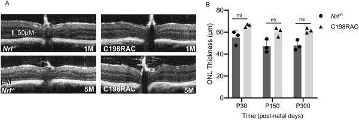
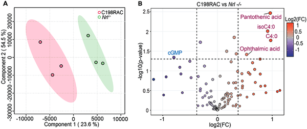
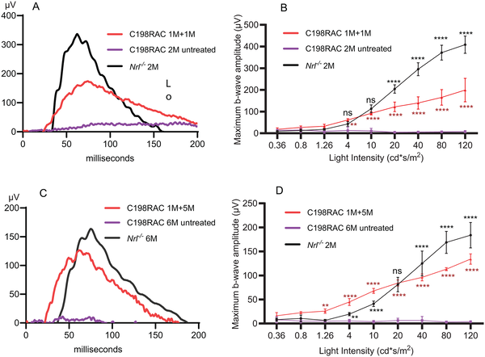
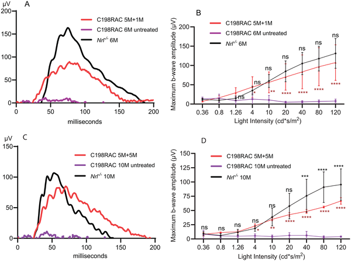

Imagine living in a world where color vision is severely limited or absent, where the vibrant hues of everyday life fade into muted shades. Blue Cone Monochromacy (BCM) is a rare inherited eye disorder that causes just this—loss of the cone cells responsible for detecting red and green light, leading to impaired color perception and reduced visual acuity. Now, scientists have developed a gene therapy that restores the function of these vital cone cells in a specially engineered mouse model, offering hope for future treatments that could one day restore color vision in humans.

> **TL;DR**
> - A gene therapy delivering a healthy opsin gene successfully restored cone photoreceptor function in a mouse model mimicking human BCM caused by the common C203R mutation.
> - The therapy regenerated cone outer segment structures and improved visual responses for at least five months after treatment, demonstrating the viability of gene therapy for this inherited retinal disorder.

Blue Cone Monochromacy is an X-linked genetic disorder characterized by the loss or severe dysfunction of long- (L) and medium-wavelength (M) cones in the retina, which are crucial for red and green color detection. The disorder arises primarily from mutations in the OPN1LW and OPN1MW genes that encode these opsin proteins. One of the most common mutations is a missense change called C203R, which disrupts a critical disulfide bond necessary for proper folding and function of the opsin protein. This misfolding prevents the opsin from reaching the cone outer segments, leading to cone dysfunction and degeneration. BCM patients experience reduced visual acuity, color blindness, and light sensitivity from birth, with no current effective treatments.

To better study BCM and test therapies, researchers created a novel mouse model carrying the equivalent of the human C203R mutation on an all-cone retinal background. This was achieved by crossing mice with the mutation in the medium-wavelength opsin gene (Opn1mwC198R) with Nrl knockout mice that lack rod photoreceptors, resulting in retinas composed entirely of cones. The mice also lacked the short-wavelength opsin gene to more closely mimic human foveal cones affected in BCM. The team then delivered an adeno-associated virus (AAV) vector carrying a healthy human L-opsin gene under a cone-specific promoter by subretinal injection at both early (1 month) and later (5 months) stages. They assessed retinal structure and function over several months using electroretinography (ERG), optical coherence tomography (OCT), immunohistochemistry, and metabolomic profiling.

The mutant mice showed absent cone-mediated ERG responses and shortened cone outer segments, closely replicating human BCM cone pathology. Metabolomic analysis revealed altered retinal metabolism, including reduced cGMP and increased markers of oxidative stress. Following gene therapy, treated mice exhibited significant restoration of cone function, with improved ERG responses sustained for at least five months post-injection. Structural analyses confirmed regeneration of cone outer segments and re-expression of key phototransduction proteins. Importantly, both early and late treatments were effective, indicating that cones expressing the mutant opsin remained viable therapeutic targets.

This study provides compelling preclinical evidence that gene augmentation therapy can rescue cone structure and function in a model closely resembling the human foveal cone environment affected by BCM. By demonstrating successful restoration of cone-mediated vision in densely packed cones expressing the C203R mutant opsin, the research advances the feasibility of gene therapy as a treatment for BCM, a currently untreatable inherited vision disorder. The all-cone mouse model developed here offers a valuable platform for further therapeutic development and testing.

While these results are promising, it is important to recognize that mouse retinas differ from human retinas in several ways, including overall structure and cone distribution. The therapy’s long-term safety and efficacy in humans remain to be established through clinical trials. Additionally, the study focused on a specific mutation (C203R), and other genetic causes of BCM may require different therapeutic approaches. Nonetheless, this work lays important groundwork for future gene therapy strategies aimed at restoring color vision in patients with inherited cone dystrophies.

## Figures

*Images and measurements show retinal layer thickness in C198RAC and Nrl -/- mice at different ages, revealing no significant differences.*

*Mutation C198R changes retinal metabolism in mice, showing distinct metabolite patterns and levels compared to normal mice at one month old.*

*Gene therapy improved cone cell function in treated mice compared to untreated ones, showing stronger eye responses to light over time.*

*Gene therapy improved vision in treated mice, showing stronger eye responses compared to untreated mice over 1 and 5 months.*

## Sources

- [Gene therapy rescues cone function in an all-cone retina mouse model with the most common cone opsin C203R missense mutation](https://journals.plos.org/plosone/article?id=10.1371/journal.pone.0332684)
- DOI: [10.1371/journal.pone.0332684](https://doi.org/10.1371/journal.pone.0332684)
