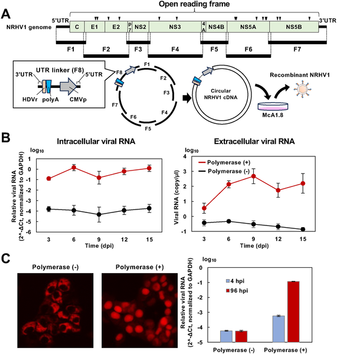

Imagine being able to watch a virus light up inside a living liver, revealing its every move as it infects cells and spreads. Scientists have now created a glowing version of a rat virus closely related to hepatitis C virus (HCV), providing a novel way to observe infection in real time. This breakthrough could help unravel the mysteries of hepatitis C infection and speed up the search for effective vaccines and treatments.

> **TL;DR**
> - A recombinant rat hepacivirus expressing a small luminescent tag (HiBiT) was developed, allowing quantitative monitoring of viral infection in both cultured cells and live mice.
> - This reporter virus maintains liver-specific infection and persistent replication, making it a valuable surrogate model for studying hepatitis C virus pathogenesis and testing antiviral drugs.

Hepatitis C virus chronically infects over 50 million people worldwide and can lead to serious liver diseases including cancer. Despite advances in antiviral drugs, no vaccine exists, partly because studying HCV infection in animals is challenging. The virus infects only humans and chimpanzees efficiently, and practical small-animal models with intact immune systems have been lacking. To overcome this, researchers have turned to related viruses that infect rodents. One such virus, Norway rat hepacivirus (NRHV1), naturally infects rat livers and causes liver cancer, making it a promising stand-in to study HCV. However, until now, tools to track NRHV1 infection in real time were unavailable.

The research team engineered a recombinant NRHV1 virus that carries a tiny luminescent tag called HiBiT inserted into a non-essential region of a viral protein named NS5A. This insertion allows infected cells to emit light that can be quantitatively measured. They used a technique called circular polymerase extension reaction (CPER) to assemble the full viral genome with the HiBiT tag and then introduced this recombinant virus into cultured rat liver cells and immunodeficient mice. The team monitored viral RNA levels and luminescence to confirm infection and replication. They also tested the virus’s sensitivity to antiviral drugs and its ability to persist in live animals.

The HiBiT-tagged recombinant virus successfully infected cultured rat liver cells, with luminescence levels closely matching viral RNA amounts, confirming that the light signal accurately reflects infection. When introduced into immunodeficient mice, the virus established persistent liver infection, and luminescence was detectable in the animals’ livers. Importantly, virus recovered from infected mice could reinfect cultured cells and produce luminescence, demonstrating that the reporter virus remains infectious in vivo and in vitro. While some loss of the HiBiT gene occurred in a subset of mice over time, the system overall provided a reliable means to track infection dynamics.

This glowing rat hepacivirus model represents a significant advance for hepatitis C research. It offers a practical small-animal system to study viral infection and liver disease progression in real time, which has been difficult with HCV itself. The ability to quantitatively monitor infection through luminescence enables sensitive evaluation of antiviral drugs and neutralizing antibodies, accelerating preclinical testing. Moreover, this platform can deepen understanding of hepacivirus biology and immune responses, ultimately supporting efforts to develop effective hepatitis C vaccines and therapies.

Although promising, the reporter virus occasionally lost the luminescent tag in some infected mice, indicating the need for further optimization to enhance genetic stability, especially for use in animals with fully intact immune systems. Additionally, while NRHV1 is closely related to HCV, it is not identical, so findings from this model will need careful interpretation before translating to human disease. Nonetheless, this tool provides a valuable surrogate system to complement existing models and overcome previous limitations.

## Figures

*Scientists created a synthetic NRHV1 virus in rat liver cells and tracked its RNA levels over time to study virus production.*

## Sources

- [Generation of a HiBiT-expressing recombinant rat hepacivirus supporting both in vivo and in vitro infection](https://journals.plos.org/plospathogens/article?id=10.1371/journal.ppat.1014127)
- DOI: [10.1371/journal.ppat.1014127](https://doi.org/10.1371/journal.ppat.1014127)
