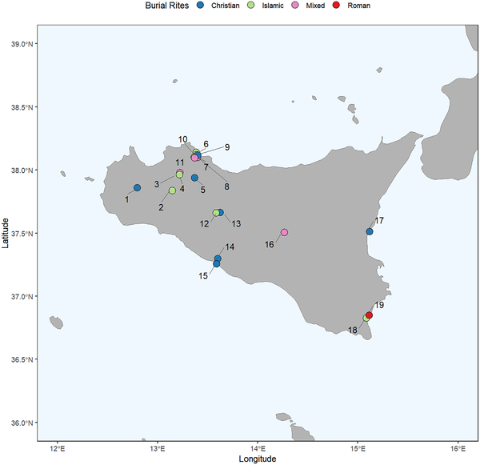
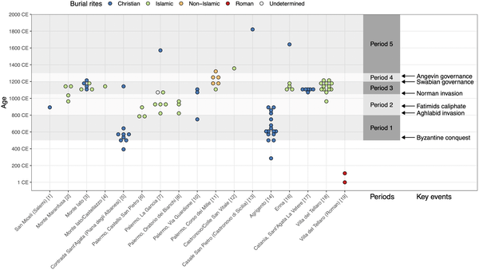
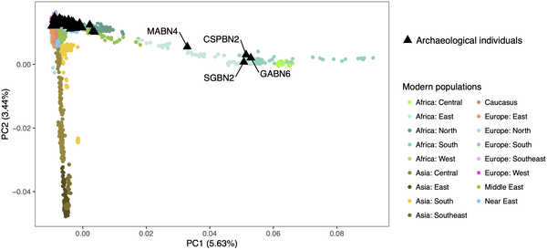

Medieval Sicily was more than just a strategic island in the Mediterranean; it was a vibrant crossroads where Europe, North Africa, and the Near East converged. While historical records tell tales of conquests and cultural exchanges, the genetic stories of the people who lived through these times remained largely hidden—until now. By analyzing ancient DNA from individuals buried across Sicily, scientists have begun to uncover the intricate genetic mosaic shaped by centuries of migration, faith, and regime change.

> **TL;DR**
> - Ancient DNA from 111 medieval Sicilian individuals reveals diverse ancestries including North African, West African, Northern European, and Mediterranean origins.
> - Genetic data challenges simple narratives of population replacement, showing nuanced demographic shifts linked to historical regimes and cultural interactions.

Between the 5th and 15th centuries CE, Sicily was governed by a succession of powers—from the Byzantines and Islamic emirates to the Normans and Swabians—each leaving their mark on the island’s cultural and political landscape. This period also saw the coexistence of multiple faiths and communities. However, historical documents provide limited insight into how these changes affected the genetic makeup of Sicily’s inhabitants. Ancient DNA (aDNA) offers a powerful tool to explore these questions by directly examining the genomes of individuals who lived through these transformative times.

Researchers collected skeletal remains from 111 individuals excavated at 18 archaeological sites across Sicily, spanning from roughly 110 BCE to the early modern period. Using radiocarbon dating refined by isotopic analysis to account for marine diet effects, they established a chronological framework aligned with major historical periods. DNA was extracted from bones and teeth, sequenced, and analyzed for mitochondrial and nuclear genetic markers. The team applied genome-wide analyses, comparing the ancient genomes to modern and other ancient populations to infer ancestry and population dynamics. Strict contamination controls and kinship analyses ensured data reliability.

Contrary to expectations of straightforward population replacement following regime changes, the genetic data revealed a complex pattern of continuity and admixture. Several individuals predating the Islamic conquest already showed substantial North African ancestry, indicating earlier Mediterranean movements. During the Islamic period (9th–11th centuries), individuals buried in Islamic cemeteries displayed diverse ancestries from across the Mediterranean, with new genetic signals from West Africa and Northern Europe appearing for the first time. The Norman period maintained this genetic diversity across Christian and Islamic burial sites. By the late medieval period, however, ancestry shifted more toward profiles resembling modern European populations. These findings highlight Sicily’s role as a genetic and cultural melting pot over centuries.

This study deepens our understanding of how historical events and cultural interactions shaped the people of medieval Sicily. It challenges simplistic views of population replacement and emphasizes the island’s long-standing role as a hub of mobility and diversity. By integrating ancient DNA with archaeological and historical data, the research offers a richer narrative of identity, migration, and coexistence in a region pivotal to Mediterranean history. Such insights also contribute to broader discussions about how genetics can inform our understanding of past societies and their complex legacies.

While the dataset is large and geographically broad, some radiocarbon dates overlap multiple historical periods, complicating precise temporal assignments. The genetic signals observed are influenced by the available comparative populations and the limits of ancient DNA preservation. Additionally, the study focuses on individuals who were buried in particular contexts, which may not represent the entire population. Therefore, interpretations about population dynamics should be made cautiously, recognizing the complexity and potential gaps in the archaeological and genetic records.

## Figures

*Map showing 19 sample collection sites across Sicily used in this study, created with public data and R software tools.*

*Timeline of tested individuals from Sicily sites, showing ages and key historical events from 535 to 1266 CE, arranged west to east for clear visualization.*

*Sicilian ancient individuals mostly cluster together, but four align genetically with modern sub-Saharan African populations.*

## Sources

- [Genetic histories of individuals from multi-faith medieval Sicily](https://journals.plos.org/plosone/article?id=10.1371/journal.pone.0350298)
- DOI: [10.1371/journal.pone.0350298](https://doi.org/10.1371/journal.pone.0350298)
