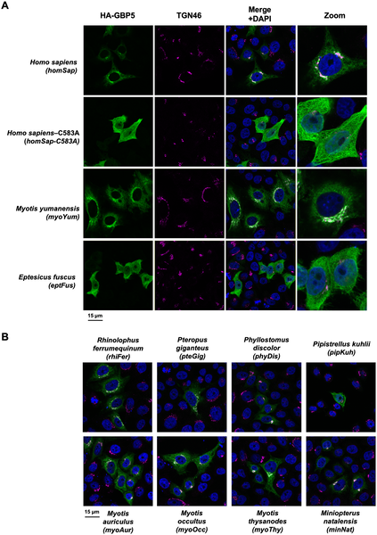
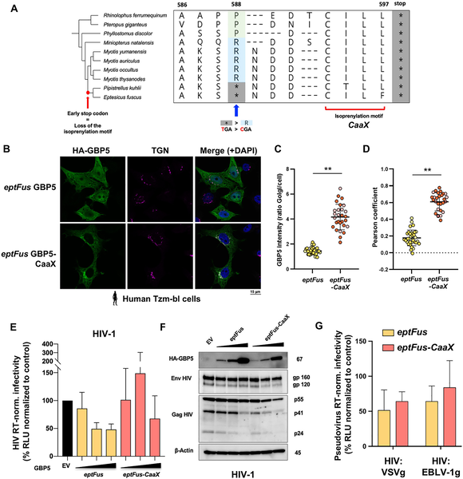

Bats are fascinating creatures that harbor many viruses deadly to other species, yet they rarely fall ill themselves. What makes their immune system so special? Recent research uncovers how bats have evolved a unique version of an antiviral protein, GBP5, which helps them fight viruses effectively while avoiding harmful inflammation.

> **TL;DR**
> - Bats show strong evolutionary changes in the antiviral protein GBP5, including gene duplications and rapid mutations, indicating a long history of arms races with viruses.
> - A key modification in GBP5’s structure in some bat lineages changes its location inside cells and alters its antiviral activity, highlighting species-specific immune adaptations.

Bats serve as natural reservoirs for many viruses that can cause serious diseases in humans and other animals. Despite carrying these viruses, bats typically do not exhibit symptoms, suggesting they have evolved immune systems finely tuned to control infections without excessive inflammation. Understanding these adaptations is crucial for insights into viral tolerance and potential therapeutic avenues. One area of interest is the family of guanylate-binding proteins (GBPs), which are antiviral effectors induced by interferons, proteins that activate immune defenses. Among these, GBP5 stands out for its broad antiviral activity in humans, but how it functions and evolves in bats remained unclear.

To investigate bat antiviral immunity, researchers collected primary cells from Myotis yumanensis bats and stimulated them with type I interferon, mimicking a viral infection. They performed RNA sequencing to identify genes activated by interferon and found GBP5 to be the most highly upregulated gene. Next, they analyzed GBP5 gene sequences from 55 bat species spanning over 60 million years of evolution, alongside sequences from other mammals. Using phylogenetic analyses, they detected signs of positive selection—evidence that GBP5 evolved rapidly in response to viral pressures. Functional experiments tested GBP5 proteins from 10 bat species against viruses including HIV-1 and rhabdoviruses, assessing antiviral activity and cellular localization. They also engineered a version of GBP5 to restore a lost protein motif to study its effects.

The study revealed that bat GBP5 has undergone strong episodic positive selection and gene duplications, reflecting historical viral arms races. Functionally, GBP5 from different bat species showed virus-specific antiviral effects, restricting viruses like HIV-1 and vesicular stomatitis virus (VSV) in species-dependent ways. A striking discovery was the lineage-specific loss of a prenylation motif—a small protein tag important for directing GBP5 to the trans-Golgi network inside cells—in certain bats (Pipistrellus and Eptesicus). Restoring this motif in Eptesicus fuscus GBP5 changed its cellular localization but surprisingly reduced its ability to inhibit rhabdoviruses. These findings suggest that bats have tailored GBP5’s antiviral functions over millions of years, balancing effectiveness and immune tolerance.

This research sheds light on the molecular adaptations that help bats coexist with viruses that are lethal to other species. By pinpointing how GBP5 evolved to gain or lose specific functions, the study advances our understanding of innate immunity and host-virus coevolution. Such insights could inform future strategies to modulate immune responses or develop antiviral therapies. Moreover, it highlights the importance of studying wildlife immune systems to grasp the complexities of zoonotic disease reservoirs.

While the study provides compelling evidence of GBP5’s evolutionary adaptations and antiviral roles in bats, the exact mechanisms by which GBP5 restricts different viruses remain incompletely understood. The functional assays focused on a limited set of viruses and bat species, so broader testing is needed to generalize findings. Additionally, restoring the lost prenylation motif altered GBP5 behavior in cells but did not fully recapitulate ancestral functions, indicating that other factors may contribute to antiviral activity. Finally, translating these findings into medical applications will require further research.

## Figures

*Bat and human GBP5 proteins show different locations inside cells, revealed by fluorescent microscopy images.*

*Restoring a protein part in bat cells moves GBP5 to a cell area but doesn't bring back its virus-fighting ability.*

## Sources

- [Genomic and functional adaptations in the guanylate-binding protein 5 highlight specificities of bat antiviral innate immunity](https://journals.plos.org/plosbiology/article?id=10.1371/journal.pbio.3003760)
- DOI: [10.1371/journal.pbio.3003760](https://doi.org/10.1371/journal.pbio.3003760)
