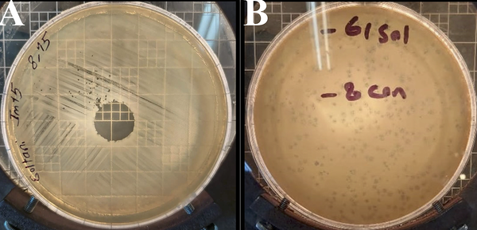
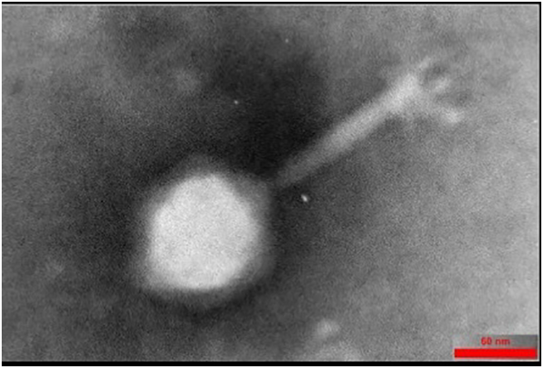
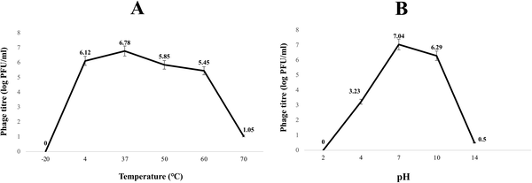
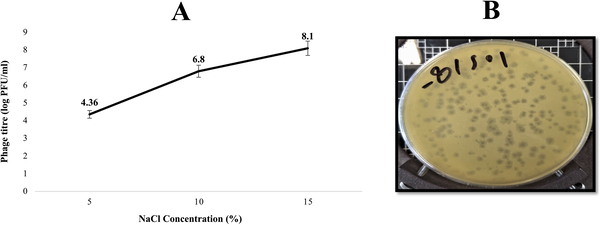

Imagine a tiny virus that can hunt down and kill some of the most dangerous antibiotic-resistant bacteria while also helping wounds heal faster. Scientists have recently uncovered such a virus, called Halo KS-7, isolated from hospital wastewater. This bacteriophage specifically targets carbapenem-resistant Klebsiella pneumoniae, a pathogen notorious for causing severe infections that are difficult to treat with existing antibiotics. Beyond its bacterial-killing power, Halo KS-7 also accelerates wound healing in infected mice, opening new avenues for combating stubborn infections and improving recovery.

> **TL;DR**
> - Halo KS-7 is a newly discovered halophilic bacteriophage that effectively kills multidrug-resistant Klebsiella pneumoniae.
> - In mouse models, treatment with Halo KS-7 significantly improved wound healing and infection control, demonstrating its therapeutic potential.

Klebsiella pneumoniae is a common bacterium that can cause serious infections, especially in hospitalized or immunocompromised patients. The rise of carbapenem-resistant strains (CRKP) has made treatment increasingly challenging, as these bacteria resist many antibiotics, including last-resort drugs. This resistance, combined with the bacteria’s ability to form protective biofilms, has driven researchers to explore alternative therapies. Bacteriophages—viruses that infect and kill bacteria—have emerged as promising candidates due to their specificity and ability to target antibiotic-resistant strains without harming beneficial microbes. However, discovering phages that are both effective and stable under physiological conditions remains a challenge. Halo KS-7, a halophilic (salt-loving) bacteriophage isolated from hospital wastewater, represents a novel addition to this therapeutic toolkit.

Researchers isolated Halo KS-7 from hospital wastewater by enriching samples with carbapenem-resistant K. pneumoniae strains collected from diabetic foot ulcers. The phage was purified through plaque isolation and confirmed using double-layer agar assays. Its structure was visualized by transmission electron microscopy, revealing features typical of the Myoviridae family. The team tested Halo KS-7’s ability to infect a panel of 30 CRKP strains and assessed its stability across different temperatures, pH levels, and salt concentrations. They measured replication dynamics using one-step growth curves and determined the optimal multiplicity of infection (MOI). To evaluate therapeutic potential, they used a mouse wound infection model, applying Halo KS-7 to infected wounds and monitoring healing progression and tissue regeneration through blinded histopathological analysis. The phage’s genome was sequenced using Illumina HiSeq technology and analyzed with an AI-driven Python pipeline to identify genes relevant to its antibacterial activity and safety.

Halo KS-7 demonstrated strong lytic activity against carbapenem-resistant K. pneumoniae strains, producing clear plaques indicative of effective bacterial killing. It showed optimal activity at human body temperature (37°C) and neutral pH but remained active across a broad pH range (4–10) and was notably more stable and effective in high-salinity environments, with peak performance at 15% NaCl. The phage had a short latent period of about 20 minutes and a modest burst size, meaning it quickly infects and kills bacteria but produces a moderate number of new viral particles per infected cell. In the mouse wound model, Halo KS-7 treatment led to nearly complete wound closure within 14 days, significantly outperforming untreated infected controls. Histological analysis revealed improved tissue regeneration, reduced inflammation, and restored skin architecture comparable to healthy controls. Genomic analysis showed Halo KS-7 has a 58.7 kb double-stranded DNA genome with 49 predicted genes, including structural and replication proteins but no genes associated with antibiotic resistance or lysogeny, supporting its safety. It also carries auxiliary genes like MazG and HNH endonucleases that may enhance bacterial killing without promoting resistance or gene transfer.

The discovery of Halo KS-7 adds a valuable new candidate to the growing arsenal of bacteriophages targeting multidrug-resistant pathogens. Its ability to remain stable and active under physiological and high-salt conditions suggests it could be particularly useful for treating infections in challenging environments, such as chronic wounds where salt concentrations and pH may vary. The phage’s demonstrated efficacy in accelerating wound healing while controlling infection highlights its dual therapeutic potential. Moreover, the use of AI-driven genome annotation enhances confidence in its safety profile and helps identify genetic features that could be harnessed or engineered for improved treatments. As antibiotic resistance continues to threaten global health, phages like Halo KS-7 offer a promising complementary approach to conventional antibiotics.

While the results are encouraging, several limitations remain. The mouse wound model, though informative, does not fully replicate the complexity of human infections and immune responses. Further studies are needed to assess Halo KS-7’s safety, efficacy, and pharmacodynamics in humans. The modest burst size suggests that dosing strategies will need optimization to maintain effective bacterial suppression. Additionally, although no known harmful genes were detected, ongoing surveillance is essential to ensure the phage does not acquire or transfer undesirable traits over time. Finally, regulatory pathways for phage therapy remain under development, and clinical translation will require rigorous testing and validation.

## Figures

*Bacteriophage Halo KS-7 kills Klebsiella pneumoniae bacteria, shown by clear spots and plaques on bacterial layers.*

*Electron microscope image showing the detailed head and tail structure of the Halo KS-7 virus, with a scale bar of 60 nm.*

*Halo KS-7 virus is most stable at 37°C and neutral pH, with lower survival at extreme temperatures and pH levels.*

*Higher salt levels boost Halo KS-7 virus stability and infectivity, with strongest activity seen at 15% NaCl concentration.*

## Sources

- [Genomic and functional characterization of a novel halophilic bacteriophage targeting carbapenem-resistant Klebsiella pneumoniae](https://journals.plos.org/plosone/article?id=10.1371/journal.pone.0348054)
- DOI: [10.1371/journal.pone.0348054](https://doi.org/10.1371/journal.pone.0348054)
