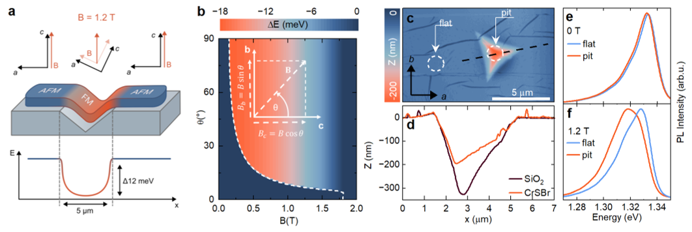
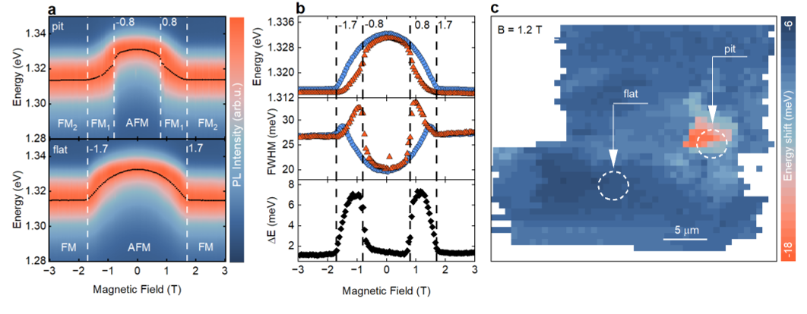
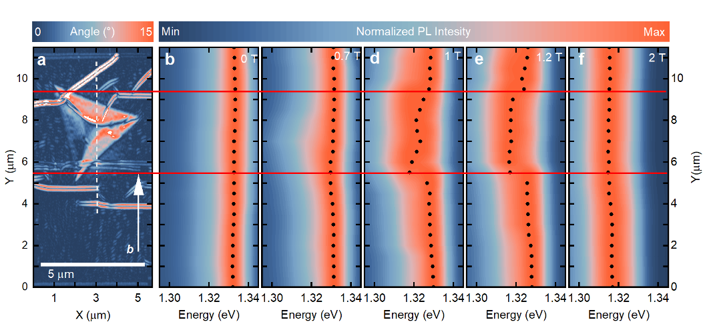

What if you could change a material’s magnetic personality just by bending the surface it rests on? Imagine a crystal whose magnetic and electronic behaviors shift simply because it’s draped over a tiny geometric shape. This is the intriguing idea behind a new concept called geometronics—where geometry, rather than chemistry or strain, becomes the key to designing material properties.

> **TL;DR**
> - Scientists demonstrated that placing a layered magnetic crystal on a nano-shaped substrate creates regions with different magnetic phases within the same continuous crystal.
> - This geometric control produces switchable electronic landscapes, visualized through light emission changes, opening a new way to engineer materials without altering their composition.

*Note: this summary is based on a preprint — research shared ahead of formal peer review.*

Layered van der Waals materials—ultra-thin crystals held together by weak forces—have revolutionized how we design electronic and magnetic properties. Traditionally, researchers tweak these properties by changing the material’s composition, applying strain, or stacking different layers. However, these approaches fix the material’s behavior once made. The new approach of geometronics leverages the natural anisotropy (directional dependence) of these crystals and the shape of the surface beneath them to program spatially varying properties dynamically. This means a uniform magnetic field can have different effects in different parts of the same crystal simply because its orientation changes with the underlying geometry.

The research team used a bilayer of chromium sulfide bromide (CrSBr), a layered antiferromagnetic semiconductor known for its strong magnetic anisotropy and coupling between magnetic order and electronic structure. They transferred this bilayer onto a silicon dioxide substrate featuring an inverted pyramidal nanoindentation—a tiny, pyramid-shaped pit just a few micrometers wide and a few hundred nanometers deep. Atomic force microscopy confirmed that the crystal conformed closely to the substrate’s shape, locally tilting the crystal axes. The team then applied uniform magnetic fields and used spatially resolved magneto-optical spectroscopy at low temperatures (around 10 K) to map how the excitonic (electron-hole pair) transitions shifted across the crystal, revealing the magnetic and electronic landscape programmed by geometry.

In the flat regions of the CrSBr bilayer, the magnetic field caused a gradual shift typical of the antiferromagnetic phase. However, in the regions bent over the nanoindentation, the local crystal orientation caused the same uniform magnetic field to project differently onto the crystal axes. This induced a rapid transition to a ferromagnetic phase locally, creating coexisting magnetic phases within the same crystal. The excitonic transition energies shifted by up to 12 meV in these reoriented regions, forming a localized potential well for excitons. Spatial maps showed sharp interfaces between these magnetic phases confined to sub-micrometer scales. Importantly, these changes arose without applying strain or altering the material chemically—purely from the interplay of substrate geometry and magnetic field.

This work introduces geometronics as a universal, non-invasive method to program electronic and magnetic properties in anisotropic layered materials. By exploiting the intrinsic directional dependence of these crystals and shaping the substrate, researchers can create complex, switchable landscapes of magnetic phases and electronic potentials on demand. This opens new possibilities for designing future devices where properties can be dynamically controlled by geometry and external fields, without the need for complex fabrication or chemical modification. The clear visualization of these effects also provides a promising platform to study fundamental physics at engineered magnetic interfaces.

While the concept is demonstrated convincingly in CrSBr, a single material system, further work is needed to explore its applicability across other anisotropic van der Waals materials. The current spatial resolution limits direct measurement of phase boundary widths, and real-world device integration will require controlling and scaling these geometric effects. Additionally, the experiments were performed at low temperatures, so understanding how these effects persist at higher temperatures remains an open question. Nonetheless, geometronics offers a fresh design principle with exciting potential for future materials engineering.

## Figures

*A CrSBr bilayer on a nanoindentation shows magnetic and energy changes, with height and light emission differences under varying magnetic fields. — Figure from Maciej Śmiertka et al., [CC BY 4.0](http://creativecommons.org/licenses/by/4.0/), caption edited.*

*Magnetic fields change light emission in CrSBr bilayers, revealing localized energy shifts and exciton behavior at low temperatures. — Figure from Maciej Śmiertka et al., [CC BY 4.0](http://creativecommons.org/licenses/by/4.0/), caption edited.*

*Maps show how tiny twists and magnetic fields change light emission in a CrSBr bilayer at very low temperatures. — Figure from Maciej Śmiertka et al., [CC BY 4.0](http://creativecommons.org/licenses/by/4.0/), caption edited.*

## Sources

- [Geometry-Controlled Magnetic and Electronic Landscapes in Anisotropic van der Waals Materials](https://arxiv.org/abs/2609.01223)
- DOI: [10.48550/arxiv.2609.01223](https://doi.org/10.48550/arxiv.2609.01223)

*This article reuses and adapts text and figures from the original research by Maciej Śmiertka et al., available via arXiv Materials Science, under the [CC BY 4.0](http://creativecommons.org/licenses/by/4.0/) license.*
