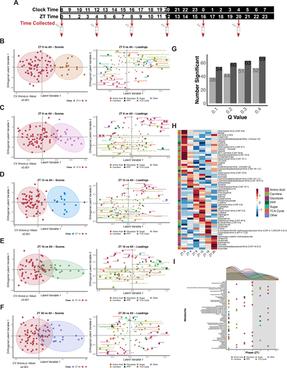
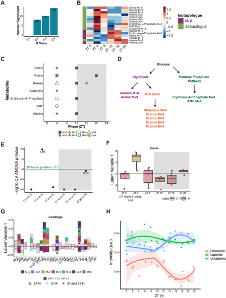
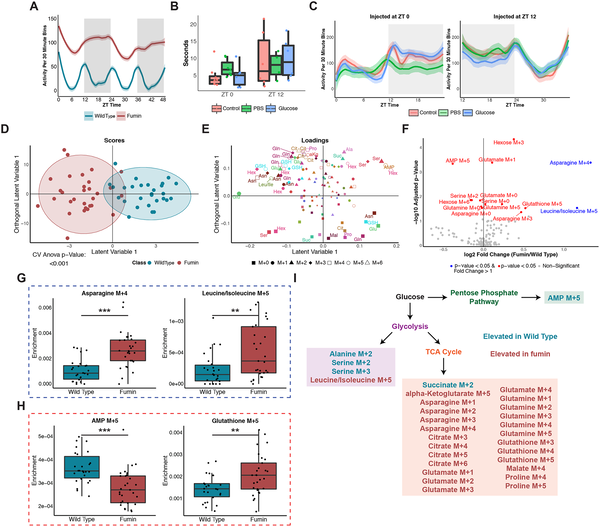

Have you ever wondered why your energy levels fluctuate throughout the day or why doctors sometimes see different blood sugar readings depending on the time? Recent research uncovers that our bodies—and even tiny fruit flies—follow an internal clock that dynamically controls how glucose, the sugar our cells use for energy, is processed at different times of day. This rhythmic pattern of glucose use, including a surprising “rush hour” early in the day, sheds new light on the intimate link between our biological clocks and metabolism.

> **TL;DR**
> - Glucose metabolism follows a daily rhythm in humans and fruit flies, peaking early in the day in a coordinated 'rush hour' of sugar use.
> - These rhythms are controlled by internal circadian clocks rather than feeding times, and altered neural signals can shift or amplify glucose metabolism patterns.

Our bodies operate on a roughly 24-hour cycle known as the circadian rhythm, which governs many physiological processes, including sleep, hormone release, and metabolism. While it's well known that glucose tolerance—the body's ability to manage blood sugar—varies by time of day, the detailed metabolic pathways that process glucose downstream have remained elusive. Understanding these pathways is important because disruptions to circadian rhythms, such as those caused by shift work or jet lag, are linked to metabolic disorders like obesity and diabetes. Model organisms like fruit flies offer a powerful way to study these processes because of their genetic similarities and well-characterized circadian systems.

To explore how glucose metabolism changes over the day, researchers combined human blood metabolite profiling with a novel isotope-tracing method in fruit flies. In humans, plasma samples were collected every four hours over 24 hours from healthy volunteers, and targeted metabolomics measured levels of glucose-related metabolites. In fruit flies, the team injected a stable isotope-labeled form of glucose (^13C_6-glucose) at different times and used mass spectrometry to track how glucose carbons flowed into various metabolic pathways. This approach allowed precise measurement of glucose utilization dynamics across the day. The researchers also tested a mutant fly with altered dopamine signaling to see how neural activity influences these rhythms.

The study revealed that in humans, many glucose-related metabolites show robust daily oscillations, with a notable peak in glucose processing early in the light phase (morning). In fruit flies, a pronounced “rush hour” of glucose utilization was observed shortly after lights-on, where glucose carbons were rapidly incorporated into biosynthetic and energy-producing pathways. Interestingly, this rhythmic pattern persisted even when feeding schedules were changed or flies were briefly fasted, indicating that internal circadian clocks, not just nutrient availability, control glucose metabolism timing. The dopamine reuptake-deficient mutant flies displayed shifted and amplified metabolic peaks, suggesting neural signaling modulates the timing and magnitude of glucose use.

These findings establish a conserved temporal architecture of glucose metabolism regulated by circadian clocks across species. Understanding that glucose utilization is dynamically gated by time of day provides a mechanistic framework to explain clinical observations such as the ‘afternoon diabetes’ phenomenon, where glucose tolerance varies by time. Moreover, the work highlights how disruptions to circadian rhythms or neural signaling could contribute to metabolic dysfunction and disease. This knowledge lays groundwork for future strategies to optimize metabolic health through timed interventions like diet or medication aligned with our internal clocks.

While the study robustly demonstrates daily rhythms in glucose metabolism and their regulation by circadian timing, it primarily focuses on healthy humans and fruit flies under controlled conditions. The direct implications for metabolic diseases require further investigation, especially in diverse human populations and real-world settings. Additionally, the isotope tracing in flies used a supraphysiological glucose dose, which, although validated not to impair fly behavior, may differ from natural feeding conditions. Future research will need to explore how these rhythms interact with other physiological factors and how they can be manipulated for therapeutic benefit.

## Figures

*Human blood metabolites linked to glucose show daily patterns, changing levels at different times over 24 hours.*

*Glucose boosts biosynthesis across multiple pathways at ZT 4, showing daily rhythmic patterns in metabolites and significant changes compared to other times.*

*A mutant fly uses energy differently after eating sugar, showing changes in activity, climbing, movement, and metabolism compared to normal flies.*

## Sources

- [Glucose is dynamically regulated by time of day in humans and Drosophila](https://journals.plos.org/plosbiology/article?id=10.1371/journal.pbio.3003717)
- DOI: [10.1371/journal.pbio.3003717](https://doi.org/10.1371/journal.pbio.3003717)
