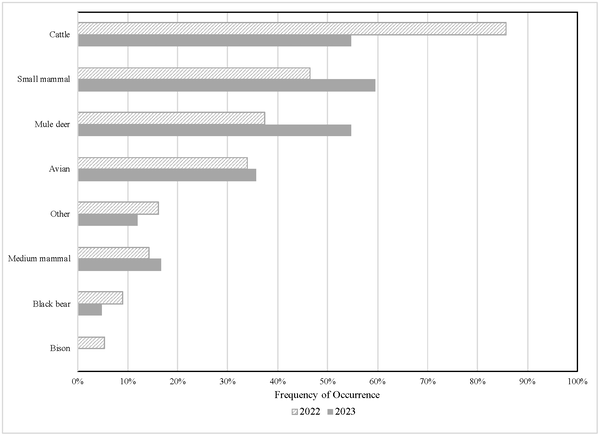
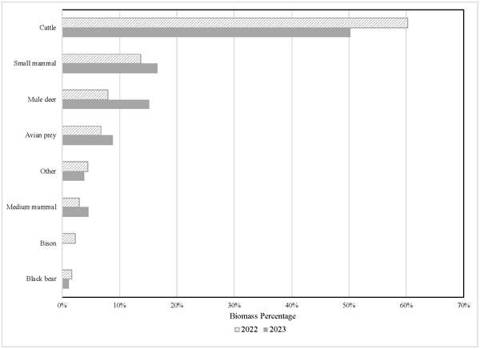

How do wolves survive in landscapes dominated by humans and farms? As gray wolves have made a comeback in California after nearly a century of absence, understanding what they eat is key to managing conflicts and conserving these iconic predators. Recent genetic detective work reveals a surprising twist: rather than primarily hunting wild deer, California’s wolves rely heavily on cattle for their meals.

> **TL;DR**
> - Gray wolves in northeastern California’s human-altered landscapes consume cattle in the majority of their diet, with cattle DNA found in 72% of wolf scat samples.
> - Wild mule deer and small mammals make up smaller portions of their diet, indicating that wolves adapt their feeding behavior to the availability of livestock in these landscapes.

Gray wolves once roamed across much of North America, but were nearly wiped out in the contiguous United States by the mid-1900s. Thanks to legal protections and reintroduction efforts, wolves have gradually recolonized parts of their historic range, including California where they returned in 2011 after almost 100 years. However, the landscapes they now inhabit are heavily modified by human activities, including extensive cattle grazing. This raises important questions about how wolves are adapting their diets and what this means for coexistence with humans and livestock.

To investigate wolf diet, researchers collected wolf scat samples during summer months in 2022 and 2023 from two packs in northeastern California’s Lassen region. Using cutting-edge genetic techniques, they first confirmed which scats belonged to wolves and identified individual animals. Then, through DNA metabarcoding—a method that sequences DNA fragments from prey species present in the scats—they identified the variety of animals wolves had consumed. The team combined this with estimates of prey biomass to understand the relative contribution of each prey type to the wolves’ caloric intake.

The study found that cattle DNA appeared in 72% of wolf scat samples and accounted for an estimated 55% of the dietary biomass, making livestock the dominant food source. In contrast, mule deer DNA was found in 45% of samples but contributed only about 12% of biomass, while small mammals appeared in 51% of samples and made up roughly 15% of biomass. These results indicate that in this human-dominated landscape with abundant cattle and relatively fewer wild ungulates, wolves primarily meet their energy needs by consuming livestock rather than wild prey.

These findings shed light on the complex ecological dynamics of wolves recolonizing areas heavily used by humans and livestock. Understanding that wolves rely heavily on cattle for food highlights the challenges of managing human-wolf coexistence in California. This knowledge can inform wildlife managers and policymakers in developing strategies to reduce conflicts, such as targeted livestock protection measures, while supporting wolf conservation efforts. It also underscores the adaptability of wolves in human-altered environments, which has implications for how we think about predator-prey relationships in modern landscapes.

While this study provides robust genetic evidence of wolf diet composition, it is limited to summer months and two wolf packs in northeastern California, so results may not generalize across all seasons or regions. Biomass estimates rely on assumptions about average prey sizes, which can vary, and the presence of cattle DNA in scats does not distinguish between active predation and scavenging of carcasses. Further research including year-round sampling and direct observation would help clarify these dynamics and better inform management decisions.

## Figures

*Gray wolf diet in summer 2022 and 2023 showing how often different foods were eaten.*

*Gray wolf diet in summer 2022 and 2023 shown by the percentage of different food types they ate.*

## Sources

- [Gray Wolf Diet Composition in California’s Human-Dominated Landscape](https://journals.plos.org/plosone/article?id=10.1371/journal.pone.0351768)
- DOI: [10.1371/journal.pone.0351768](https://doi.org/10.1371/journal.pone.0351768)
