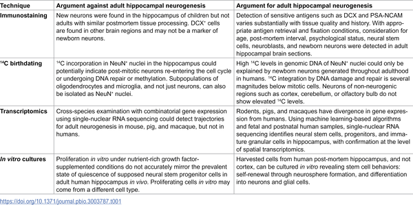

Could activating stem cells in your brain help keep your memory sharp as you age? Scientists are increasingly exploring the human hippocampus—a brain region crucial for learning and memory—as a potential source of new neurons that might protect against cognitive decline. What if your brain’s own stem cells could be harnessed to slow or even reverse some aspects of aging-related memory loss?

> **TL;DR**
> - Adult neurogenesis—the birth of new neurons from stem cells in the hippocampus—occurs in humans, though at low levels and with ongoing debate about its extent.
> - Emerging evidence suggests that strategies to stimulate these stem cells could promote cognitive resilience and healthy brain aging.

Memory lapses and cognitive decline are common challenges as we grow older. In rodents, new neurons continue to be generated in the hippocampus throughout adulthood, arising from dormant stem cells that can be activated to produce neurons that integrate into brain circuits. This process, called adult neurogenesis, supports learning, memory, and cognitive flexibility. While adult neurogenesis is well established in rodents and non-human primates, its existence and significance in humans have been controversial. This debate has often centered more on technical challenges in detecting new neurons than on the underlying biology. However, mounting evidence from various approaches—including advanced molecular techniques, carbon dating of neurons, and cell culture studies—supports the presence of neural stem cells and newborn neurons in the adult human hippocampus.

Scientists have used multiple methods to investigate adult neurogenesis in humans, each with strengths and limitations. Immunostaining techniques detect proteins specific to newborn neurons but depend heavily on tissue quality and processing. Carbon-14 birthdating measures the incorporation of atmospheric carbon into DNA to estimate neuron age, revealing ongoing neuron turnover in the hippocampus. Transcriptomic analyses use RNA sequencing to identify gene expression patterns characteristic of neural stem cells and immature neurons, tailored to human-specific molecular signatures. Additionally, cells isolated from surgically removed human hippocampus tissue have been cultured in vitro, demonstrating stem cell properties like self-renewal and the ability to differentiate into neurons and glial cells. Together, these complementary approaches build a coherent picture of adult neurogenesis in humans despite technical challenges.

The evidence suggests that adult neurogenesis does occur in the human hippocampus, though at lower levels than in rodents. Studies show that neural stem cells and newborn neurons are present in young adults, decline with normal aging, but are relatively preserved in ‘SuperAgers’—older individuals with exceptional memory performance. Conversely, patients with Alzheimer’s disease show reduced neurogenesis. In rodents, increasing neurogenesis improves memory and cognitive functions, and lifestyle factors such as physical exercise, exposure to novel environments, cognitive engagement, and stress reduction can boost neurogenesis. These findings hint that similar interventions might support brain health in aging humans by harnessing the brain’s own regenerative capacity.

Understanding and harnessing adult neurogenesis in humans could open new avenues to combat cognitive aging and neurodegenerative diseases. While the debate over the extent of neurogenesis continues, shifting the focus toward how to activate and support these stem cells offers practical hope. Interventions like regular physical activity, lifelong learning, and stress management are accessible strategies that may promote neurogenesis and cognitive resilience. Continued research is essential to unravel the complex biology and develop targeted therapies that could preserve memory and independence in older adults.

Despite promising evidence, many questions remain. The number of neural stem cells and newborn neurons in the adult human hippocampus is small, and their precise role in cognition is not fully understood. Technical challenges in detecting these cells contribute to ongoing debate. Moreover, increasing neurogenesis alone may not be sufficient to improve cognition in disease contexts without addressing other factors such as brain environment and growth factors. Human studies face inherent limitations, and causative links between neurogenesis and cognitive function are yet to be firmly established. Therefore, while the potential is exciting, more research is needed before clinical applications can be realized.

## Figures

*Table 1 summarizes the pros and cons of adult brain cell growth in the hippocampus from different studies.*

## Sources

- [Harnessing the stem cell potential in the human hippocampus to limit cognitive aging](https://journals.plos.org/plosbiology/article?id=10.1371/journal.pbio.3003787)
- DOI: [10.1371/journal.pbio.3003787](https://doi.org/10.1371/journal.pbio.3003787)
