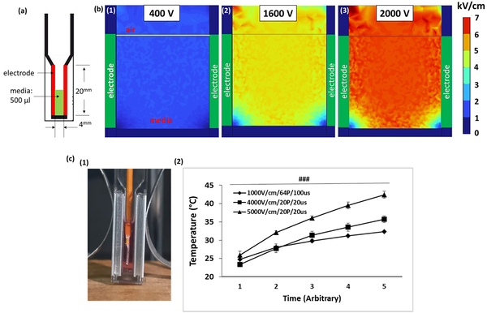
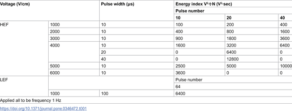
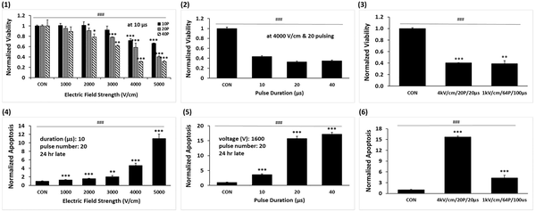

Imagine treating lung cancer not by cutting or burning tissue, but by delivering precise electric pulses that disrupt cancer cells from within. Scientists have discovered that by increasing the strength of these electric fields, they can cause more profound damage inside cancer cells, targeting critical structures like mitochondria and nuclei. This novel method promises to improve the effectiveness of a non-thermal tumor ablation technique known as irreversible electroporation (IRE), potentially offering a powerful new tool in lung cancer treatment.

> **TL;DR**
> - High-intensity irreversible electroporation (IRE) uses stronger electric fields than conventional methods to damage internal structures of lung cancer cells, leading to more effective tumor destruction.
> - In laboratory and animal models, this approach caused extensive intracellular injury, oxidative stress, and uniform tumor ablation, overcoming limitations of standard IRE protocols.

Lung cancer remains one of the deadliest cancers worldwide, and while surgery, chemotherapy, and radiation are common treatments, they often come with significant side effects and may not fully eradicate tumors. Irreversible electroporation (IRE) is an emerging technique that applies short, high-voltage electric pulses to create tiny pores in cancer cell membranes, disrupting their function and triggering cell death without the heat damage caused by traditional ablation methods. However, standard IRE protocols typically use electric field strengths between 1000 and 2500 volts per centimeter (V/cm), which may not sufficiently affect intracellular organelles like mitochondria and nuclei—key players in cell survival and death pathways. This can result in incomplete tumor destruction and cancer recurrence.

Researchers sought to optimize IRE by safely increasing electric field strengths beyond 4000 V/cm, while avoiding electrical sparking or tissue damage from heat. Using computer simulations, they designed pulse parameters and electrode setups that delivered these high fields in cell culture and animal lung tumor models. Human lung cancer cells (A549) were exposed to varying pulse voltages, durations, and numbers, and their viability, oxidative stress levels, and ultrastructural damage were assessed. Transmission electron microscopy provided detailed images of cellular injury. In vivo experiments tested how high-field IRE affected tumor ablation compared to conventional lower-field treatments.

The high-intensity IRE pulses dramatically increased oxidative stress in cancer cells, with a 30-fold rise in hydrogen peroxide production—a marker of reactive oxygen species that damage cells. Mitochondrial membrane potential was severely disrupted, and electron microscopy revealed ruptured plasma membranes, deformed nuclear envelopes, and complete loss of mitochondrial internal structures called cristae. These changes led to irreversible cell death. In animal models, high-field IRE produced extensive, uniform tumor ablation, whereas conventional lower-field IRE caused only partial, localized damage. These results demonstrate that elevating electric field intensity effectively targets intracellular organelles, overcoming the limitations of traditional IRE protocols and enhancing tumor destruction.

This study presents a promising advance in cancer treatment technology by refining IRE to more powerfully attack cancer cells from the inside out. By focusing on intracellular damage, especially to mitochondria and nuclei, high-intensity IRE may reduce the chance of cancer cell survival and tumor recurrence. Its non-thermal nature also preserves surrounding healthy tissues, which is particularly important in delicate lung structures. While further research is needed to assess long-term safety and effectiveness in humans, these findings open new avenues for improving minimally invasive lung cancer therapies.

Although the results are encouraging, this research is still at an early stage, primarily involving cell cultures and animal models. The safety profile of higher electric fields must be carefully evaluated in clinical settings to avoid unintended tissue damage or complications. Additionally, the precise parameters for optimal pulse strength, duration, and frequency require further refinement to balance efficacy and safety. Long-term studies will be necessary to determine whether high-intensity IRE can sustainably prevent tumor regrowth and improve patient outcomes.

## Figures

*Setup and simulation of electric fields and temperature changes in culture media during electrical experiments with varying voltages.*

*Table showing electric pulse settings and energy levels used in high and low electric fields at 1 Hz frequency.*

*Cell survival and death in A549 cells change with different electric field strengths, pulse counts, and durations during treatment.*

## Sources

- [High-intensity irreversible electroporation targeting intracellular structures enhance tumor ablation in lung cancer models](https://journals.plos.org/plosone/article?id=10.1371/journal.pone.0346472)
- DOI: [10.1371/journal.pone.0346472](https://doi.org/10.1371/journal.pone.0346472)
