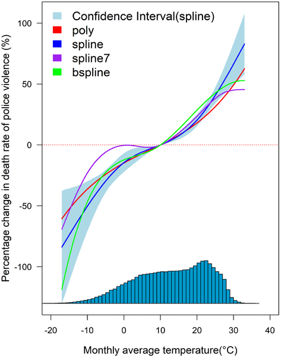
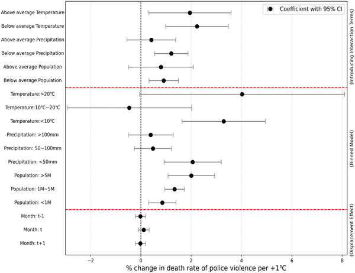

Could hotter weather be making police violence worse? While climate change is often discussed in terms of environmental and economic impacts, emerging research reveals it may also be influencing social and public health outcomes in unexpected ways. A recent nationwide study in the United States has uncovered a link between rising temperatures and an increased risk of deaths caused by police violence, highlighting a complex intersection of climate, social dynamics, and law enforcement.

> **TL;DR**
> - Higher monthly average temperatures are associated with increased death rates from police violence across US counties.
> - If greenhouse gas emissions continue at high levels, climate change could contribute to hundreds of additional police violence deaths by 2050.

Global warming is accelerating, with recent years setting new records for high temperatures. Beyond well-known health impacts like heat-related illness, research has increasingly shown that heat can also influence human behavior, including rates of violence and crime. Studies from various countries have linked hotter weather to rises in violent incidents, but until now, the specific relationship between temperature and police violence—a leading cause of death for young men in the US—has been less explored. Understanding this connection is crucial, given the profound social and public health implications of police-related fatalities.

The researchers analyzed data on police violence deaths from 2013 through 2024, sourced from the Mapping Police Violence database, which records detailed information on fatal encounters involving law enforcement across US counties. They combined this with monthly average temperature and precipitation data from the National Oceanic and Atmospheric Administration. Using advanced statistical models called panel regressions with high-dimensional fixed effects, the team controlled for factors like population size, seasonal trends, and regional differences to isolate the effect of temperature on police violence death rates. This approach allowed them to assess how changes in temperature relate to changes in the risk of fatal police encounters over time and across different counties.

The analysis revealed a generally positive association between temperature and police violence deaths: as temperatures rose, so did the death rates from police violence. This relationship was especially pronounced in counties with large populations (over 5 million people) and during months with low precipitation (less than 50 mm). Specifically, each 1°C increase in monthly average temperature corresponded to approximately two additional deaths per million people from police violence. The effect varied across states and over time, with 2024 showing elevated risks. Importantly, the study projected that under a high greenhouse gas emissions scenario, climate change could contribute to nearly 480 additional police violence deaths in the US by 2050, underscoring a potential future public health challenge linked to warming temperatures.

This study is among the first to quantitatively link ambient temperature increases to the risk of police violence deaths on a national scale. It highlights how climate change may exacerbate social and public safety issues beyond the commonly discussed environmental and health effects. By revealing this connection, the research points to the urgent need for law enforcement policies and public health interventions that consider environmental stressors like heat. Addressing these factors could be critical in mitigating the broader societal impacts of rising temperatures, particularly as climate change continues to intensify.

While the study uses robust statistical methods and comprehensive datasets, it is observational and cannot definitively establish causation between temperature and police violence. Complex social, economic, and political factors also influence police violence rates and may interact with environmental conditions in ways not fully captured here. Additionally, the analysis relies on monthly average temperatures, which may mask short-term temperature spikes that could have different effects. Future research is needed to explore underlying mechanisms, consider other environmental and social variables, and test intervention strategies that might reduce heat-related risks in policing contexts.

## Figures

*Fig 1 shows how changes in climate relate to police violence deaths using different curve fits and temperature distribution.*

*This figure shows how temperature affects police violence death rates across groups, with estimates and confidence intervals highlighted.*

## Sources

- [Higher temperatures are associated with increased risk of police violence: A nationwide county-level study in the United States, 2013–2024](https://journals.plos.org/plosone/article?id=10.1371/journal.pone.0345523)
- DOI: [10.1371/journal.pone.0345523](https://doi.org/10.1371/journal.pone.0345523)
