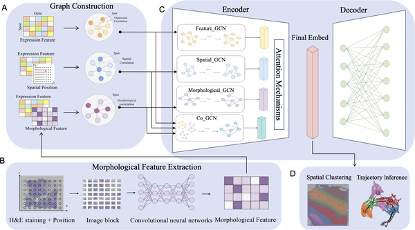
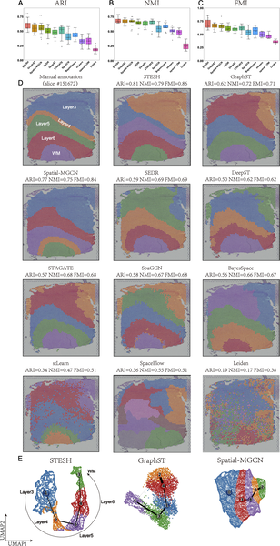
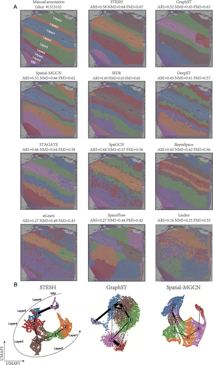
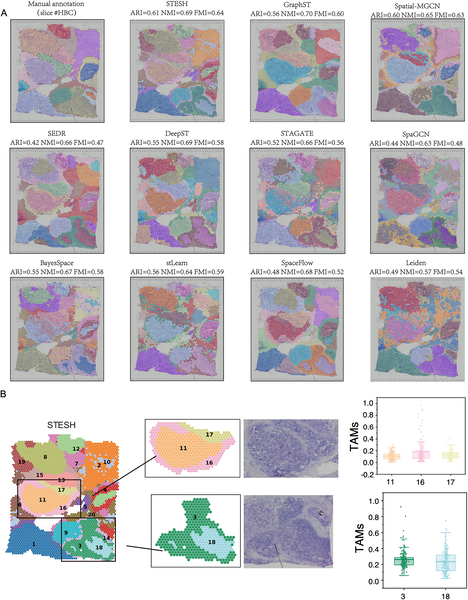

Imagine being able to peer inside a tissue and not only see its cells but also understand how their gene activity, physical location, and microscopic structure come together to form complex biological patterns. This is the promise of spatial transcriptomics, a cutting-edge technology that maps gene expression in tissue slices. Yet, integrating the layers of information—from gene activity to spatial coordinates to histological images—has been a major challenge. A new AI-powered method called STESH now brings these data types together, offering a clearer, more accurate map of tissue architecture and tumor complexity.

> **TL;DR**
> - STESH is a novel computational method that integrates gene expression, spatial location, and histological images using a multi-view graph convolutional network with attention mechanisms.
> - Benchmarking on brain and breast cancer tissues shows STESH outperforms existing methods in accurately identifying spatial domains and revealing fine tumor heterogeneity.

Spatial transcriptomics is revolutionizing biology by enabling researchers to see where genes are active within intact tissue sections. This spatial context is crucial for understanding how cells interact and organize in health and disease. Traditional methods often analyze gene expression alone or combine it with spatial data, but rarely incorporate histological images—those detailed microscopic pictures of tissue structure. Histology provides vital clues about tissue morphology that gene data alone cannot capture. Integrating all three data types promises a more complete picture but poses significant computational challenges.

To tackle this, the researchers developed STESH, which first extracts detailed features from histological images using a convolutional neural network (CNN). It then constructs separate graphs representing gene expression similarity, spatial proximity, and histological features. These graphs are fed into a multi-view graph convolutional network (GCN) that learns from each data type independently and collaboratively through an attention mechanism. This design allows STESH to capture complex relationships across the different data modalities, producing a refined low-dimensional representation of tissue spots that can be clustered into spatial domains.

STESH was tested on multiple datasets, including human brain tissue, breast cancer samples, and high-resolution mouse olfactory bulb data. Compared to ten state-of-the-art methods, STESH consistently achieved higher clustering accuracy, measured by metrics like the adjusted Rand index. In brain tissue, it precisely delineated cortical layers and captured developmental trajectories of cells. In breast cancer, STESH identified tumor regions and uncovered subtle heterogeneity within tumors, such as differences in tumor-associated macrophage distribution—cells known to influence cancer progression. These results demonstrate STESH’s ability to integrate complex data and reveal biologically meaningful spatial patterns.

By effectively combining gene expression, spatial coordinates, and histological images, STESH advances the analysis of spatial transcriptomics data. This integrated approach provides researchers with a more reliable and detailed map of tissue organization, which is essential for understanding normal biology and diseases like cancer. The ability to detect fine-scale tumor heterogeneity could inform future diagnostics and therapies. Moreover, STESH’s open-source availability encourages broader adoption and further development in the field of computational biology.

While STESH shows promising improvements, it remains a computationally sophisticated method that requires high-quality spatial transcriptomics and histological data. Its performance depends on the accuracy of histological feature extraction and the quality of spatial coordinates. Additionally, the method’s complexity may pose challenges for users without computational expertise. Future work will need to explore its applicability across diverse tissue types and spatial transcriptomics platforms, as well as its integration with other biological data modalities.

## Figures

*Fig 1. STESH analyzes gene expression, location, and tissue images using graphs and AI to study tissue features in detail.*

*STESH outperforms other methods in identifying brain tissue regions and visualizes spatial patterns effectively in brain samples.*

*Fig 3 shows how STESH better identifies brain tissue regions and maps cell development paths compared to other methods.*

*Fig 4 shows how STESH better identifies regions and tumor-related cells in human breast cancer tissue compared to other methods.*

## Sources

- [Histology-informed spatial domain identification through multi-view graph convolutional networks](https://journals.plos.org/ploscompbiol/article?id=10.1371/journal.pcbi.1014281)
- DOI: [10.1371/journal.pcbi.1014281](https://doi.org/10.1371/journal.pcbi.1014281)
