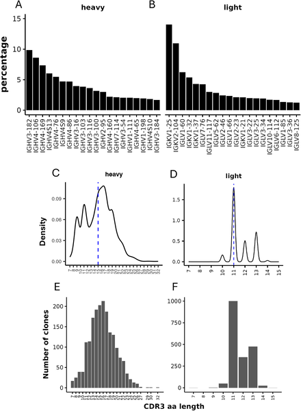
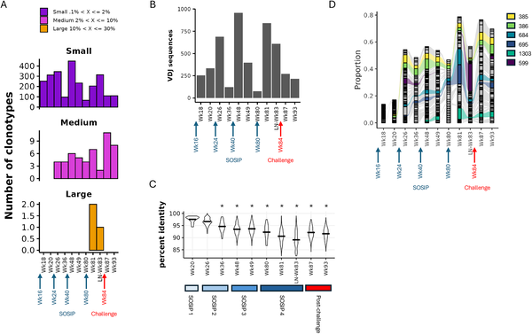
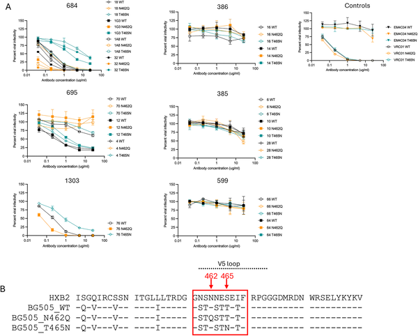

Despite decades of research, developing an effective HIV vaccine remains a formidable challenge. One promising approach involves a stabilized HIV envelope protein called BG505 SOSIP, which has shown the ability to elicit antibodies that neutralize the virus in animal models. But how exactly does this vaccine candidate stimulate the immune system to produce such antibodies? Recent research combining cutting-edge sequencing and molecular imaging techniques sheds light on the diverse ways antibodies recognize and disable the virus, offering valuable clues for future vaccine design.

> **TL;DR**
> - Repeated immunization with BG505 SOSIP in rhesus macaques drives expansion and maturation of specific B cell clones targeting a vulnerable glycan hole on the HIV envelope protein.
> - Neutralizing antibodies from these B cell clones bind the glycan hole using distinct molecular modes, interfering with the virus’s ability to engage host cell receptors and thereby blocking infection.

HIV’s envelope glycoprotein (Env) is the sole target on the virus surface for antibodies aiming to prevent infection. However, Env is heavily shielded by sugars (glycans), making it difficult for antibodies to access vulnerable sites. Vaccine candidates like BG505 SOSIP present a stabilized, native-like version of Env to the immune system, exposing certain ‘glycan holes’—regions where glycans are missing—that can serve as Achilles’ heels. Previous studies showed that antibodies targeting these glycan holes can neutralize the virus, but the detailed immune response and mechanisms of neutralization remained unclear.

To dissect the immune response, researchers immunized rhesus macaques with BG505 SOSIP and tracked antigen-specific B cells over time using high-throughput sequencing of B cell receptors. They analyzed over 4,700 B cells, identifying dominant B cell clones that expanded and evolved with repeated immunizations. The team then isolated monoclonal antibodies from these clones and used biolayer interferometry to measure their binding to Env proteins. Finally, cryo-electron microscopy (cryo-EM) provided high-resolution 3D structures of antibody-Env complexes, revealing how antibodies interact with the glycan hole at the molecular level.

The study found that repeated BG505 SOSIP immunizations led to profound expansion of a few dominant B cell clones targeting the 465 glycan hole on Env’s gp120 subunit. Among six abundant clones studied, three produced antibodies capable of neutralizing the virus. Structural analyses showed that these neutralizing antibodies bound the glycan hole in distinct ways, some even displacing a nearby glycan or contacting the critical CD4 binding loop used by HIV to infect cells. Functionally, these antibodies inhibited the virus by blocking or interfering with the Env-CD4 interaction, a key step in viral entry. Notably, non-neutralizing antibodies also targeted the same glycan hole but lacked these inhibitory effects.

These findings provide a detailed mechanistic understanding of how a leading HIV vaccine candidate stimulates the immune system to produce diverse neutralizing antibodies targeting a specific viral vulnerability. The revelation that antibodies can use different binding modes and mechanisms to neutralize the virus highlights the complexity and adaptability of the immune response. Such insights are crucial for guiding the design of next-generation vaccines that aim to elicit broad and potent antibody responses capable of overcoming HIV’s defenses.

While this study offers valuable insights into antibody responses against a specific glycan hole on BG505 Env, these antibodies primarily neutralize the matched virus strain and may not confer broad protection against diverse HIV variants. Additionally, the research was conducted in rhesus macaques, and immune responses in humans may differ. Further studies are needed to translate these mechanistic findings into vaccines that elicit broadly effective immunity across the global diversity of HIV strains.

## Figures

*This figure shows the main types and lengths of antibody parts in Ag + B cells, highlighting common patterns and diversity.*

*Tracking B cell groups over time shows how their size and diversity change after repeated BG505 SOSIP.664 immunizations and a virus challenge.*

*Graphs show how different antibodies reduce virus infectivity at varying concentrations against normal and mutated BG505 viruses.*

## Sources

- [HIV-1 BG505 SOSIP immunization induced B cell expansion targeting the 465-glycan hole, with neutralizing antibodies exhibiting distinct binding modes and mechanisms of virus inhibition](https://journals.plos.org/plospathogens/article?id=10.1371/journal.ppat.1014268)
- DOI: [10.1371/journal.ppat.1014268](https://doi.org/10.1371/journal.ppat.1014268)
