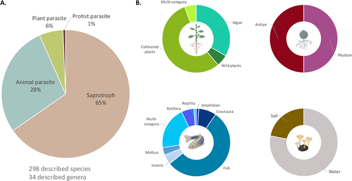
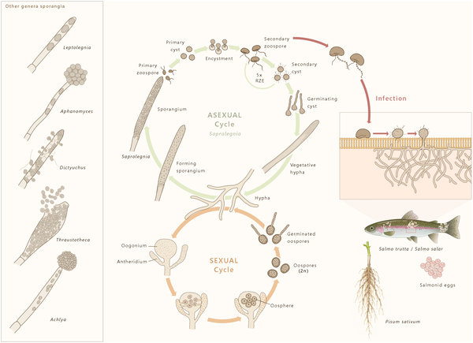

Imagine a group of microscopic organisms that have quietly evolved from decomposers to some of the most effective parasites in aquatic environments. These are the Saprolegniales, a diverse order of fungi-like microbes that infect a wide range of hosts, from plants to fish. Their story reveals fascinating insights into how parasitism evolves and thrives across ecosystems.

> **TL;DR**
> - Saprolegniales include both saprotrophic species that decompose organic matter and parasitic species that infect plants, animals, and protists, showcasing remarkable ecological diversity.
> - Their success as parasites hinges on specialized life cycles, molecular tools to evade host defenses, and dispersal strategies that allow them to spread across vast geographic distances.

Saprolegniales belong to the oomycetes, a group of eukaryotic microorganisms related to algae and distinct from true fungi, yet sharing some similar traits. Traditionally known as decomposers in aquatic systems, recent research reveals that about one-third of described species are parasitic, causing diseases in fish, plants, and other aquatic organisms. Some species, like Saprolegnia parasitica and Aphanomyces astaci, are notorious pathogens with significant economic and ecological impacts, especially in aquaculture and wildlife conservation.

Researchers reviewed taxonomic databases and literature to assess species diversity and ecological roles within Saprolegniales. They examined molecular data from about 40% of species to clarify evolutionary relationships and parasitic adaptations. Genomic analyses focused on secreted proteins and virulence factors, while microscopy and infection studies detailed life cycle stages and host interactions. Dispersal mechanisms were inferred from ecological observations and known host-vector relationships.

The study highlights that parasitism in Saprolegniales likely evolved from ancestral marine lineages, with horizontal gene transfer from fungi and bacteria playing a key role in acquiring genes that facilitate host infection. Their life cycle includes both sexual and asexual stages, with motile zoospores that actively seek hosts and specialized attachment structures enhancing infection efficiency. Molecular weapons such as proteases degrade host immune proteins, allowing parasites to evade defenses. Additionally, dispersal is not limited to water currents; hosts like invasive crayfish and possibly insects and waterfowl act as vectors, enabling long-distance spread across isolated water bodies.

Understanding how Saprolegniales evolved parasitism and their infection strategies sheds light on fundamental processes of parasite adaptation and host-pathogen coevolution. This knowledge is crucial for managing emerging diseases that threaten aquatic biodiversity and fisheries worldwide. Moreover, recognizing the role of biotic vectors in dispersal informs biosecurity measures to prevent the spread of these pathogens.

Despite advances, significant gaps remain. The exact evolutionary timeline and mechanisms behind the transition from saprotrophy to parasitism are not fully resolved. The diversity of virulence factors and their evolutionary origins require further study across more species. Dispersal pathways, especially involving insects and birds, need empirical confirmation. These uncertainties highlight the complexity of parasite evolution and the need for ongoing research to better predict and control Saprolegniales-related diseases.

## Figures

*Fig 1. Shows the variety of lifestyles among 298 Saprolegniales species, including plant, protist, animal parasites, and decomposers.*

*Diagram showing how Saprolegniales reproduce and infect hosts, highlighting their growth stages and spore types.*

## Sources

- [How Saprolegniales became successful parasites](https://journals.plos.org/plospathogens/article?id=10.1371/journal.ppat.1014359)
- DOI: [10.1371/journal.ppat.1014359](https://doi.org/10.1371/journal.ppat.1014359)
