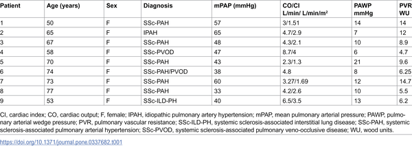

Inflammation is a double-edged sword: essential for fighting infections but harmful when uncontrolled. Scientists have long known that a protein called resistin is linked to various inflammatory diseases, but how exactly it fuels inflammation remained a mystery. Recent research now shines light on a novel mechanism by which human resistin triggers a key inflammatory complex in immune cells, opening new avenues for targeted therapies.

> **TL;DR**
> - Human resistin activates the NLRP3 inflammasome in macrophages by priming and triggering its assembly through a newly identified pathway involving Bruton’s tyrosine kinase (BTK).
> - Blocking resistin with a therapeutic antibody reduces inflammasome activation, suggesting a promising strategy for treating diseases driven by harmful inflammation, such as pulmonary hypertension.

The NLRP3 inflammasome is a protein complex inside immune cells called macrophages that plays a central role in initiating inflammation. When activated, it leads to the release of inflammatory molecules like interleukin-1β (IL-1β) and interleukin-18 (IL-18), which help coordinate the immune response. However, excessive or chronic activation of NLRP3 is implicated in many diseases, including diabetes, cardiovascular conditions, and lung disorders like pulmonary hypertension. Resistin, a hormone-like protein elevated in these diseases, was suspected to influence inflammation, but the direct connection to NLRP3 had not been clearly defined.

Researchers used cultured human macrophages derived from THP-1 monocytes to study how human resistin affects inflammasome activation. They measured gene and protein expression changes using quantitative PCR and western blotting, and explored protein interactions with co-immunoprecipitation techniques. To confirm findings in living organisms, they examined lung tissues from mice exposed to low oxygen (a model for pulmonary hypertension) and from human patients with pulmonary hypertension. They also tested the effects of blocking resistin with a monoclonal antibody, assessing impacts on inflammasome activation and inflammatory signaling.

The study revealed that human resistin promotes the expression and secretion of a damage-associated protein called HMGB1 in macrophages, which primes the cells by increasing NLRP3 and related inflammatory components. Resistin was found to bind directly to Bruton’s tyrosine kinase (BTK), causing BTK to activate itself and subsequently phosphorylate NLRP3. This phosphorylation triggers the assembly and activation of the inflammasome complex, leading to the cleavage and release of IL-1β and IL-18. These cytokines then stimulate proliferation of pulmonary vascular smooth muscle cells, contributing to vascular remodeling seen in pulmonary hypertension. In mouse models lacking the resistin-like molecule RELMα, inflammasome activation and vascular changes were significantly reduced. Importantly, lung tissues from patients with pulmonary hypertension showed increased co-localization of resistin, BTK, and NLRP3 in macrophages, supporting the relevance of this pathway in human disease. Blocking resistin with a monoclonal antibody effectively inhibited inflammasome activation in cell culture.

This research uncovers a previously unknown immune mechanism linking human resistin to the activation of the NLRP3 inflammasome, a central player in many inflammatory diseases. By identifying resistin as a critical upstream regulator that primes and activates this inflammasome via BTK, the study suggests that targeting resistin could be a novel therapeutic approach. This is especially promising for diseases like pulmonary hypertension, where excessive inflammation drives harmful vascular remodeling. A monoclonal antibody against resistin could potentially dampen this inflammatory cascade, offering a new strategy to treat or prevent disease progression.

While these findings are compelling, the molecular details of inflammasome regulation are complex, and further studies are needed to fully understand resistin’s role across different tissues and diseases. The mouse model used reflects aspects of pulmonary hypertension but cannot capture all human disease features. Additionally, translating antibody therapies from cell and animal models to safe and effective human treatments requires extensive clinical testing. Nevertheless, this study provides a strong foundation for exploring resistin-targeted therapies in inflammatory diseases.

## Figures

*Table showing heart and blood flow data plus diagnostic markers in patients with high blood pressure in lung arteries.*

## Sources

- [Human resistin is critical to activation of the NLRP3 inflammasome in macrophages](https://journals.plos.org/plosone/article?id=10.1371/journal.pone.0337682)
- DOI: [10.1371/journal.pone.0337682](https://doi.org/10.1371/journal.pone.0337682)
