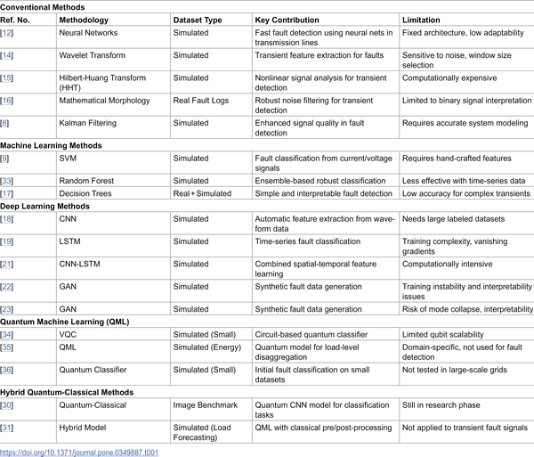

How can quantum computing help keep our power grids safe and reliable? As our energy systems grow more complex with renewable sources and smart devices, detecting faults quickly and accurately becomes vital. A new hybrid approach combining quantum computing with classical neural networks offers a promising path to spot power system faults in milliseconds, potentially revolutionizing how we protect and manage electrical grids.

> **TL;DR**
> - A hybrid quantum-classical neural network (HQCNN) model combines classical convolutional neural networks with quantum circuits to classify power grid faults rapidly and accurately.
> - Tested on both simulated IEEE bus systems and real-world phasor measurement unit (PMU) data, the HQCNN achieved over 94% accuracy with detection times under 3 milliseconds, outperforming traditional deep learning models.

Modern power grids are evolving with the integration of renewable energy and decentralized generation, but this complexity introduces new challenges for fault detection. Traditional protection methods often rely on fixed thresholds and impedance calculations that struggle with noisy, dynamic grid conditions. Meanwhile, classical deep learning models like CNNs and LSTMs have improved detection accuracy but require large datasets and significant computational resources, limiting their real-time application, especially at the grid's edge. Quantum computing, with its unique principles of superposition and entanglement, offers a new computational paradigm that could accelerate complex data processing tasks. However, current quantum hardware faces limitations such as qubit count and noise, making fully quantum solutions impractical for now. This has led researchers to explore hybrid quantum-classical neural networks that leverage the strengths of both worlds.

The research team developed a Hybrid Quantum-Classical Neural Network (HQCNN) that integrates a classical one-dimensional convolutional neural network (1D CNN) as a feature extractor with a parameterized quantum circuit (PQC) layer for classification. This hybrid model was trained and evaluated using simulated fault data from IEEE 14-bus and 39-bus power systems, alongside approximately 800 real fault events recorded by phasor measurement units (PMUs). The quantum layer enhances feature representation, while the classical CNN handles initial data processing. The model's performance was benchmarked against traditional deep learning models such as standalone CNNs and LSTMs, focusing on accuracy, computational efficiency, and detection latency. The researchers also analyzed the impact of removing the quantum layer and assessed hardware constraints and quantum noise effects.

The HQCNN model achieved high accuracy rates—96.43% on simulated data and 94.74% on real PMU data—surpassing conventional deep learning counterparts. Importantly, it maintained fault detection times under 3 milliseconds, meeting the stringent requirements for real-time grid monitoring. The system successfully classified various fault types, including single line to ground, double line, three-phase, and high-impedance faults. Ablation studies revealed that the quantum layer significantly contributed to improved classification performance. While quantum hardware limitations and noise were acknowledged, the hybrid approach demonstrated robustness and practical promise for deployment.

This study highlights the potential of hybrid quantum-classical neural networks to enhance real-time fault detection in power systems—a critical capability for maintaining grid stability and preventing widespread outages. By combining classical AI's maturity with emerging quantum computing advantages, the HQCNN approach offers a pathway to faster, more accurate fault diagnosis that could be integrated into smart grid infrastructure and substation edge devices. This fusion of technologies may accelerate the adoption of quantum-enhanced AI in energy systems, supporting the transition to more resilient and sustainable power networks.

Despite promising results, the research acknowledges current quantum hardware limitations such as qubit scalability, gate fidelity, and noise sensitivity, which constrain full quantum implementations. The dataset size, particularly for real-world PMU events, remains relatively modest, and further validation on larger, more diverse datasets is needed. Additionally, the model's explainability is an ongoing challenge; future work aims to incorporate hybrid explainable AI methods to improve transparency. Practical deployment will require continued advances in quantum hardware and optimization of hybrid models for edge computing environments.

## Figures

*Summary of studies on detecting faults in power systems from existing research.*

## Sources

- [Hybrid quantum-classical neural networks for real-time fault detection in power systems](https://journals.plos.org/plosone/article?id=10.1371/journal.pone.0349887)
- DOI: [10.1371/journal.pone.0349887](https://doi.org/10.1371/journal.pone.0349887)
