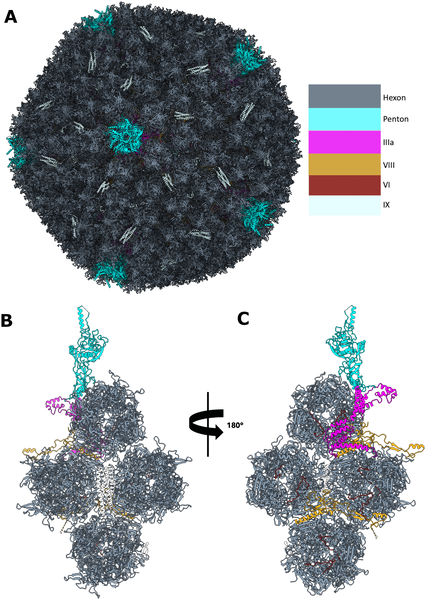
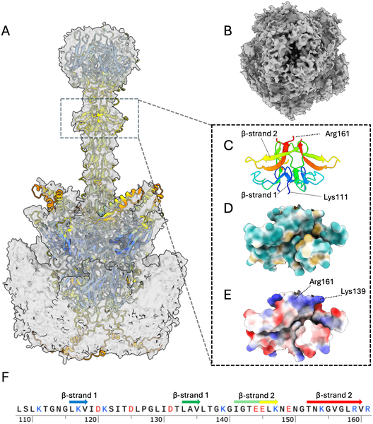
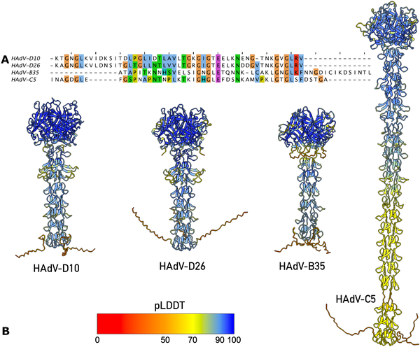
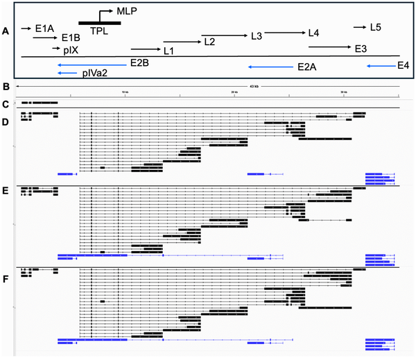

Viruses have long been both foes and tools in medicine. Among them, adenoviruses stand out as versatile vectors for delivering vaccines and gene therapies, including promising treatments targeting cancer cells. Recently, scientists have uncovered a previously unknown structural feature in the fiber protein of human adenovirus type 10 (HAdV-D10), a virus with low prevalence in humans. This discovery not only deepens our understanding of viral architecture but also holds potential to enhance the safety and effectiveness of gene delivery systems.

> **TL;DR**
> - The study reveals a novel 'umbrella' motif in the fiber shaft of HAdV-D10, a structural feature critical for virus attachment and entry into cells.
> - Transcriptomic analysis shows unique patterns of viral gene expression, including abundant production of a DNA-binding protein, supporting the virus's potential as a next-generation gene therapy vector.

Adenoviruses are double-stranded DNA viruses that infect humans, causing illnesses ranging from mild respiratory infections to conjunctivitis. Beyond their role as pathogens, these viruses have been harnessed as vectors to deliver therapeutic genes in vaccines and cancer treatments. The commonly used adenovirus type 5 (HAdV-C5) faces limitations due to widespread immunity in humans, which can neutralize the vector before it reaches target cells. Human adenovirus D10, part of species D adenoviruses, is less common in humans and interacts differently with cellular receptors, making it an attractive candidate for gene delivery. Understanding its structure and gene activity is essential to safely and effectively repurpose it for medical use.

The researchers employed cryo-electron microscopy (cryo-EM) to capture high-resolution images of the HAdV-D10 virus capsid, focusing on the fiber protein that mediates cell entry. They combined this structural data with transcriptomic profiling using long-read RNA sequencing to map viral gene expression in infected cells. Advanced computational tools, including AlphaFold3 for protein structure prediction, helped validate and interpret the novel features observed in the fiber shaft.

The cryo-EM analysis revealed that the fiber shaft of HAdV-D10 contains a previously uncharacterized structural motif, shaped somewhat like an 'umbrella.' This motif consists of a distinctive loop and beta-strand arrangement, featuring charged regions that may influence how the virus attaches to host cells. Comparisons with other adenoviruses showed that this motif is unique to certain species D viruses, including HAdV-D26, but absent in commonly used vectors like HAdV-C5. Transcriptomic data uncovered that HAdV-D10 expresses certain viral proteins, notably a mature form of protein VII, at higher levels than related viruses. Protein VII is involved in viral DNA packaging and may impact how the virus delivers its genetic payload.

Discovering the 'umbrella' motif in the fiber shaft provides new insights into how HAdV-D10 interacts with host cells, which is crucial for designing vectors that can efficiently and selectively infect target tissues, such as cancer cells. The unique gene expression profile further supports the virus's suitability as a gene delivery platform with potentially improved safety and efficacy. These findings underscore the importance of detailed structural and molecular characterization of viral vectors before clinical application, paving the way for next-generation therapies that could better evade immune detection and deliver therapeutic genes more effectively.

While the structural and transcriptomic data offer valuable clues, further research is needed to fully understand how the 'umbrella' motif affects viral infectivity and immune response in living organisms. The current study focuses on in vitro analyses and computational predictions; translating these findings into clinical success will require rigorous testing in preclinical models and human trials. Additionally, the complexity of viral-host interactions means that modifications to improve vector performance must be carefully balanced to avoid unintended effects.

## Figures

*3D model of HAdV-D10 virus shows its outer and inner protein structures from different angles.*

*Cryo-EM and AlphaFold3 reveal detailed 3D structure and features of the HAdV-D10 virus fiber protein, highlighting its shape and charge properties.*

*Fig 3 compares the fiber shaft structures of HAdV viruses, showing similar shapes and sequences in species D types HAdV-D10 and HAdV-D26.*

*This figure shows how the HAdV-D10 virus's genes are active at different times after infection, with key gene maps and directions highlighted.*

## Sources

- [Identification of a novel fiber shaft structural motif and overexpression of key transcripts elucidated in human adenovirus D 10](https://journals.plos.org/plospathogens/article?id=10.1371/journal.ppat.1014182)
- DOI: [10.1371/journal.ppat.1014182](https://doi.org/10.1371/journal.ppat.1014182)
