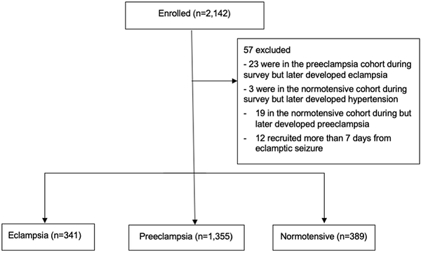
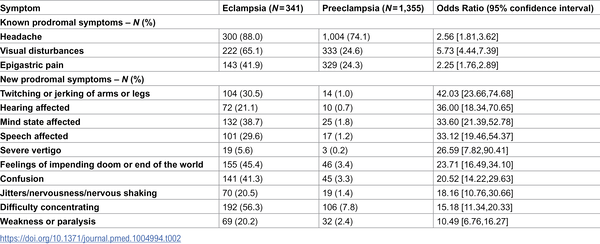
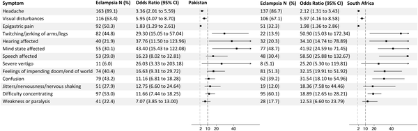

Eclampsia, a dangerous complication of pregnancy characterized by seizures, can threaten the lives of mothers and babies worldwide. While doctors have long relied on symptoms like headaches and visual disturbances to predict who might develop eclampsia, these signs are only modestly helpful. Now, a new study spanning two countries has uncovered ten previously unrecognized neurological symptoms that could serve as much stronger early warning signs, offering hope for better prevention.

> **TL;DR**
> - Researchers identified 10 new neurological symptoms that are far more strongly linked to eclampsia than the traditionally recognized signs such as headache and visual changes.
> - Screening for these symptoms in women with preeclampsia could help clinicians better target magnesium sulphate treatment to prevent life-threatening seizures.

Eclampsia occurs when women with preeclampsia—a condition marked by high blood pressure during pregnancy—experience seizures. It affects about 1 to 2% of women with preeclampsia and can lead to serious complications or death. Magnesium sulphate is the only medication proven to reduce the risk of eclampsia seizures by about half. However, deciding which women should receive this treatment has been challenging because the early warning signs currently used, like headache, visual disturbances, and upper abdominal pain, are not highly predictive. Some women even develop seizures without any of these symptoms. This gap in early detection has motivated researchers to search for better prodromal (early warning) symptoms.

To find new prodromal symptoms, researchers conducted a prospective case-control study across three large hospitals in South Africa and Pakistan between 2018 and 2023. They enrolled 2,142 pregnant or postpartum women divided into three groups: those who had experienced eclampsia seizures (341 women), those with preeclampsia but no seizures (1,355 women), and those with normal blood pressure during pregnancy (389 women). Women with eclampsia were interviewed within seven days of their seizure about 20 neurological symptoms they might have experienced beforehand. The team compared the frequency of these symptoms in women with eclampsia to those with preeclampsia and normotensive pregnancies, using statistical models to estimate how strongly each symptom predicted eclampsia.

The study confirmed that traditional prodromal symptoms like headache, visual disturbances, and epigastric pain were more common before eclampsia seizures but only modestly predictive. Strikingly, the researchers identified ten new neurological symptoms with much stronger associations to eclampsia, each increasing the odds of seizures by 10 to over 40 times compared to preeclampsia without seizures. These included twitching or jerking limbs, affected hearing, altered mental state, impaired speech, feelings of doom, severe vertigo, confusion, jitters, difficulty concentrating, and weakness or paralysis. These symptoms were rare in women with normal blood pressure and nearly all women with eclampsia experienced at least one prodromal symptom. The findings were consistent across both countries studied.

These newly identified symptoms could transform how clinicians assess risk in pregnant women with preeclampsia. By incorporating these neurological signs into routine clinical history taking, healthcare providers may better identify women at high risk of eclampsia seizures and prioritize them for magnesium sulphate prophylaxis. This targeted approach could improve prevention of life-threatening seizures, reduce maternal morbidity and mortality, and optimize resource use, especially in settings with limited access to advanced monitoring.

A key limitation of the study is that women were asked about prodromal symptoms after they had already experienced seizures, which introduces the possibility of recall bias. Symptoms might be remembered differently after such a dramatic event. Additionally, while the associations are strong, further research is needed to validate these findings prospectively and to determine how best to integrate these symptoms into clinical practice. Nonetheless, this study provides a valuable foundation for improving early detection of eclampsia risk.

## Figures

*Overview of how participants were selected and joined the study.*

*Odds of symptoms appearing before eclampsia compared to during preeclampsia were analyzed using logistic regression.*

*Odds of symptoms before eclampsia compared to preeclampsia, shown by country where women were recruited.*

## Sources

- [Identifying novel prodromal symptoms of eclampsia: A two-country, case-control study](https://journals.plos.org/plosmedicine/article?id=10.1371/journal.pmed.1004994)
- DOI: [10.1371/journal.pmed.1004994](https://doi.org/10.1371/journal.pmed.1004994)
