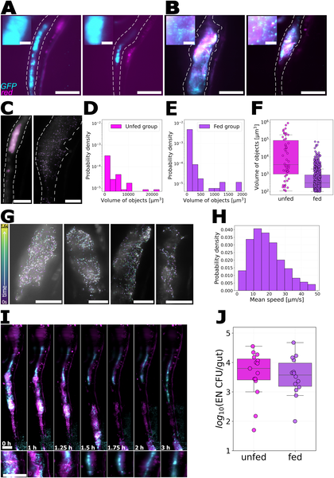
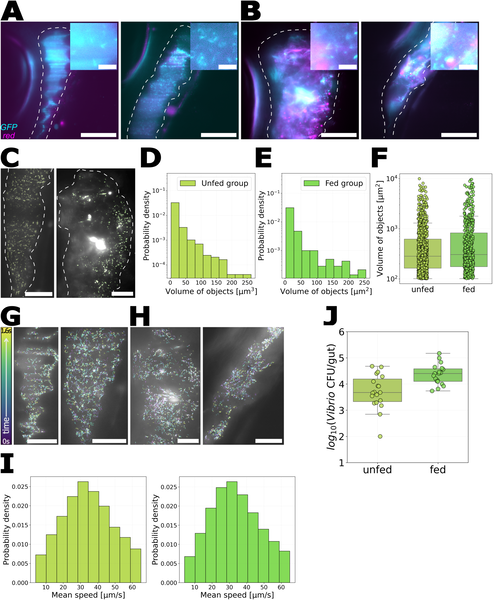
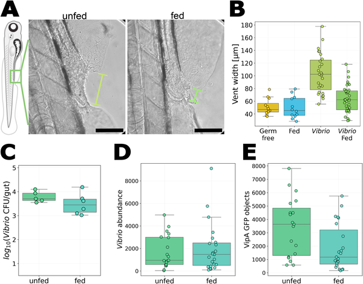

Imagine peering inside a living gut to watch bacteria move, cluster, and interact in real time. This is now possible thanks to transparent zebrafish larvae and sophisticated microscopy techniques. Recent research shows that feeding these tiny fish with a common live food, rotifers, dramatically changes how gut bacteria behave—breaking up bacterial clusters and dialing down harmful bacterial activity. These insights open new windows into understanding the dynamic relationship between diet, microbes, and host health.

> **TL;DR**
> - Feeding zebrafish larvae with UV-treated rotifers causes Enterobacter bacteria to shift from clustered, non-motile groups to dispersed, motile individuals inside the gut.
> - The motile Vibrio bacteria reduce their harmful secretion system activity after feeding, leading to less damage to the host’s intestinal tissue.

The gut microbiome plays a crucial role in host health, influencing digestion, immunity, and even behavior. While it’s well known that diet affects which microbes live in the gut, less understood is how food changes bacterial behavior inside the living intestine. This is largely because most animals’ guts are opaque, making it difficult to observe microbes in action. Zebrafish larvae offer a unique solution: their transparency and the ability to raise them germ-free allow scientists to introduce specific bacteria and watch their behavior live using fluorescence microscopy. Two bacteria of interest are Enterobacter, which tends to form large clusters in the gut, and Vibrio, a motile species capable of damaging intestinal tissue through a specialized secretion system.

Researchers raised zebrafish larvae in sterile conditions and introduced fluorescently labeled Enterobacter and Vibrio strains isolated from zebrafish guts. To study the effect of feeding without adding new microbes, they fed the larvae rotifers — a common live food source — that had been treated with ultraviolet light to drastically reduce their microbial load. Using light sheet fluorescence microscopy, the team captured detailed, three-dimensional images of bacterial behavior inside live fish guts. They also engineered Vibrio bacteria to express a fluorescent marker linked to their Type VI Secretion System (T6SS), allowing visualization of this harmful apparatus in action. Image analysis and bacterial motility tracking were performed with custom software tools.

The study revealed striking changes in bacterial behavior following feeding. Enterobacter, which normally forms dense, static aggregates in unfed larvae, dispersed into motile, individual cells after rotifer consumption. Vibrio bacteria remained planktonic and motile regardless of feeding but showed a significant decrease in the activity of their T6SS, as indicated by reduced fluorescence of the secretion system marker. This reduction in T6SS activity correlated with a marked decrease in intestinal tissue damage, suggesting that feeding modulates bacterial pathogenicity. Importantly, these behavioral shifts occurred without changes in overall bacterial abundance, highlighting that feeding influences bacterial function and organization rather than just population size.

These findings demonstrate that feeding can profoundly alter gut bacterial behavior in ways that impact host health. By breaking up bacterial clusters and suppressing harmful secretion systems, diet may help maintain a balanced and less damaging microbiome. This work underscores the importance of considering bacterial behavior, not just composition, when studying gut microbiomes and their role in disease. The use of transparent zebrafish larvae and live imaging provides a powerful platform for exploring these dynamic host-microbe interactions in vivo, potentially guiding future strategies to promote gut health through diet or microbial management.

While zebrafish larvae offer a valuable model due to their transparency and genetic tractability, their gut environment differs from that of mammals, so direct extrapolation to human gut microbiomes should be cautious. The study focused on two bacterial strains, and gut microbial communities are far more complex in natural settings. Additionally, the feeding involved UV-treated rotifers to minimize microbial introduction, which may not fully replicate natural feeding conditions. Further research is needed to explore how diverse diets and microbial communities interact to shape bacterial behaviors and host outcomes across different species.

## Figures

*Rotifer feeding changes how Enterobacter bacteria group and move inside zebrafish larvae guts, shown by glowing bacteria and gut images.*

*Vibrio bacteria's location and movement in zebrafish guts stay the same whether or not rotifers are eaten.*

*Feeding larvae reduces Vibrio bacteria's harmful effects on their vent area without changing bacterial numbers.*

## Sources

- [Imaging the impact of rotifer consumption on bacterial behaviors in the zebrafish gut](https://journals.plos.org/plosone/article?id=10.1371/journal.pone.0349516)
- DOI: [10.1371/journal.pone.0349516](https://doi.org/10.1371/journal.pone.0349516)
