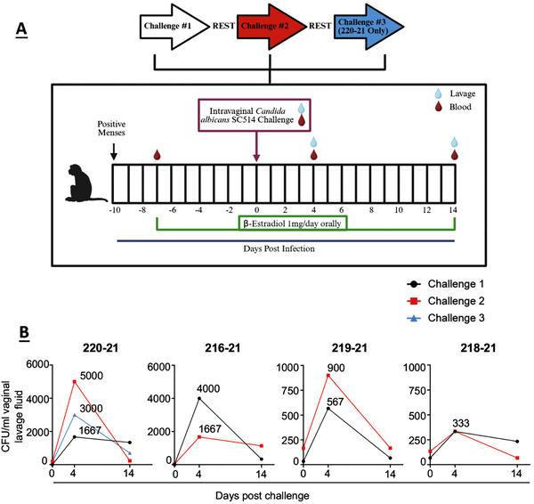
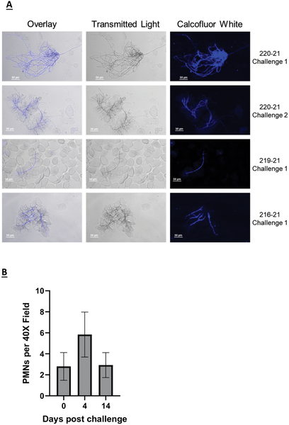
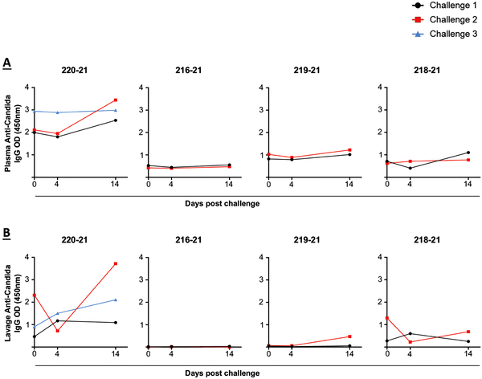
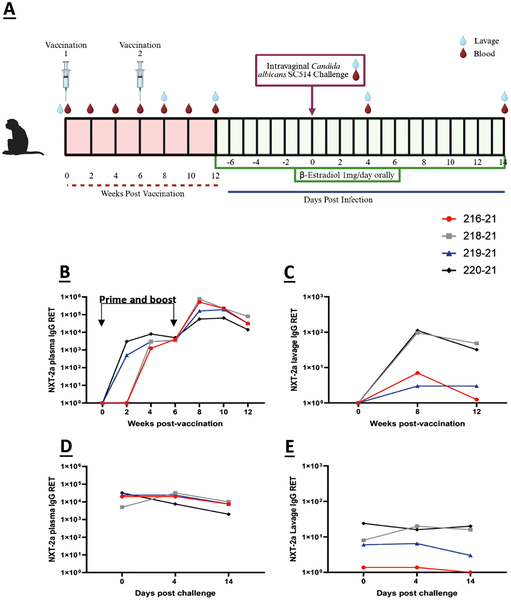

Could a vaccine help millions of women suffering from painful, recurrent yeast infections? Vulvovaginal candidiasis (VVC), caused primarily by the fungus Candida albicans, affects most women at least once in their lifetime, and a significant number experience recurrent episodes that disrupt daily life. Current treatments often fail to prevent these recurrences, and rising drug resistance limits options. Now, scientists have tested a promising new vaccine candidate, called NXT-2, in a primate model that closely mimics human infection, offering hope for a more effective preventive strategy.

> **TL;DR**
> - Japanese macaques, like humans, can be repeatedly infected with Candida albicans, showing active fungal growth and immune responses but limited natural antibody protection against reinfection.
> - Vaccination with the pan-fungal candidate NXT-2 induced strong antibody responses and significantly reduced fungal burden after repeated vaginal challenges, demonstrating potential to prevent recurrent infections.

Recurrent vulvovaginal candidiasis (RVVC) affects an estimated 138 million women worldwide each year. While antifungal drugs like azoles are commonly prescribed, they often fail to prevent recurrence and carry risks such as drug resistance and potential harm during pregnancy. Despite this high burden, no fungal vaccines have yet been approved. Rodent models have helped researchers understand VVC, but their immune responses and susceptibility differ from humans, limiting translation. Non-human primates (NHPs), such as Japanese macaques, share closer anatomical and immune similarities with humans, making them valuable for studying infections and testing vaccines in a setting more relevant to human disease.

Researchers developed a model of recurrent vaginal Candida infection using Japanese macaques. The animals were treated with estradiol to mimic hormonal conditions favorable for infection, then repeatedly exposed to Candida albicans via intravaginal challenge. Fungal burden was measured from vaginal lavages over 14 days post-challenge, and immune responses were tracked by measuring antibody levels in blood and vaginal fluid. After establishing that macaques could be reinfected and showed limited natural immunity, the team immunized some animals with the NXT-2 vaccine—a peptide designed to target multiple fungal pathogens. The vaccinated macaques were then rechallenged with Candida to assess vaccine-induced protection.

The study confirmed that Japanese macaques are susceptible to repeated Candida infections, with fungal levels peaking around four days after each challenge and persisting for up to two weeks. Active infection was evident through the presence of fungal hyphae and recruitment of immune cells in vaginal samples. Despite prior exposure, natural antibody responses against Candida were modest and did not prevent reinfection. In contrast, vaccination with NXT-2 elicited robust systemic and mucosal antibody responses. Following subsequent fungal challenge, vaccinated macaques showed a significant reduction in vaginal fungal burden compared to unvaccinated controls, indicating that the vaccine enhanced protective immunity against recurrent infection.

This research represents a meaningful advance in the quest for a fungal vaccine to prevent recurrent vulvovaginal candidiasis. By using a primate model that closely resembles human infection and immunity, the study provides compelling evidence that the pan-fungal vaccine candidate NXT-2 can induce protective immune responses and reduce fungal burden after repeated exposures. Given the limitations of current antifungal treatments and the high global burden of RVVC, a vaccine like NXT-2 could offer a much-needed preventive option for millions of women, improving quality of life and reducing healthcare costs.

While promising, these findings are preliminary and based on a small number of animals in a controlled experimental setting. The macaque model, though closer to humans than rodents, is not identical to human biology, and vaccine safety and efficacy must be rigorously tested in clinical trials. Additionally, the study focused on fungal burden reduction rather than clinical symptoms, so further research is needed to confirm the vaccine’s impact on disease severity and recurrence in humans. Nonetheless, this study lays important groundwork for future development of fungal vaccines.

## Figures

*Japanese macaques were repeatedly exposed to Candida albicans vaginally, with fungal levels measured before and after each challenge.*

*Infection with C. albicans in macaques shows fungal growth and immune cell response in vaginal samples after initial and repeated exposures.*

*Antibody levels against Candida were measured in blood and vaginal fluid before and after infection and reinfection over 14 days.*

*Vaccinated macaques showed increased anti-NXT-2a IgG antibodies in blood and vaginal samples over 12 weeks after vaccination and fungal challenge.*

## Sources

- [Immunization with the pan-fungal vaccine, NXT-2a, reduces fungal burden following serial intravaginal challenges with C. albicans in a non-human primate model of experimental vulvovaginal candidiasis](https://journals.plos.org/plosone/article?id=10.1371/journal.pone.0352577)
- DOI: [10.1371/journal.pone.0352577](https://doi.org/10.1371/journal.pone.0352577)
