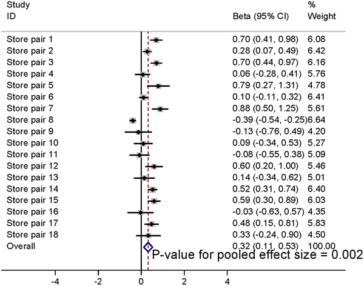

Could simply moving fruits and vegetables closer to the entrance of a supermarket encourage shoppers to buy more of them? This question might seem straightforward, but it touches on a complex interplay between retail design, consumer behavior, and public health. A recent large-scale study in England tested whether placing an expanded fruit and vegetable section near store entrances could boost produce sales and improve diet quality, even during the COVID-19 pandemic and a cost-of-living crisis.

> **TL;DR**
> - Positioning fresh fruit and vegetables near supermarket entrances increased store-level sales by roughly 2,500 extra portions per store each week.
> - While household purchasing and dietary improvements were modest and not statistically definitive, the intervention showed promise in supporting healthier choices, especially among certain groups.

Obesity and poor diet remain major public health challenges worldwide, contributing to illness and health inequalities. Retail environments heavily influence food choices, with product placement being a key marketing strategy. Typically, unhealthy foods are prominently displayed, while fresh produce often receives less visible placement, especially in discount supermarkets. Understanding how store layouts affect purchasing can inform policies aimed at improving population diets. In England, new regulations now restrict the placement of unhealthy foods in prominent store locations, but there is interest in whether promoting healthy foods like fruits and vegetables in prime spots can further support healthier eating.

This study, known as the WRAPPED trial, was a prospective matched controlled cluster design involving 36 discount supermarkets in England—18 intervention stores and 18 matched controls. The intervention moved and expanded the fresh fruit and vegetable section to near the store entrance for six months. Women aged 18 to 60 who shopped at these stores and held loyalty cards participated by sharing purchasing data and completing dietary questionnaires. Researchers collected continuous store sales data, household purchasing records, dietary quality scores, and information on household fruit and vegetable waste before, during, and after the intervention. Control stores maintained their usual layouts, with produce typically located toward the back.

At the store level, the intervention led to a statistically significant increase in fresh fruit and vegetable sales immediately after implementation, amounting to about 2,525 extra portions sold per store per week. However, this boost diminished over the following months. Household purchasing of produce showed a small, non-significant increase after six months, and dietary quality improvements among women shoppers were modest. The study also noted that the intervention might have helped protect against declines in produce purchasing during the pandemic and economic challenges, particularly for households experiencing greater socioeconomic deprivation or those exposed to a higher 'dose' of the intervention. Fruit and vegetable waste did not increase significantly, suggesting that increased purchasing did not lead to more waste.

These findings provide real-world evidence that simply repositioning fresh produce to more prominent locations in supermarkets can modestly improve sales and potentially support healthier dietary choices. This is particularly relevant for discount supermarkets, which often serve socioeconomically vulnerable populations and typically have less healthy in-store environments. The study supports policies that encourage placing fruits and vegetables near store entrances and restricting unhealthy food placements in prominent spots like checkouts and aisle ends. Such environmental nudges could be a practical component of broader strategies to improve public health nutrition.

The study was conducted during the COVID-19 pandemic and a cost-of-living crisis, times when overall fruit and vegetable purchasing and intake were declining, which may have influenced results. The stores were not randomized to intervention or control groups, raising the possibility of unmeasured confounding factors. Some findings, such as the effects related to intervention dose and socioeconomic status, were exploratory and not pre-specified, so they should be interpreted cautiously. Additionally, while store sales increased, household-level purchasing and dietary improvements were modest and not statistically significant, indicating that further research is needed to confirm and extend these results.

## Figures

*Stores with interventions saw a notable rise in fresh fruit and vegetable sales compared to expected levels.*

## Sources

- [Impact of supermarket fruit and vegetable placement on store sales, customer purchasing, diet and household waste: A prospective matched-controlled cluster trial](https://journals.plos.org/plosmedicine/article?id=10.1371/journal.pmed.1004575)
- DOI: [10.1371/journal.pmed.1004575](https://doi.org/10.1371/journal.pmed.1004575)
