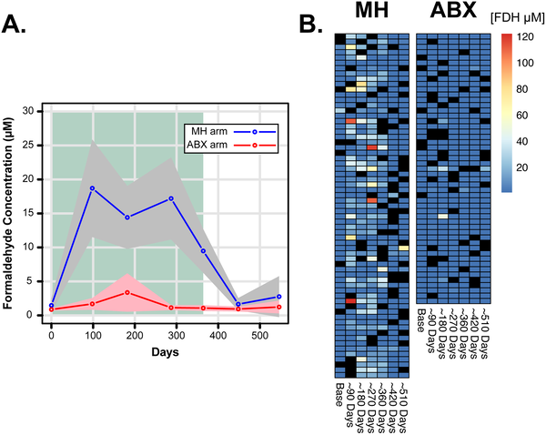
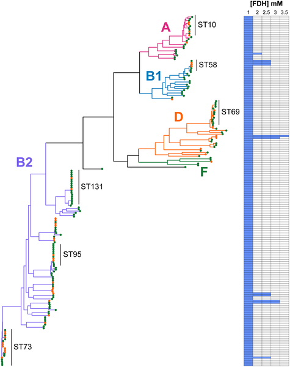
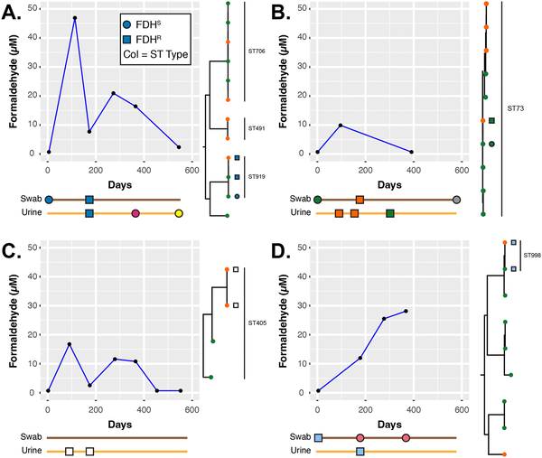

Did you know that bacteria can develop resistance not only to antibiotics but also to certain non-antibiotic treatments once considered foolproof? Methenamine hippurate, a urinary antiseptic used for decades to prevent recurrent urinary tract infections (UTIs), works by releasing formaldehyde in the bladder—a potent antiseptic chemical. Until recently, it was assumed bacteria couldn’t adapt to this mode of attack. However, new research reveals that some strains of Escherichia coli, a common UTI culprit, are evolving ways to survive formaldehyde exposure, challenging our understanding of UTI treatment.

> **TL;DR**
> - Methenamine hippurate releases formaldehyde in acidic urine to prevent UTIs, offering an alternative to antibiotics.
> - Some E. coli bacteria have developed resistance to formaldehyde, raising concerns about the long-term effectiveness of methenamine hippurate.

Urinary tract infections are among the most common infections worldwide, often treated with short courses of antibiotics. But recurrent UTIs are a persistent problem, leading to repeated antibiotic use and contributing to the global issue of antimicrobial resistance. Methenamine hippurate (MH) has been used since the late 19th century as a non-antibiotic prophylactic treatment. It works by breaking down in acidic urine to release formaldehyde, which kills bacteria. Because formaldehyde is a chemical antiseptic rather than an antibiotic, it was widely believed that bacteria would not develop resistance to it. This assumption made MH an attractive option to reduce antibiotic use and help combat resistance. However, the ALTAR clinical trial, which compared MH to low-dose antibiotics for preventing recurrent UTIs, found that while MH was generally effective, there was a slightly higher rate of breakthrough infections. This prompted researchers to investigate whether bacteria might be adapting to MH treatment.

Researchers analyzed urine samples and bacterial isolates collected during the ALTAR trial, which involved women with recurrent UTIs treated either with MH or antibiotics. They measured formaldehyde levels in urine samples using chemical assays and examined changes in urine composition. They then isolated Escherichia coli strains from participants’ urine and perineal swabs and tested these bacteria’s ability to grow in the presence of formaldehyde at concentrations similar to those found in urine during MH treatment. Genetic sequencing of the bacterial isolates focused on the frmRAB operon, a set of genes known to regulate formaldehyde detoxification in E. coli. The team looked for mutations or plasmid-borne genes that could explain increased resistance. Finally, they tested bacterial growth in artificial urine at different pH levels to mimic conditions in the urinary tract.

The study found that formaldehyde was detectable in the urine of most MH-treated participants, though levels varied widely. Importantly, about 6% of E. coli isolates from the trial could grow in formaldehyde concentrations exceeding 1 millimolar, indicating formaldehyde resistance. Genetic analysis revealed that these resistant strains often carried mutations in the frmR gene, which normally represses the formaldehyde detoxification system, or possessed plasmids encoding additional detoxification enzymes. These adaptations allowed bacteria to neutralize formaldehyde more effectively, surviving in an environment designed to kill them. The resistant strains were found in both urine and perineal swabs, suggesting they could persist and potentially cause infection despite MH treatment. Moreover, the researchers observed changes in urine chemistry in MH users, including increased formate levels, a byproduct of formaldehyde detoxification, further supporting bacterial adaptation.

This work challenges the longstanding belief that methenamine hippurate is immune to resistance development because it is not an antibiotic. The discovery that urinary E. coli can evolve formaldehyde resistance has important clinical implications. It highlights that even non-antibiotic antiseptics can exert selective pressure on bacteria, leading to adaptation. For patients with recurrent UTIs, this means MH may not always be a fail-safe alternative to antibiotics. The findings also emphasize the need for careful monitoring and stewardship when using MH, just as with antibiotics, to preserve its effectiveness. Understanding the mechanisms behind bacterial resistance to formaldehyde could guide the development of improved treatment strategies and inform clinical decisions about UTI management.

While the study provides compelling evidence of formaldehyde resistance in E. coli from MH-treated patients, the proportion of resistant strains was relatively small, and the clinical impact of this resistance requires further investigation. The variability in formaldehyde levels among patients suggests that individual factors such as urine pH and metabolism influence treatment efficacy. Additionally, the study focused primarily on E. coli, and resistance patterns in other urinary pathogens remain to be explored. Future research should also assess how widespread formaldehyde resistance is in broader patient populations and whether it leads to more frequent or severe breakthrough infections. Overall, the findings call for a nuanced approach to using MH, balancing its benefits in reducing antibiotic use against the risk of emerging resistance.

## Figures

*Formaldehyde levels in urine were tracked over time during treatment, showing changes and variability across participants.*

*E. coli strains from swabs and urine were tested for formaldehyde resistance, shown by colored branches and heatmap of growth at different formaldehyde levels.*

*Timelines and genetic links of E. coli in four patients show how formaldehyde levels in urine relate to resistant bacterial strains over time.*

## Sources

- [Implications for methenamine hippurate use in recurrent urinary tract infection management: Formaldehyde resistance and altered urinary composition](https://journals.plos.org/plospathogens/article?id=10.1371/journal.ppat.1014081)
- DOI: [10.1371/journal.ppat.1014081](https://doi.org/10.1371/journal.ppat.1014081)
