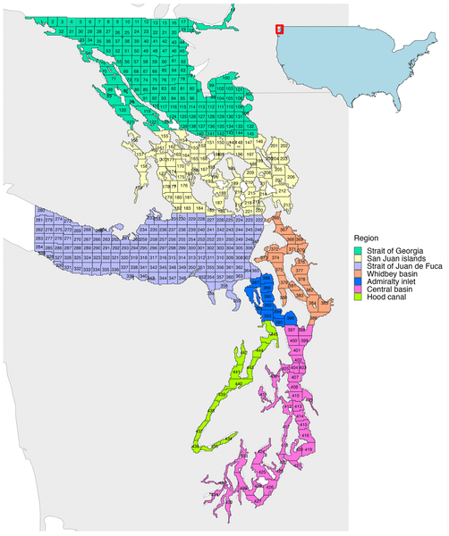
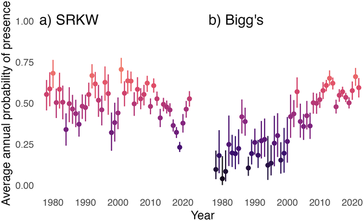
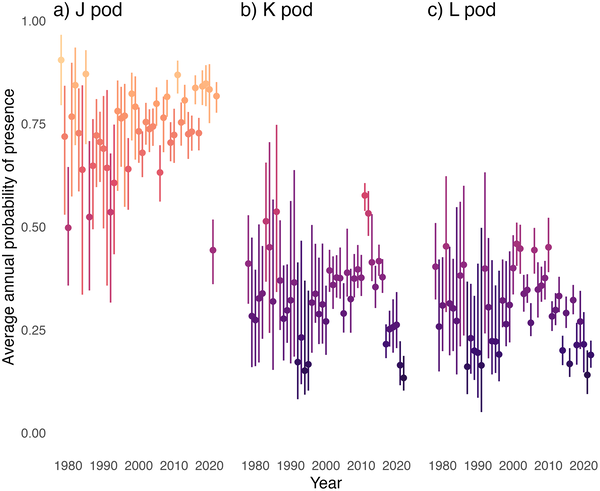
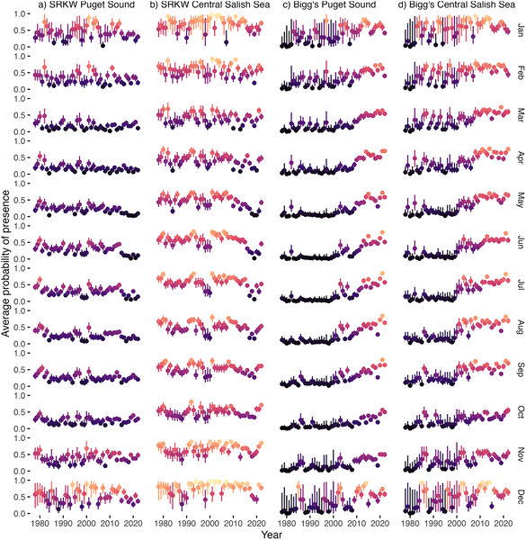

Killer whales, or orcas, are among the most iconic marine predators in the world. In the waters of Washington’s Salish Sea, two distinct types of killer whales share the same habitat but live very different lives: the endangered Southern Resident killer whales, which primarily eat fish, and Bigg’s killer whales, which hunt marine mammals. Recent research using over four decades of sightings data reveals that these two ecotypes are changing how and when they use these waters, with Bigg’s killer whales becoming more common and Southern Residents showing shifts in their seasonal presence. Understanding these changes is crucial for protecting these remarkable animals.

> **TL;DR**
> - Southern Resident killer whales have shown a decline in presence in Washington waters since the early 2000s, especially in recent years, with notable seasonal shifts.
> - Bigg’s killer whales have steadily increased their presence in the region over the past 40 years, leading to greater habitat overlap with Southern Residents.

The Salish Sea, encompassing parts of Washington State, is home to two killer whale ecotypes with distinct diets and social structures. Southern Resident killer whales (SRKW), listed as endangered, mainly feed on fish, particularly Chinook salmon, and live in stable family groups known as pods (J-, K-, and L-pods). In contrast, Bigg’s killer whales prey on marine mammals and tend to travel in smaller groups or alone. Despite sharing the same waters, these ecotypes face different ecological pressures and threats. Over the past several decades, SRKW numbers have declined from nearly 100 individuals in the 1990s to just 73 in 2024, raising concerns about their survival. Meanwhile, Bigg’s killer whales appear to be increasing in number and presence. Understanding how these two groups use the Salish Sea over time can shed light on ecosystem changes and inform targeted conservation efforts.

Researchers analyzed killer whale sightings from 1978 to 2022 using The Whale Museum’s Sightings Network, which compiles visual and acoustic detections from citizen scientists, whale-watch operators, and dedicated observers. To account for biases inherent in opportunistic sightings—such as more reports near populated areas and during favorable weather—they used species distribution models. These models incorporated both presence data (confirmed sightings) and carefully generated pseudo-absence data derived from sightings of other cetaceans to better estimate where and when each killer whale ecotype was likely present. The study also distinguished among the three Southern Resident pods to observe pod-specific trends. Spatial data were organized into quadrants approximately 4 by 6 kilometers in size, enabling detailed mapping of habitat use and seasonal patterns.

The study found that Southern Resident killer whales’ presence in Washington waters has fluctuated over the years, peaking around 2001 with a 70% probability of presence but dropping to 23% by 2019. This decline was mainly driven by reduced sightings of the K- and L-pods since 2017, while the J-pod’s presence remained relatively stable. Seasonally, SRKWs have been less present during summer months (June to August) since 2016. In contrast, Bigg’s killer whales have steadily increased their presence from just 4% in 1978 to 66% in 2022, with increases observed across all months. As Bigg’s killer whales have become more common, their habitat use has overlapped more with Southern Residents, particularly in the Puget Sound and Whidbey Basin. Notably, from October to January, both ecotypes have an equal probability of presence throughout the Central Basin, suggesting increased spatial overlap during these months.

These findings highlight important shifts in the ecology of two killer whale ecotypes sharing the Salish Sea, with direct implications for conservation management. The increasing presence of Bigg’s killer whales alongside the declining and seasonally shifting Southern Residents points to changes in the marine ecosystem, potentially linked to prey availability and human impacts. By mapping when and where each group is most likely to be found, managers can better plan actions to minimize disturbances—such as regulating vessel traffic or noise pollution—during critical times and in key habitats. This spatially explicit approach is vital for protecting the endangered Southern Resident killer whales while considering the dynamics of the growing Bigg’s population.

While this study benefits from a uniquely long and comprehensive dataset, it relies heavily on opportunistic sightings, which can be influenced by observer effort, weather, and accessibility. Although the use of pseudo-absence data helps mitigate some biases, uncertainties remain in estimating true whale presence. Additionally, acoustic detections vary with environmental conditions and species vocal behavior, which may affect detection rates. The study’s species distribution models provide probabilities rather than exact counts, and ecological factors driving these shifts—such as prey availability or human activities—require further investigation. Therefore, while the results offer valuable insights, they should be integrated with ongoing monitoring and research to fully understand and manage killer whale populations in the region.

## Figures

*Map showing study area divided into numbered sections and colored regions to explore habitat use.*

*Average yearly chances of spotting SRKW (a) and Bigg’s (b) whales shown with color-coded points and error bars.*

*Average yearly chances of spotting J-, K-, and L-pod whales shown with color and error bars, based on their presence in the area.*

*Monthly chances of SRKW and Bigg’s whales appearing in Puget Sound and Central Salish Sea, shown with average points and prediction ranges.*

## Sources

- [Increasing presence of Bigg’s killer whales and changing seasonality of Southern Resident killer whales in Washington waters](https://journals.plos.org/plosone/article?id=10.1371/journal.pone.0350181)
- DOI: [10.1371/journal.pone.0350181](https://doi.org/10.1371/journal.pone.0350181)
