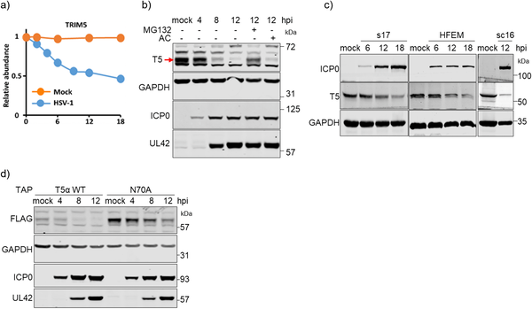
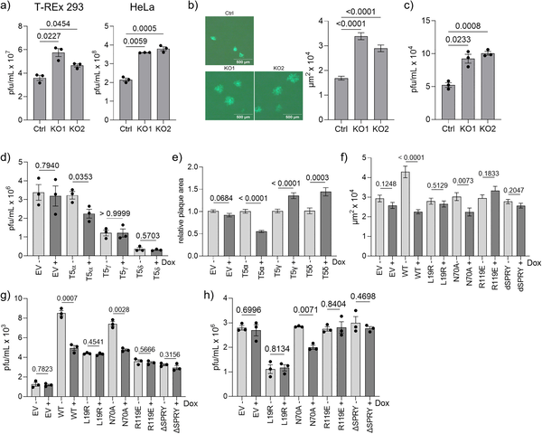
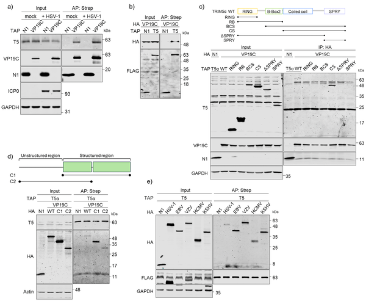
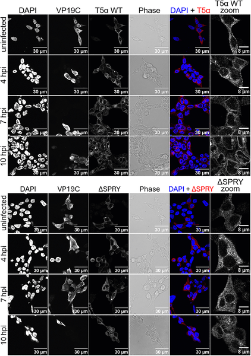

Herpes simplex virus type 1 (HSV-1) is a common virus known for causing cold sores and, in severe cases, brain infections such as encephalitis. Scientists have long sought to understand how our cells detect and fight HSV-1, and how the virus manages to evade these defenses. A recent study reveals a surprising molecular tug-of-war involving two human proteins that both recognize the same part of the virus but play opposite roles—one blocks infection, while the other helps the virus spread. This discovery opens new avenues for antiviral treatments.

> **TL;DR**
> - The human protein TRIM5α binds the HSV-1 capsid protein VP19C and restricts viral infection by stabilizing capsid complexes and activating immune signaling.
> - Cyclophilin A (CypA), another human protein that also binds VP19C, enhances HSV-1 infection, but drugs targeting CypA can reduce viral replication, suggesting potential therapies.

HSV-1 infects a majority of people worldwide and can cause a range of symptoms from mild cold sores to serious brain infections. Despite decades of research, there is no vaccine, and current antiviral drugs cannot eliminate the virus completely. Understanding the interactions between viral components and host proteins is crucial for developing new treatments. The viral capsid, a protein shell protecting the virus’s DNA, is a key structure that host cells can recognize to mount defenses. VP19C is a minor but essential capsid protein that helps assemble and stabilize the viral capsid. How human proteins interact with VP19C and influence infection was not fully understood.

The researchers used a combination of molecular biology techniques, including protein interaction assays, gene editing to remove or modify specific proteins in human cell lines, and viral infection experiments. They tracked how TRIM5α and Cyclophilin A (CypA) interact with VP19C from HSV-1 and related herpesviruses. The team also tested the effects of drugs like cyclosporin A and its derivatives, known to inhibit CypA, on viral replication in neuronal cells. Protein levels were measured over time during infection, and microscopy was used to observe protein localization within cells.

The study showed that TRIM5α directly binds to the HSV-1 capsid protein VP19C, stabilizing the capsid complex and promoting its accumulation in the cell nucleus. This interaction activates immune signaling pathways, helping to restrict viral replication. However, HSV-1 counters this defense by triggering the degradation of TRIM5α through the proteasome system. In contrast, Cyclophilin A, which is incorporated into HSV-1 virions, also binds VP19C but enhances viral infection independently of TRIM5α. Importantly, inhibiting CypA with cyclosporin A and related compounds reduced HSV-1 replication in neuronal cells, suggesting a possible therapeutic approach. The interactions between these host proteins and VP19C were conserved across diverse human herpesviruses, indicating a shared vulnerability.

This research uncovers a novel dual role of host proteins targeting the same viral capsid protein but with opposing effects—TRIM5α as an antiviral factor and CypA as a proviral factor. Understanding this molecular interplay provides valuable insight into how herpesviruses evade immune defenses and how host proteins can be leveraged for treatment. The finding that cyclosporin A derivatives can inhibit HSV-1 replication in neuronal cells is particularly promising for developing new therapies against HSV-1 encephalitis, a serious and often fatal brain infection. Moreover, the conserved nature of these interactions across herpesviruses suggests the potential for broad-spectrum antiviral drugs targeting the capsid-host interface.

While these findings are compelling, they are primarily based on cell culture models, and further research is needed to confirm their relevance in living organisms. The precise mechanisms by which HSV-1 induces TRIM5α degradation and how CypA enhances infection independently of TRIM5α require deeper investigation. Additionally, although cyclosporin A and its derivatives show antiviral activity in neuronal cells, their safety and efficacy as treatments for HSV-1 encephalitis need thorough evaluation in clinical studies. As with all antiviral strategies targeting host proteins, potential side effects and impacts on normal cellular functions must be carefully considered.

## Figures

*TRIM5 protein levels drop during HSV-1 infection in human cells, shown by protein analysis and immunoblotting over time.*

*TRIM5α protein reduces HSV-1 virus levels and plaque sizes in various human cell types, showing its role in fighting the infection.*

*TRIM5α protein binds directly to HSV-1 capsid protein VP19C, especially through its C-terminal domains, shown in cell and lab tests.*

*TRIM5α protein location changes over time during HSV-1 infection in specially modified cells, shown by colorful staining under a microscope.*

## Sources

- [Independent proviral and antiviral host factors recognize the same capsid protein in divergent human herpesviruses](https://journals.plos.org/plospathogens/article?id=10.1371/journal.ppat.1014376)
- DOI: [10.1371/journal.ppat.1014376](https://doi.org/10.1371/journal.ppat.1014376)
