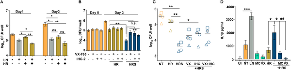
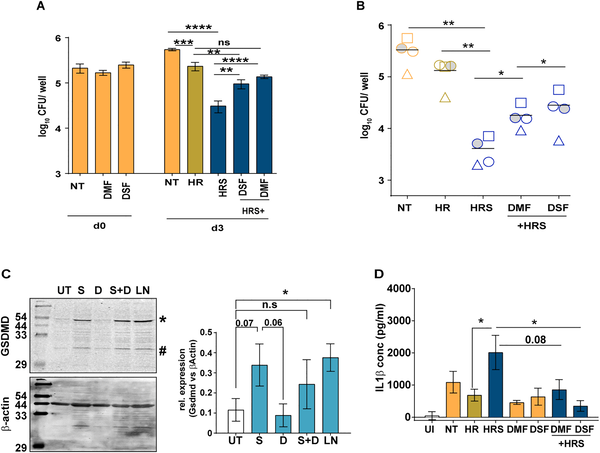
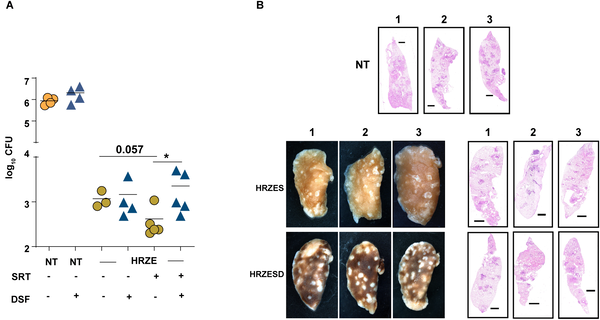

Did you know an antidepressant might help fight tuberculosis? Tuberculosis (TB) remains a leading cause of infectious disease deaths worldwide, and treatment often requires months of multiple antibiotics. But recent research has uncovered a surprising ally in this fight: sertraline, a common antidepressant. Scientists have found that sertraline can boost the ability of immune cells to kill TB bacteria by activating a key immune system component called the inflammasome.

> **TL;DR**
> - Sertraline enhances the effectiveness of frontline TB drugs by activating the NLRP3 inflammasome in macrophages, immune cells that engulf TB bacteria.
> - This activation involves changes in mitochondrial function, leading to increased reactive oxygen species (ROS) and release of inflammatory signals that help control TB infection.

Tuberculosis, caused by the bacterium Mycobacterium tuberculosis, is notoriously difficult to treat due to its ability to survive inside immune cells called macrophages. Standard treatment involves prolonged use of multiple antibiotics, but drug resistance and complex host-pathogen interactions complicate therapy. Host-directed therapies (HDTs) that enhance the body's own immune defenses are an emerging strategy to improve treatment outcomes. Previous studies showed that adding sertraline to TB drugs improved bacterial clearance in animal models, but how this antidepressant helped immune cells fight TB was unclear.

Researchers used cultured human macrophages infected with M. tuberculosis and treated them with frontline TB antibiotics alone or combined with sertraline. They measured bacterial survival, immune signaling molecules, and inflammasome activation. They also used specific inhibitors to block inflammasome components and gasdermin D, a protein that forms pores in cell membranes to release inflammatory signals. Techniques included bacterial colony counts, enzyme-linked immunosorbent assays (ELISA) for cytokines, immunoblotting for protein activation, and fluorescent dyes to assess mitochondrial reactive oxygen species and potassium ion levels. Finally, they tested the effects in mice infected with TB and treated with drug combinations.

The study revealed that sertraline enhances the killing of TB bacteria by macrophages when combined with antibiotics, but this effect depends on activating the NLRP3 inflammasome. Sertraline altered mitochondrial function, increasing production of reactive oxygen species (ROS), which served as a secondary signal to activate the inflammasome. This activation led to the release of the inflammatory cytokine IL-1β and potassium efflux through pores formed by the gasdermin D protein. Blocking inflammasome components or gasdermin D reversed sertraline’s beneficial effects, confirming their critical roles. In mice, adding sertraline to TB drugs improved bacterial clearance and lung tissue health, effects that were lost when gasdermin D was inhibited.

This research uncovers a novel mechanism linking mitochondrial physiology to inflammasome activation in the immune response against TB. By repurposing sertraline, a widely used and well-tolerated antidepressant, it may be possible to enhance existing TB treatments through host-directed therapy. Such approaches could shorten treatment duration, improve outcomes, and help combat drug resistance. The findings also highlight the importance of inflammasome pathways and gasdermin D in controlling intracellular bacterial infections, opening avenues for new therapeutic strategies.

While these results are promising, most data come from preclinical cell culture and mouse models. Human clinical trials are needed to confirm safety and efficacy of combining sertraline with TB drugs. Additionally, inflammasome activation can have complex effects, potentially causing harmful inflammation if not carefully controlled. Further research is required to optimize dosing and understand long-term impacts. Nonetheless, this study provides a strong foundation for exploring antidepressants as adjuncts in infectious disease therapy.

## Figures

*Sertraline boosts antibiotic effects against bacteria by activating the inflammasome, shown in infected immune cells with or without inhibitors.*

*Sertraline boosts gasdermin D activation in infected immune cells, reducing bacterial growth and increasing immune response signals.*

*Treating mice with TB drugs plus sertraline and disulfiram reduces lung bacteria and improves lung tissue health after 4 weeks.*

## Sources

- [Inflammasome activation dictates the efficacy of antimycobacterial activity of frontline TB drugs](https://journals.plos.org/plospathogens/article?id=10.1371/journal.ppat.1014384)
- DOI: [10.1371/journal.ppat.1014384](https://doi.org/10.1371/journal.ppat.1014384)
