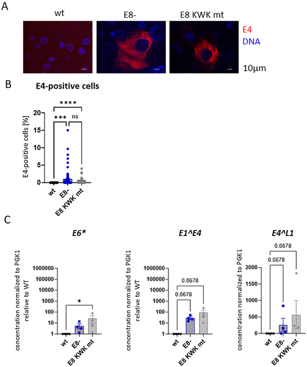
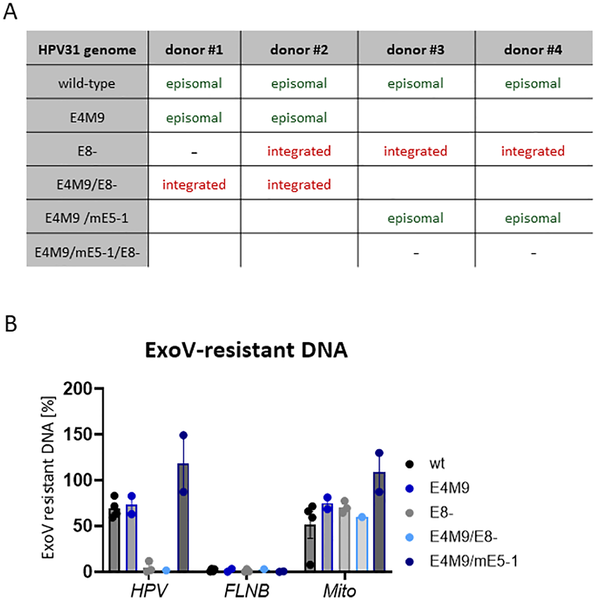

Human papillomaviruses (HPVs) are common viruses, some of which can cause cancers by establishing long-term infections in skin and mucosal tissues. But how does HPV know when to make more copies of itself inside our cells? Scientists have discovered a viral 'gatekeeper' protein that tightly controls when HPV31 begins replicating its genome and producing viral proteins, ensuring the virus stays under the radar in basal skin cells. Understanding this control mechanism not only sheds light on HPV’s stealthy persistence but also points to new strategies for antiviral therapies.

> **TL;DR**
> - The HPV31 virus uses a viral protein called E8^E2 to repress genome amplification and late viral protein expression in undifferentiated basal keratinocytes, preventing premature virus production.
> - Disrupting the interaction between E8^E2 and cellular co-repressor complexes triggers viral genome amplification and viral protein expression even in undifferentiated cells, suggesting a potential antiviral approach to force infected cells into a non-persistent state.

HPVs infect the skin and mucosal tissues and can cause cancers when infections persist. The virus’s life cycle is closely tied to the differentiation state of the infected skin cells, called keratinocytes. Normally, HPV genomes replicate at low levels in basal keratinocytes, which are undifferentiated and actively dividing. The virus waits until these cells begin to differentiate and move upwards in the skin layers before amplifying its genome extensively and producing viral proteins needed to assemble new virus particles. This careful timing helps the virus maintain a persistent infection without killing the host cells prematurely.

In this study, researchers investigated the role of the viral protein E8^E2 in controlling HPV31 replication. They used human keratinocyte cultures transfected with either wild-type or mutant HPV31 genomes lacking functional E8^E2. They examined viral genome replication, viral protein expression, and the physical state of viral DNA (episomal versus integrated) using molecular biology techniques such as immunofluorescence, quantitative PCR, and exonuclease digestion assays. Additionally, they depleted cellular co-repressor complexes (NCoR/SMRT) known to interact with E8^E2 using RNA interference to assess their role in viral regulation.

The researchers found that when E8^E2 function is lost, HPV31 prematurely amplifies its genome and expresses the viral late protein E4 even in undifferentiated basal keratinocytes, which normally do not support productive replication. This premature activation disrupts the infected cells’ ability to divide and maintain the viral genome as an episome, leading to integration of viral DNA into the host genome in surviving cells. Depleting the cellular co-repressor complexes NCoR/SMRT mimicked the effects of E8^E2 loss, triggering genome amplification and E4 expression in undifferentiated cells. Interestingly, most cells expressing E4 retained basal-like characteristics, indicating that viral genome amplification and protein expression can be uncoupled from the normal differentiation process when E8^E2 repression is relieved. Moreover, differentiation itself appeared to reduce the impact of co-repressor depletion, suggesting that E8^E2 activity is naturally inactivated during differentiation to allow productive replication.

These findings identify E8^E2 as a critical viral 'gatekeeper' that prevents premature viral genome amplification and late gene expression in basal keratinocytes. By tightly controlling when HPV31 enters its productive replication cycle, E8^E2 helps the virus maintain persistent infections without killing host cells prematurely. Importantly, disrupting the interaction between E8^E2 and the NCoR/SMRT co-repressor complexes forces the virus into a premature replication phase, which could be exploited as a novel antiviral strategy. Forcing infected cells into this productive cycle may prevent long-term viral persistence and reduce the risk of HPV-associated cancers.

While these results provide valuable insight into HPV31 replication control, the study was conducted primarily in cultured human keratinocytes, which may not fully replicate the complexity of HPV infections in living tissues. The exact mechanisms by which differentiation inactivates E8^E2 remain to be elucidated. Additionally, the safety and efficacy of targeting the E8^E2–NCoR/SMRT interaction as an antiviral approach require further investigation, including potential effects on normal cellular functions. Nonetheless, this work lays a strong foundation for future studies exploring therapeutic interventions against persistent HPV infections.

## Figures

*Images and data show how different HPV31 genome mutations affect viral protein levels and gene activity in human skin cells.*

*Table and DNA tests show how different HPV31 types affect cell growth and viral DNA forms in stable cell lines from various donors.*

## Sources

- [Inhibition of high risk HPV31 E8^E2 repressor activity enables differentiation-independent genome amplification and E4 expression](https://journals.plos.org/plospathogens/article?id=10.1371/journal.ppat.1014330)
- DOI: [10.1371/journal.ppat.1014330](https://doi.org/10.1371/journal.ppat.1014330)
