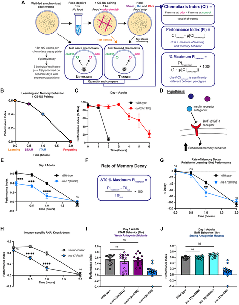
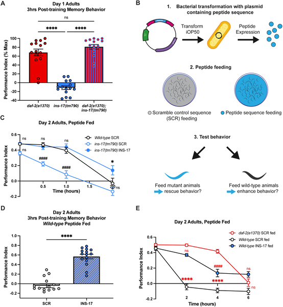
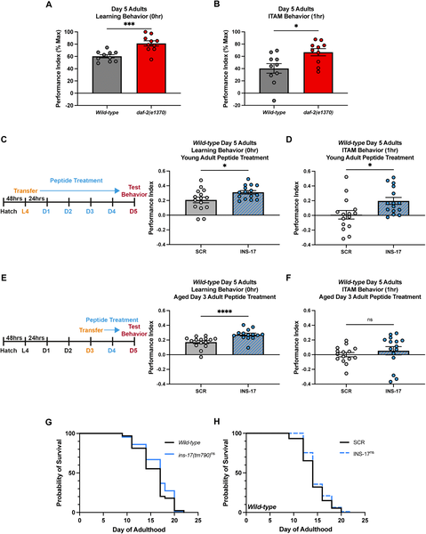
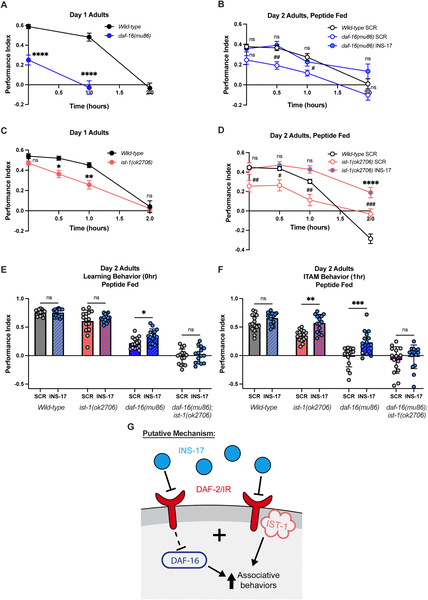

Imagine if your brain could remember better simply because you’re hungry. In the tiny nematode worm Caenorhabditis elegans, scientists have uncovered a fascinating molecular signal that does just that. This signal, an insulin-like peptide called INS-17, acts as a messenger of nutrient deprivation, tuning the worm’s memory and behavior in response to its internal energy state. But unlike many insulin-related signals, INS-17 influences memory without altering lifespan, revealing a surprising specificity in how metabolism shapes brain function.

> **TL;DR**
> - INS-17, an insulin-like peptide in C. elegans, is essential for learning and memory, especially under nutrient-deprived conditions.
> - INS-17 modulates associative behaviors independently of lifespan, acting through the insulin receptor DAF-2 to signal hunger and adjust memory accordingly.

Insulin signaling is a fundamental pathway that regulates many biological processes, from growth and metabolism to aging and cognition. In the nematode worm C. elegans, reduced function of the insulin receptor DAF-2 is known to double lifespan and improve memory. However, it has been unclear how specific insulin-like peptides (ILPs) contribute to distinct effects, such as memory enhancement, without affecting other traits like longevity. Understanding these specific ligand-receptor interactions is challenging because insulin signaling is widespread and pleiotropic, meaning it influences multiple traits simultaneously. The new research focuses on dissecting which ILPs regulate learning and memory independently of lifespan, using genetic tools in this simple but powerful model organism.

Researchers performed targeted genetic screening of insulin-like peptides predicted to antagonize the DAF-2 receptor. They tested mutants lacking individual ILPs for their ability to learn and remember a food-associated odor in a well-established behavioral assay. This assay measures how worms form and retain positive associations with butanone odor paired with food over several hours. They also used neuron-specific RNA interference to knock down INS-17 expression only in adult worms, avoiding developmental effects. Further experiments examined how INS-17 interacts with the DAF-2 receptor and whether increasing INS-17 levels could enhance memory in both young and aged worms.

The study revealed that among several insulin-like peptides tested, only INS-17 was required for normal learning and memory. Worms lacking INS-17 showed impaired ability to form and retain associations with food odors. Knocking down INS-17 specifically in adult neurons confirmed its role in memory independent of development. Remarkably, increasing INS-17 levels extended memory performance even in aged worms, without changing their lifespan. Genetic analyses showed that INS-17 signals through the DAF-2 insulin receptor, and that this signaling acts as a nutrient deprivation cue. INS-17 helps worms adjust their behavior when they are hungry, promoting advantageous responses to environmental stimuli.

These findings offer a new mechanistic insight into how insulin signaling can selectively regulate cognitive functions like learning and memory, separate from other well-known effects such as lifespan extension. By identifying INS-17 as a specific nutrient deprivation signal that modulates associative behavior, the work highlights how metabolic state is communicated to the nervous system to influence behavior. This uncoupling of memory regulation from lifespan challenges the idea that all insulin-related effects are intertwined and opens avenues for exploring metabolic influences on cognition in more complex animals.

While the nematode C. elegans provides a valuable model to study insulin signaling, its simplicity means that direct translation to humans is not straightforward. The exact molecular mechanisms by which INS-17 modulates neuronal circuits remain to be elucidated. Additionally, although INS-17 influences memory without affecting lifespan in worms, insulin signaling pathways in mammals are more complex and may not show the same uncoupling. Further research is needed to explore whether similar ligand-receptor specificity exists in higher organisms and how metabolic signals broadly affect brain function.

## Figures

*Worms learn and remember food smells in a timed test, with certain mutants showing longer memory than normal worms.*

*INS-17 and DAF-2 work together to support memory in worms, and feeding INS-17 peptide can restore memory in mutants lacking it.*

*INS-17 improves learning and memory in aging worms without affecting lifespan.*

*Mutations affecting DAF-2 signaling impair worm learning and memory, but INS-17 treatment can restore these behaviors.*

## Sources

- [INS-17 acts as a nutrient deprivation signal to mediate adult IIS-regulated associative behaviors in C. elegans](https://journals.plos.org/plosgenetics/article?id=10.1371/journal.pgen.1012130)
- DOI: [10.1371/journal.pgen.1012130](https://doi.org/10.1371/journal.pgen.1012130)
