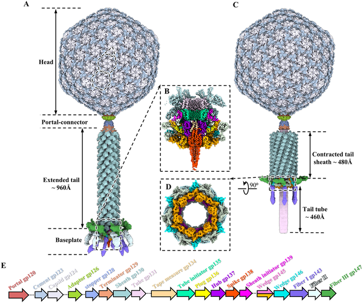
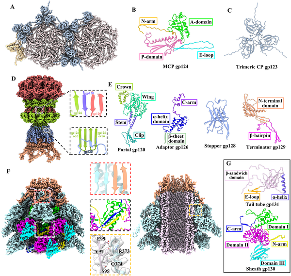
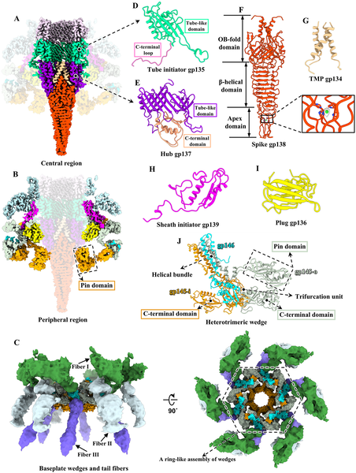
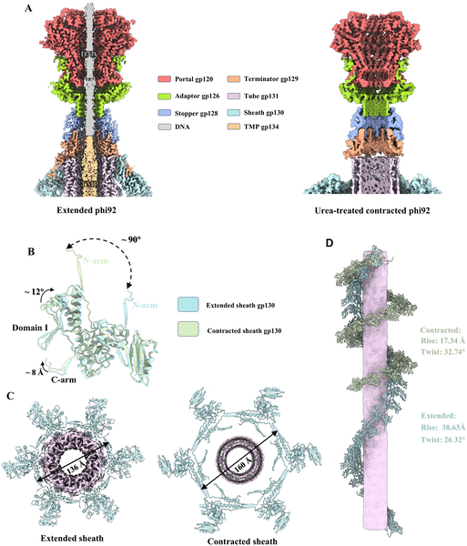

Imagine a microscopic warrior equipped with a sophisticated toolkit, capable of breaking through the tough armor of bacteria that resist even our strongest antibiotics. This is the promise of bacteriophages—viruses that infect bacteria. Among them, the myophage phi92 stands out for its ability to attack a broad range of harmful bacteria, including those shielded by protective capsules. Scientists have now uncovered near-atomic details of phi92’s structure and infection mechanism, shedding light on how this tiny virus could help us fight antibiotic-resistant infections.

> **TL;DR**
> - Phi92 is a bacteriophage with a complex multi-fiber system that enables it to recognize and penetrate the protective capsules of drug-resistant bacteria.
> - Using cryo-electron microscopy, researchers revealed phi92’s structures in both extended and contracted states, uncovering how conformational changes trigger tail contraction to inject viral DNA into host cells.

Antibiotic resistance is a growing global health threat, especially when bacteria develop protective capsules made of polysaccharides that block drugs and immune defenses. Phage therapy, which uses viruses that specifically infect bacteria, is gaining renewed interest as an alternative treatment. Myophages, a type of tailed phage with contractile tails, are particularly promising because their mechanical tails can penetrate bacterial defenses. Phi92 is a myophage notable for its broad host range, infecting both encapsulated and non-encapsulated strains of Escherichia coli and Salmonella, many of which are clinically important and drug-resistant. Understanding how phi92 recognizes and breaches bacterial capsules at the molecular level is crucial for developing effective phage therapies.

Researchers purified phi92 viruses and used cryo-electron microscopy (cryo-EM) to capture high-resolution images of the virus particles in two states: the native extended state and a contracted state induced by urea treatment. They collected tens of thousands of particle images and applied advanced image reconstruction techniques to build detailed 3D maps of phi92’s components, including its head, tail, baseplate, and tail fibers. By combining these maps with computational protein structure predictions from AlphaFold3, they constructed near-complete atomic models of the virus. This approach allowed them to visualize how different parts of phi92 rearrange during infection.

The study revealed that phi92’s head is an icosahedral shell composed of hundreds of protein subunits, housing the viral genome. The tail is a contractile sheath surrounding a rigid tube, ending in a complex baseplate with multiple tail fibers. Notably, phi92 has three distinct tail fibers: one (fiber I) acts as an enzyme that degrades the bacterial capsule’s polysaccharides, clearing a path; another (fiber III) facilitates stable attachment to the bacterial outer membrane. This multi-fiber system enables phi92 to infect a broad range of bacteria with different capsule types. Comparing the extended and contracted states showed that conformational changes in fiber III and the baseplate trigger sheath contraction, which drives the tail tube through the bacterial envelope to inject viral DNA. This detailed mechanism explains how phi92 overcomes the physical barrier of encapsulated bacteria.

By elucidating the intact structures and infection mechanism of phi92, this research provides a crucial foundation for engineering phages tailored to combat antibiotic-resistant, encapsulated bacteria. The identification of specific fibers responsible for capsule degradation and membrane attachment opens avenues for designing phage therapies that can precisely target and penetrate bacterial defenses. Moreover, understanding the molecular trigger for tail contraction enhances our ability to manipulate phage infection processes. As antibiotic resistance continues to rise, such structural insights into phage biology are vital for developing alternative treatments that could save lives and reduce reliance on traditional antibiotics.

While the structural models offer unprecedented detail, the study was conducted in vitro using purified virus particles and urea-induced contraction, which may not capture all aspects of infection dynamics in living bacterial environments. The flexibility of some tail fibers limited resolution in certain regions, leaving some structural details unresolved. Further research is needed to observe phi92 infection in real-time within host bacteria and to test engineered variants for therapeutic efficacy and safety. Nonetheless, these findings represent a significant step toward rational phage design against drug-resistant pathogens.

## Figures

*Images show the virus phi92 in extended and contracted forms, highlighting its baseplate and genome layout with color-coded segments.*

*Detailed 3D structures of the phi92 virus head, portal, and tail reveal how its proteins connect and interact to form its complex shape.*

*Detailed 3D views show the structure and components of the phi92 baseplate, including proteins and metal ions involved in its function.*

*Phi92 virus tail changes shape from extended to contracted, shown by detailed 3D views and models.*

## Sources

- [Intact architectures of myophage phi92 in extended and contracted states](https://journals.plos.org/plospathogens/article?id=10.1371/journal.ppat.1014494)
- DOI: [10.1371/journal.ppat.1014494](https://doi.org/10.1371/journal.ppat.1014494)
