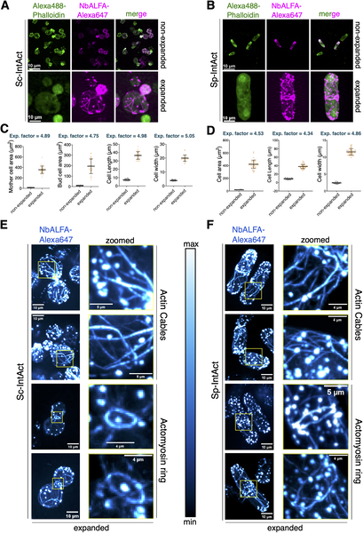
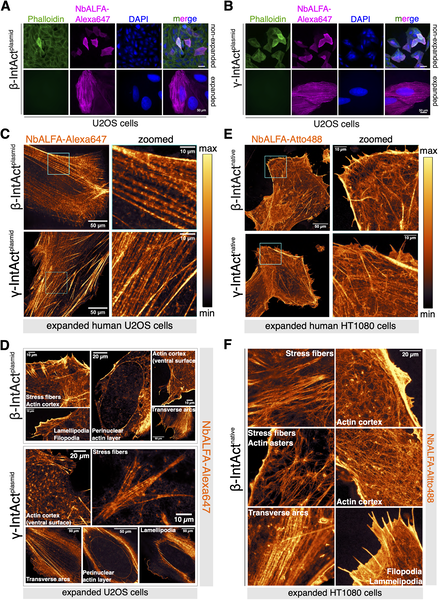
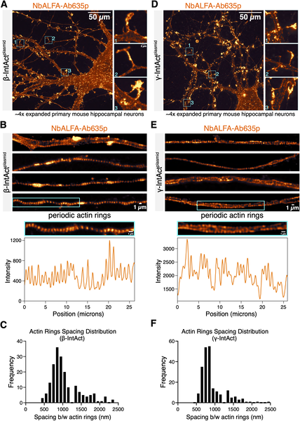

Imagine trying to understand the framework of a complex building by looking through a foggy window. For decades, scientists have faced a similar challenge when trying to visualize the tiny scaffolding inside cells formed by actin proteins. These actin networks are crucial for cell shape, movement, and function, but their nanoscale organization has remained elusive—until now. A new microscopy technique called IntAct-U-ExM is opening that foggy window wide, allowing researchers to see actin structures in exquisite detail across different species, from yeast to neurons.

> **TL;DR**
> - IntAct-U-ExM combines an innovative actin tagging method (IntAct) with ultrastructure expansion microscopy to achieve super-resolution imaging of actin isoforms in various cell types.
> - This approach reveals detailed, isoform-specific actin networks including periodic actin rings in neurons and transient nuclear actin filaments, providing new insights into cellular architecture.

Actin is a fundamental protein that forms filaments acting as a cellular skeleton, supporting cell shape, enabling movement, and facilitating intracellular transport. Cells contain multiple actin isoforms, each contributing uniquely to the cell's architecture and function. However, imaging these actin networks at the nanoscale has been challenging. Traditional super-resolution methods require complex optics and computational tricks, while expansion microscopy (ExM) offers a simpler approach by physically enlarging the specimen. Yet, until recently, ExM lacked effective probes to label actin isoforms without disrupting their delicate structures, limiting its usefulness for studying actin.

The breakthrough came by combining IntAct, a genetically engineered actin protein tagged internally with a small epitope (ALFA tag), with ultrastructure expansion microscopy (U-ExM), a refined ExM protocol that preserves cellular ultrastructure during expansion. Researchers introduced IntAct variants into yeast, mammalian cells, and primary neurons. After chemically fixing and embedding the cells in a swellable hydrogel, the samples were expanded nearly fivefold in yeast and around threefold in mammalian cells. Post-expansion, the ALFA tag was targeted with a specific nanobody conjugated to fluorescent dyes, enabling high-fidelity, isoform-specific visualization of actin networks using conventional microscopes.

This approach successfully revealed diverse actin architectures across species. In yeast, IntAct-U-ExM clearly visualized actin patches, cables, and rings with unprecedented resolution. In mammalian cells, it distinguished beta and gamma actin isoforms within complex structures such as stress fibers, lamellipodia, and filopodia. Remarkably, in primary hippocampal neurons, the method uncovered the periodic arrangement of actin rings along axons, a nanoscale pattern critical for nerve cell function, confirming and extending previous observations. Additionally, transient nuclear actin filaments were detected, structures that have been difficult to observe with other techniques. These results demonstrate that IntAct-U-ExM can provide detailed, isoform-specific insights into the nanoscale organization of actin networks in a wide range of biological contexts.

By enabling super-resolution imaging of actin isoforms across species with relative ease and high specificity, IntAct-U-ExM represents a significant advance for cell biology research. Understanding the precise arrangement of actin networks is vital for deciphering cellular mechanics, signaling, and development. This method opens new avenues to study how different actin isoforms contribute to cellular functions and diseases, including neurobiology where actin’s role in synaptic structures is crucial. Moreover, the compatibility of IntAct with U-ExM allows researchers to apply this technique broadly, potentially accelerating discoveries about the cytoskeleton’s role in health and disease.

While IntAct-U-ExM offers impressive resolution and isoform specificity, it requires genetic modification to introduce the IntAct tag, which may not be feasible in all systems. The expansion factors vary between species and cell types, which might affect quantitative measurements. Also, although the method preserves ultrastructure well, some delicate actin filaments may still be challenging to capture fully intact. Finally, the technique’s technical complexity and need for specialized reagents could limit immediate adoption outside specialized labs. Nevertheless, this approach sets a promising foundation for future improvements and broader applications.

## Figures

*Advanced imaging reveals detailed actin structures in budding and fission yeast cells, showing size and shape changes after expansion.*

*IntAct-U-ExM reveals detailed, isoform-specific actin networks in human cells using advanced imaging techniques.*

*High-res images show the tiny, regularly spaced actin structures in mouse brain neurons using advanced staining and expansion techniques.*

## Sources

- [IntAct-U-ExM enables super-resolution imaging of isoform-specific actin networks across species](https://journals.plos.org/plosbiology/article?id=10.1371/journal.pbio.3003832)
- DOI: [10.1371/journal.pbio.3003832](https://doi.org/10.1371/journal.pbio.3003832)
