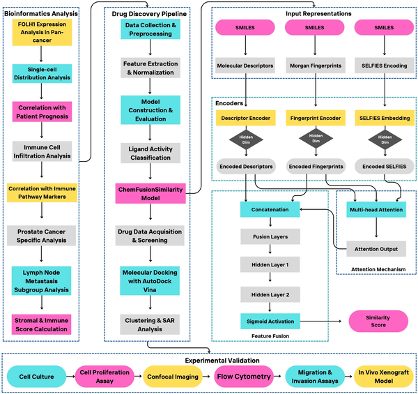
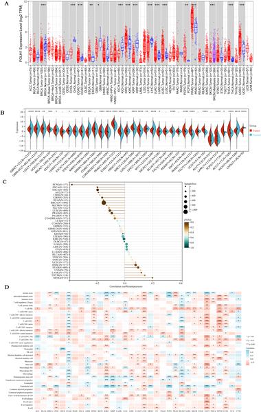

What if a hormone best known for regulating sleep could also help fight prostate cancer? Recent research harnessing artificial intelligence (AI) has spotlighted melatonin, the body’s natural sleep regulator, as a potential player in slowing prostate cancer progression. This surprising connection opens new avenues for understanding how cancer biology and our body’s internal clock might intersect.

> **TL;DR**
> - FOLH1, a protein highly expressed in prostate cancer and other tumors, shows distinct patterns across many cancer types and relates to immune cell activity.
> - Using AI-driven drug screening, researchers identified melatonin as a candidate that suppresses FOLH1 expression and slows prostate tumor growth in lab and animal models.

Cancer remains a major global health challenge, with prostate cancer among the most common malignancies in men. Scientists have long studied Folate Hydrolase 1 (FOLH1), also called prostate-specific membrane antigen (PSMA), because it is often overexpressed in prostate tumors and linked to cancer progression and metastasis. While FOLH1-targeted therapies have shown promise, its broader role across different cancers and how it interacts with the immune system is less understood. Meanwhile, advances in AI and machine learning are transforming drug discovery by enabling rapid screening of thousands of compounds to find new therapeutic candidates. This study leverages these technologies to explore FOLH1’s expression patterns across cancers and to identify existing drugs that might modulate its activity.

The researchers began by analyzing large public genomic databases to map FOLH1 gene expression across 27 cancer types, focusing especially on prostate cancer. They examined how FOLH1 levels correlated with patient outcomes and immune cell infiltration within tumors. Next, they developed a machine learning workflow incorporating deep learning models to predict which existing drugs might bind to and influence FOLH1. This computational pipeline screened hundreds of compounds, ultimately nominating melatonin as a promising candidate. To validate these predictions, the team conducted lab experiments treating prostate cancer cells with melatonin, measuring changes in FOLH1 expression and cancer cell behavior. They also tested melatonin’s effects in mouse models implanted with human prostate tumors, monitoring tumor growth under normal and disrupted circadian melatonin levels.

The study revealed that FOLH1 expression varies significantly across many cancer types and is linked to distinct immune cell patterns, highlighting its complex role in tumor biology. Importantly, melatonin was computationally predicted to interact with FOLH1. Experimental results showed that melatonin reduced FOLH1 levels in prostate cancer cells in a dose-dependent manner, limiting their ability to invade and migrate. In mouse models, physiological melatonin levels helped restrict tumor growth, whereas disrupting natural sleep cycles—and thereby lowering melatonin—accelerated tumor progression. These findings suggest melatonin’s potential as a modulator of prostate cancer through its impact on FOLH1.

This work illustrates how integrating AI-driven drug discovery with experimental validation can accelerate the identification of new therapeutic strategies. Melatonin, a well-known hormone with a strong safety profile, emerges as an intriguing candidate for further exploration in prostate cancer treatment. Beyond proposing melatonin’s role, the study provides a comprehensive pan-cancer view of FOLH1 expression and its immune associations, laying groundwork for future research. If confirmed through additional mechanistic studies and clinical trials, melatonin or related compounds could complement existing therapies, potentially improving outcomes for prostate cancer patients.

While promising, these findings are preliminary and require further investigation. The exact molecular mechanisms by which melatonin influences FOLH1 and tumor behavior remain to be fully elucidated. The study’s experimental models, though informative, cannot capture all complexities of human cancer biology. Moreover, clinical trials are needed to determine whether melatonin can safely and effectively modulate prostate cancer progression in patients. Thus, while AI-guided discovery offers exciting possibilities, cautious interpretation and rigorous follow-up studies are essential before clinical application.

## Figures

*A three-phase study used data analysis, AI drug discovery, and lab tests to find and confirm new prostate cancer treatments targeting FOLH1.*

*FOLH1 gene activity differs between normal and tumor tissues and relates to age and immune cell presence across cancers.*

## Sources

- [Integrated computational and experimental analysis explores FOLH1 expression patterns across cancers and nominates melatonin as a potential modulator in prostate cancer models](https://journals.plos.org/ploscompbiol/article?id=10.1371/journal.pcbi.1014315)
- DOI: [10.1371/journal.pcbi.1014315](https://doi.org/10.1371/journal.pcbi.1014315)
