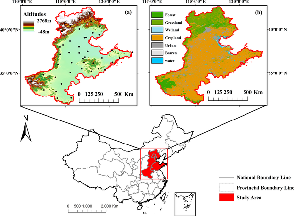

Droughts are becoming more frequent and severe as our climate changes, threatening food security and water supplies in vital agricultural regions. But what if we could predict droughts more accurately and earlier, giving farmers and policymakers a better chance to prepare? A new study from China’s Beijing-Tianjin-Hebei-Shandong-Henan region demonstrates how combining satellite data with advanced machine learning can provide a clearer, more timely picture of drought conditions across different time scales.

> **TL;DR**
> - Researchers developed a novel drought monitoring system that integrates multiple satellite datasets with an ensemble of machine learning models optimized through Bayesian techniques.
> - This system not only improves drought prediction accuracy but also uses explainable AI methods to identify the key environmental drivers behind droughts, aiding better water resource management.

Traditional drought monitoring often relies on ground weather stations or single satellite indices, which can miss important spatial details or complex interactions among factors like rainfall, soil moisture, and temperature. The Beijing-Tianjin-Hebei-Shandong-Henan region in eastern China, a major agricultural hub with variable rainfall and frequent droughts, exemplifies these challenges. Existing methods struggle to capture the nonlinear and multi-scale nature of droughts in such a diverse landscape. Advances in remote sensing provide rich data streams—from vegetation health to soil moisture—but integrating these effectively requires sophisticated analysis tools.

To tackle these challenges, the researchers designed a framework that pulls together multiple remote sensing datasets, including precipitation, temperature, soil moisture, vegetation indices, and evapotranspiration, all harmonized at a consistent spatial resolution. They combined four different machine learning algorithms—Random Forest, Extreme Gradient Boosting, Support Vector Regression, and Deep Feedforward Neural Networks—into a single ensemble model. Using Bayesian optimization, the model dynamically weights each algorithm’s contribution to maximize prediction accuracy. They trained and tested this system using drought data from 2000 to 2020, evaluating performance across short- to long-term drought indicators measured by the Standardized Precipitation Evapotranspiration Index (SPEI) at multiple time scales.

The ensemble model achieved strong performance, explaining over 70% of the variability in drought conditions across 1-, 3-, 6-, and 12-month periods. It correctly classified drought severity with more than 78% accuracy and detected extreme drought events with 98% accuracy, including the severe drought in June 2019. Importantly, the researchers applied SHapley Additive exPlanations (SHAP), an explainable AI technique, to quantify how much each environmental factor contributed to drought predictions. For short-term droughts, precipitation anomalies and potential evapotranspiration were the dominant drivers, each accounting for about 21% of the influence. For longer-term droughts, soil moisture and the Palmer Drought Severity Index emerged as key contributors. This interpretability helps clarify the physical processes behind drought development, not just the predictions themselves.

By integrating diverse satellite data with a carefully optimized ensemble of machine learning models, this study offers a scalable, interpretable tool for regional drought monitoring. Its ability to predict drought severity accurately across multiple time scales and reveal the dominant environmental drivers provides valuable insights for agricultural planning and water resource management. As climate change intensifies drought risks worldwide, such data-driven approaches can empower decision-makers with earlier warnings and a deeper understanding of drought dynamics, helping to mitigate impacts on food security and ecosystems.

While promising, this framework was developed and validated in a specific region with unique climate and land use characteristics, so its performance may vary in other geographic contexts. The reliance on satellite data also means that cloud cover or sensor limitations could affect data quality. Moreover, machine learning models, despite their accuracy, are only as good as the input data and assumptions behind them. Continued refinement, including incorporating additional environmental variables and testing in diverse settings, will be important to fully realize the potential of AI-powered drought monitoring.

## Figures

*Map shows elevation and weather stations in Beijing-Tianjin-Hebei-Shandong-Henan area, plus land types like forest, urban, and water.*

## Sources

- [Integrated drought monitoring and analysis: A novel framework based on multi-source remote sensing data and ensemble machine learning](https://journals.plos.org/plosone/article?id=10.1371/journal.pone.0346060)
- DOI: [10.1371/journal.pone.0346060](https://doi.org/10.1371/journal.pone.0346060)
