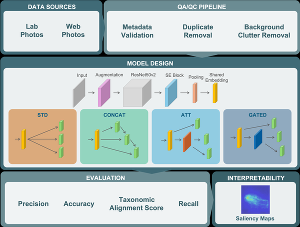
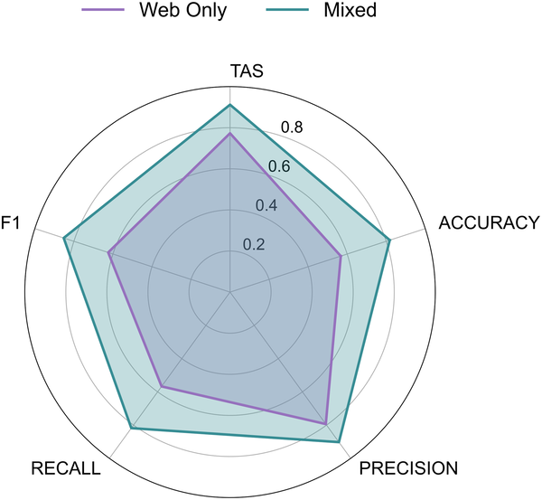
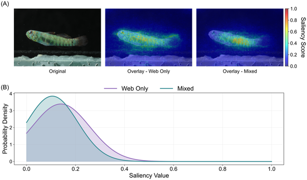
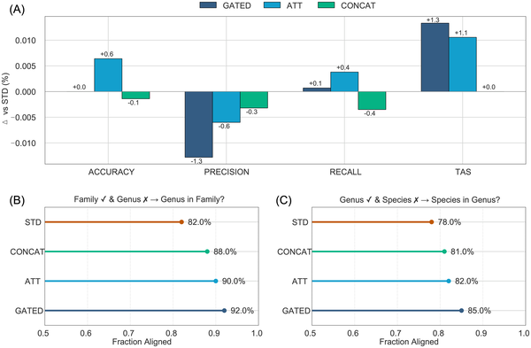

Coral reefs are among the most vibrant and diverse ecosystems on Earth, home to thousands of fish species. Yet, many of these species are tiny, elusive, and look remarkably similar, making them difficult to identify even for experts. What if artificial intelligence could help us see these hidden fish species more clearly? Meet CryptoVision, a cutting-edge AI tool designed to recognize cryptic coral reef fishes by combining deep learning with biological knowledge and high-resolution images.

> **TL;DR**
> - CryptoVision is a deep learning model that uses taxonomic hierarchies to accurately identify small, cryptic coral reef fishes from images.
> - By training on both laboratory-standard and real-world underwater photos, CryptoVision improves species identification, supporting biodiversity monitoring and ecological studies.

The oceans’ coral reefs harbor more than a third of all marine biodiversity, yet many reef fish species remain understudied due to their small size and cryptic appearance. These 'cryptobenthic' fishes, often less than 5 cm long, are ecologically important but challenging to identify because they differ only in subtle features. Traditionally, experts painstakingly classify these fishes by examining fine morphological traits, a process that limits large-scale monitoring and understanding of their diversity. Advances in artificial intelligence, particularly deep learning, offer promising new ways to automate species identification from images, but existing models often overlook the biological relationships between species, leading to errors and less interpretable results.

To tackle these challenges, researchers developed CryptoVision, a convolutional neural network built on a powerful ResNet50v2 architecture enhanced with Squeeze-and-Excitation modules. Uniquely, CryptoVision predicts fish family, genus, and species simultaneously, respecting the hierarchical structure of biological classification. The team compiled a large dataset of over 26,000 images, combining about 7,600 high-quality laboratory photos taken under controlled conditions with roughly 18,800 web-sourced underwater images from platforms like iNaturalist and FishBase. This diverse dataset helped the model learn to recognize fishes in both ideal and natural settings. The researchers also applied four different methods to fuse taxonomic information during training and used saliency maps to visualize which image features the model focused on when making identifications.

CryptoVision demonstrated a roughly 25% improvement in identification accuracy when laboratory-standard images were included in training, achieving an average precision of 90.5%. Among the fusion strategies tested, the gating approach provided the best calibration, meaning the model’s confidence closely matched its accuracy. Saliency map analyses revealed that the model’s attention aligned well with expert-defined morphological traits critical for distinguishing species, especially within the challenging dwarfgoby genus Eviota. This alignment suggests that CryptoVision not only classifies species effectively but also bases its decisions on biologically meaningful features.

This work represents a significant step forward in applying AI to marine biodiversity science. By explicitly incorporating taxonomic hierarchies and combining curated laboratory images with real-world photos, CryptoVision offers a scalable, interpretable tool for identifying cryptic reef fishes. This can accelerate biodiversity monitoring, support ecological research, and streamline taxonomic workflows, particularly for species that have traditionally been difficult to study. Moreover, by revealing which features drive AI decisions, the approach fosters trust and collaboration between machine learning and expert knowledge in taxonomy.

While CryptoVision shows promising accuracy and interpretability, its performance depends on the quality and diversity of training images. Real-world underwater photos can vary widely in lighting and clarity, which may still pose challenges. Additionally, the model currently focuses on 113 species and may require retraining or expansion to cover the full diversity of cryptobenthic fishes. Finally, AI tools like CryptoVision are intended to assist, not replace, expert taxonomists, who remain essential for validating and interpreting species identifications and discoveries.

## Figures

*CryptoVision workflow: images are collected, filtered, and used to train models with four fusion methods, then evaluated and explained with saliency maps.*

*Radar plot compares model accuracy using Web Only (purple) vs. Mixed (green) data across various performance metrics from 0 to 1.*

*Models trained on different datasets highlight different parts of a dwarfgoby fish image, showing how training data affects attention patterns.*

*Fig 4 shows how well models perform and how often wrong species or genus guesses still match the correct family or genus.*

## Sources

- [Integrating deep learning, biological hierarchies, and high-resolution imagery to create a new identification tool for cryptic coral reef fishes](https://journals.plos.org/plosone/article?id=10.1371/journal.pone.0349646)
- DOI: [10.1371/journal.pone.0349646](https://doi.org/10.1371/journal.pone.0349646)
