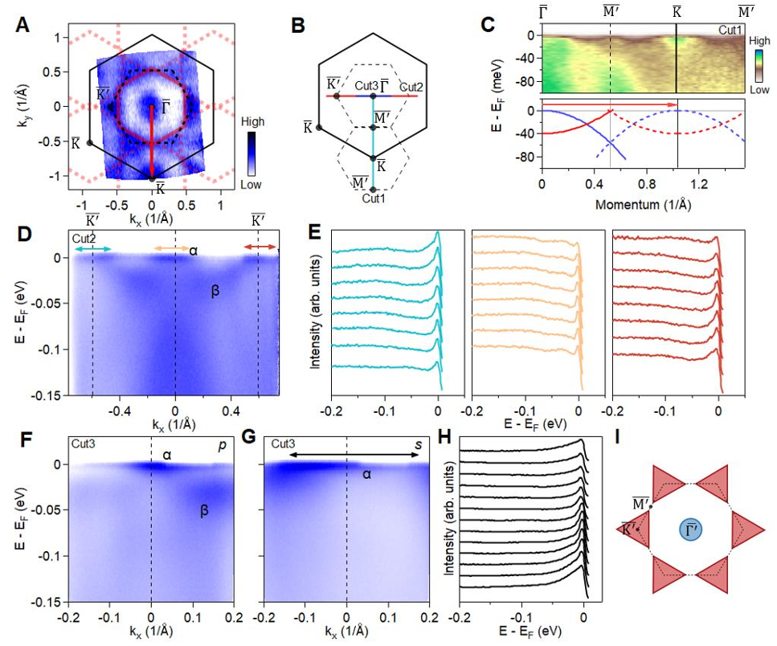
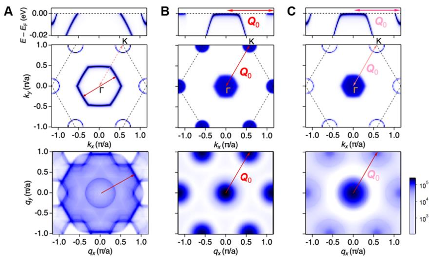

Flat electronic bands in materials are a gateway to some of the most intriguing quantum phenomena, from superconductivity to exotic charge orders. Traditionally, these flat bands arise because of the material’s lattice geometry, such as in twisted bilayers or kagome lattices. But what if flat bands could emerge purely from the interactions between electrons themselves, independent of the underlying crystal structure? A recent study on the magnetic van der Waals material Fe5GeTe2 reveals exactly this — an interaction-driven flat band at the Fermi level that triggers a distinctive charge order, opening new paths to explore quantum states in solids.

> **TL;DR**
> - Fe5GeTe2 hosts a novel flat electronic band at the Fermi level created by strong electron interactions rather than lattice geometry.
> - This flat band promotes a √3 × √3 charge order, evidenced by band folding in ARPES measurements, and exhibits temperature-dependent behavior consistent with a Kondo-like coherent state.

*Note: this summary is based on a preprint — research shared ahead of formal peer review.*

Flat bands are energy levels where electrons have nearly zero velocity, leading to a high density of states that can foster collective electronic phenomena like superconductivity or charge density waves. Most known flat bands arise from specific lattice geometries that cause destructive quantum interference, such as in twisted graphene layers or kagome lattices. However, these geometry-driven flat bands often lie far from the Fermi level, limiting their influence on low-energy electronic properties. Alternatively, strong electronic interactions can reshape the band structure, potentially creating flat bands at the Fermi level. Yet, achieving such interaction-driven flatness without destroying electron coherence has been a major challenge. Fe5GeTe2, a layered magnetic material, provides a promising platform to explore this possibility because of its complex iron site arrangements and strong correlations.

The research team employed high-resolution angle-resolved photoemission spectroscopy (ARPES) with photon energies of 6 eV and 21.2 eV to probe the electronic structure of Fe5GeTe2 at microscopic scales. By controlling the cooling rates during sample preparation, they accessed different structural and electronic phases of the material. Their ARPES measurements revealed the momentum-resolved band dispersions and Fermi surfaces, allowing them to detect subtle band folding patterns indicative of charge ordering. Temperature-dependent ARPES spectra further characterized the evolution of the flat band and its spectral weight. Complementary theoretical analyses, including calculations of Lindhard response functions, helped interpret the nesting conditions and the role of flat bands in stabilizing electronic order.

The study uncovered two distinct phases of Fe5GeTe2. In the charge-ordered phase (termed Phase II), ARPES revealed a flat band pinned at the Fermi level extending across the Brillouin zone, accompanied by a √3 × √3 reconstructed Fermi surface. This reconstruction manifests as band folding within a narrow energy window (~30 meV below the Fermi level), signaling a purely electronic charge order rather than a structural lattice distortion. The flat band’s spectral weight increased logarithmically as temperature decreased, a hallmark of a Kondo-like coherent Fermi liquid state emerging from strong electron correlations. The nesting vector connecting flat band segments at different momenta explained the observed charge order. These findings establish Fe5GeTe2 as a rare example where interaction-driven flat bands promote large-scale electronic ordering.

This work advances our fundamental understanding of how strong electronic interactions alone can create flat bands at the Fermi level, a feat typically attributed to lattice geometry. Demonstrating a Kondo-like coherent state in a d-electron magnetic material with an interaction-driven flat band opens new avenues for exploring correlated quantum phases in van der Waals magnets. Such insights could inform the design of future quantum materials with tunable electronic orders, potentially impacting technologies based on quantum coherence and correlated electron behavior. Moreover, Fe5GeTe2’s robustness and tunability make it a promising platform for studying emergent phenomena beyond the limitations of moiré or geometrically constrained systems.

While the evidence strongly supports an interaction-driven flat band and associated charge order in Fe5GeTe2, the precise microscopic mechanisms remain complex. The Kondo-like interpretation, though consistent with temperature-dependent spectral features, differs from traditional f-electron Kondo systems and requires further theoretical refinement. Additionally, the coexistence of multiple structural phases and the subtlety of the electronic order pose challenges for reproducibility and broader applicability. Direct technological applications are still speculative, and more work is needed to understand how to harness these phenomena in devices.

## Figures

*Fig. 2 shows the electron patterns and energy bands in Fe5GeTe2's UUU phase, highlighting key features of its atomic structure. — Figure from Qiang Gao et al., [CC BY 4.0](http://creativecommons.org/licenses/by/4.0/), caption edited.*

*Simulated model showing how flat energy bands create nesting patterns in Fe5GeTe2 material. — Figure from Qiang Gao et al., [CC BY 4.0](http://creativecommons.org/licenses/by/4.0/), caption edited.*

## Sources

- [Interaction-driven flat band and charge order in Fe5GeTe2](https://arxiv.org/abs/2508.03116)
- DOI: [10.1126/sciadv.aeg5930](https://doi.org/10.1126/sciadv.aeg5930)

*This article reuses and adapts text and figures from the original research by Qiang Gao et al., available via Science Advances 12, eaeg5930 (2026), under the [CC BY 4.0](http://creativecommons.org/licenses/by/4.0/) license.*
