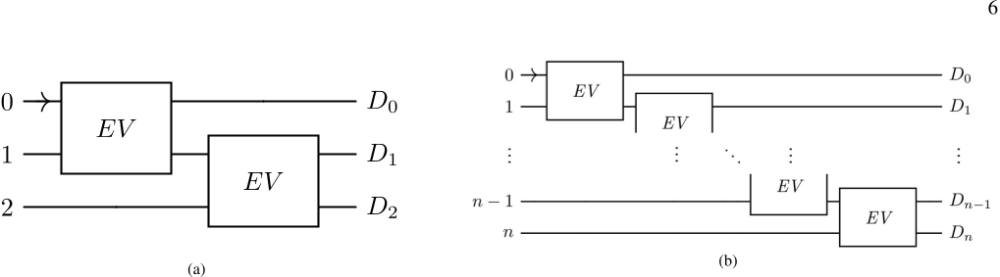
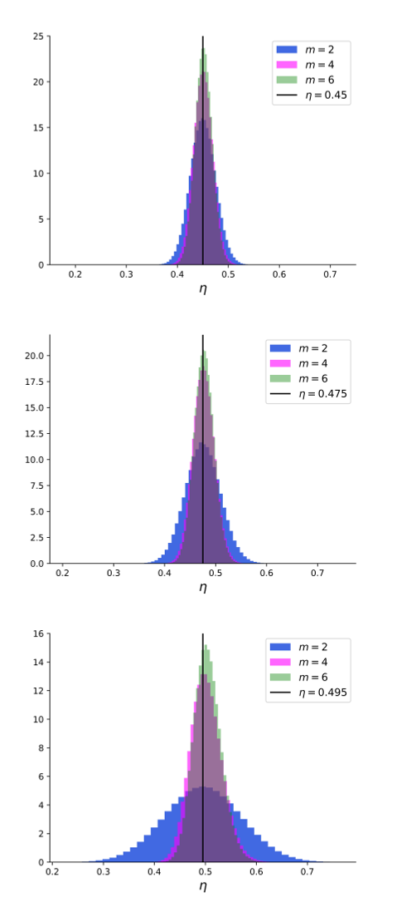
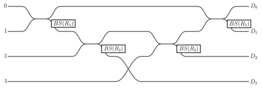
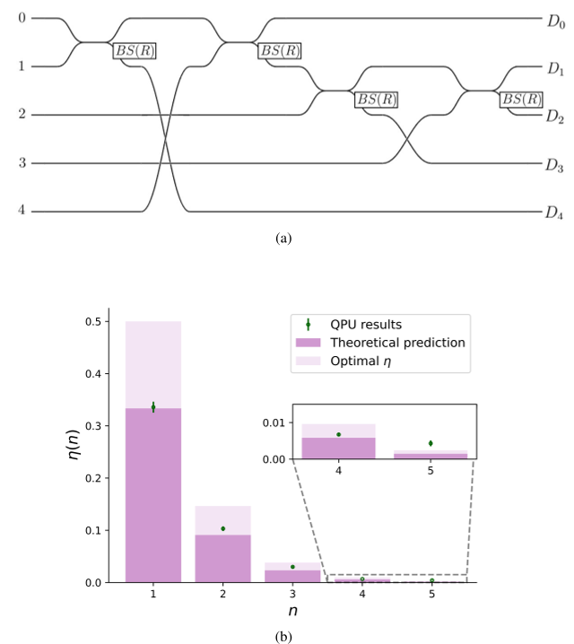

What if you could detect the presence of an object without ever shining light on it or touching it? This seemingly paradoxical idea is made possible by the strange rules of quantum physics. Using a quantum photonic processor, scientists have now demonstrated a way to detect not just one, but multiple objects without any direct interaction between the probing photon and the objects themselves. This breakthrough extends a decades-old quantum measurement concept into a scalable, practical realm.

> **TL;DR**
> - Interaction-free measurement (IFM) allows detecting objects without the probing photon being absorbed or scattered by them, using quantum interference.
> - Researchers implemented a multi-object IFM protocol on a universal integrated photonic processor, successfully detecting up to five objects sequentially with a single photon.

*Note: this summary is based on a preprint — research shared ahead of formal peer review.*

The concept of interaction-free measurement was first proposed in the early 1990s through a thought experiment known as the Elitzur-Vaidman bomb tester. In this setup, a single photon passes through an interferometer where one path might be blocked by a sensitive object. Remarkably, the mere possibility of interaction alters the quantum interference pattern, allowing the photon's detection at a specific output to signal the presence of the object—even if the photon never actually touched it. This phenomenon challenges our classical intuition about measurement and interaction. Over the years, improvements have been made to increase the efficiency of such measurements, and recent advances in integrated photonics have opened new doors for practical implementations.

In this study, the researchers used the Ascella photonic processor, a cloud-accessible universal photonic processor capable of implementing complex linear optical circuits on multiple spatial modes. They adapted a recent theoretical proposal to detect multiple objects sequentially using a single photon that is recycled through a series of interferometric measurements. Each object is emulated as an absorber placed in one arm of the interferometer. By carefully tuning the beam splitters and phase settings, the photon’s path probabilities are manipulated so that its detection at certain outputs indicates the presence of each object without the photon being absorbed. The integrated photonic platform provides the phase stability and reconfigurability required for these delicate quantum interference experiments.

The team successfully demonstrated sequential interaction-free measurements of up to five objects using a single photon probe. Their experimental results closely matched theoretical predictions after applying error mitigation techniques to account for imperfections in the photonic processor. This confirms that the photon can be reused to interrogate multiple absorbers one after another, extending the original single-object IFM scheme. The experiments showed that it is possible to scale up IFM protocols to more complex quantum interrogation tasks using integrated photonic technology.

This work pushes the boundaries of quantum measurement by moving from detecting a single object without interaction to detecting multiple objects sequentially with a single quantum probe. Such advances could have practical implications in quantum sensing and imaging, where minimizing disturbance to delicate samples is crucial. Moreover, the use of a programmable integrated photonic processor highlights the potential for scalable, stable, and reconfigurable quantum devices to perform sophisticated measurement tasks remotely via the cloud. This paves the way for more accessible and versatile quantum technologies in the future.

While the results are promising, interaction-free measurement remains a probabilistic process and does not guarantee detection on every attempt. The efficiency of detection depends on the precise tuning of optical components and is sensitive to experimental imperfections. Additionally, the current demonstrations use emulated absorbers rather than physical objects, and extending these protocols to real-world applications will require further development. The underlying quantum phenomena are also abstract and may be challenging to visualize or intuitively grasp without careful explanation.

## Figures

*A single probe detects two or more objects without interaction, using special setups that can be scaled for any number of objects. — Figure from Sara Franco et al., [CC BY 4.0](http://creativecommons.org/licenses/by/4.0/), caption edited.*

*Histograms show efficiency of 3-mode IFM setups with random reflectivity errors in beamsplitters. — Figure from Sara Franco et al., [CC BY 4.0](http://creativecommons.org/licenses/by/4.0/), caption edited.*

*Simulated 3-mode circuit with adjustable reflectivities tests how errors affect multimode interaction-free measurements using an extra mode as an absorber. — Figure from Sara Franco et al., [CC BY 4.0](http://creativecommons.org/licenses/by/4.0/), caption edited.*

*Diagram and efficiency results of a quantum circuit measuring multiple objects without direct interaction, matching theory and optimized simulations. — Figure from Sara Franco et al., [CC BY 4.0](http://creativecommons.org/licenses/by/4.0/), caption edited.*

## Sources

- [Interaction-free measurement of multiple objects using a universal integrated photonic processor](https://arxiv.org/abs/2604.04691)
- DOI: [10.1088/2058-9565/ae8df9](https://doi.org/10.1088/2058-9565/ae8df9)

*This article reuses and adapts text and figures from the original research by Sara Franco et al., available via Interaction-free measurement of multiple objects using a universal integrated photonic processor. Sara Franco, Anita Camillini and Ernesto F Galvão, Quantum Sci. Technol. 11 035055, 2026, under the [CC BY 4.0](http://creativecommons.org/licenses/by/4.0/) license.*
